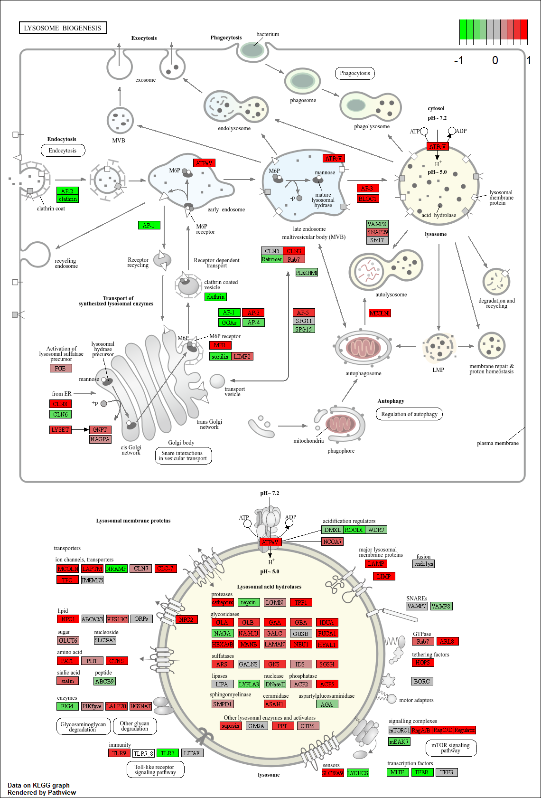
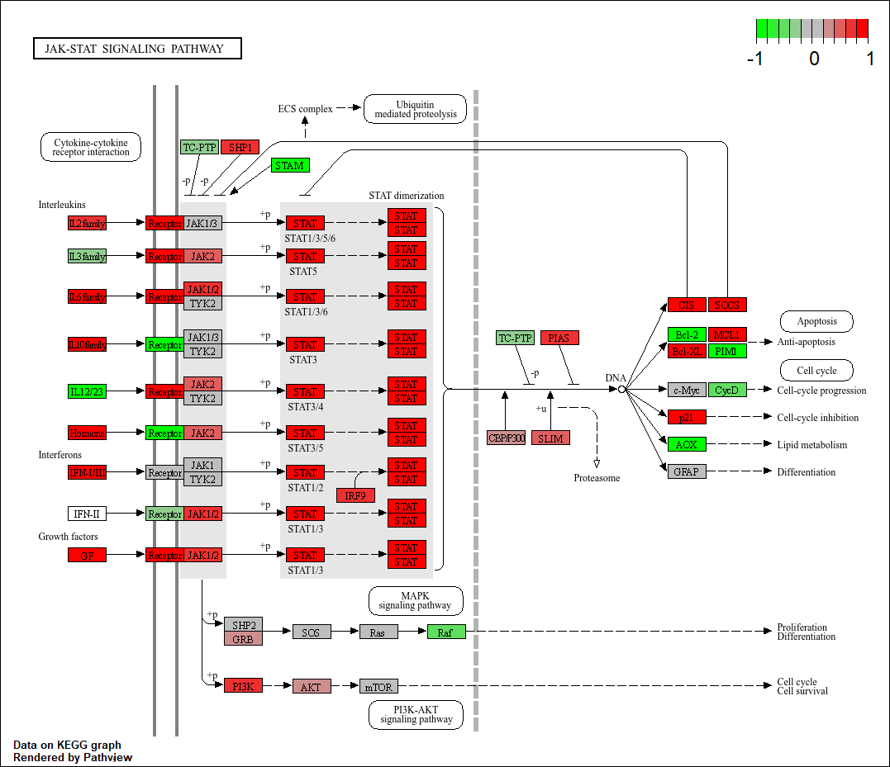
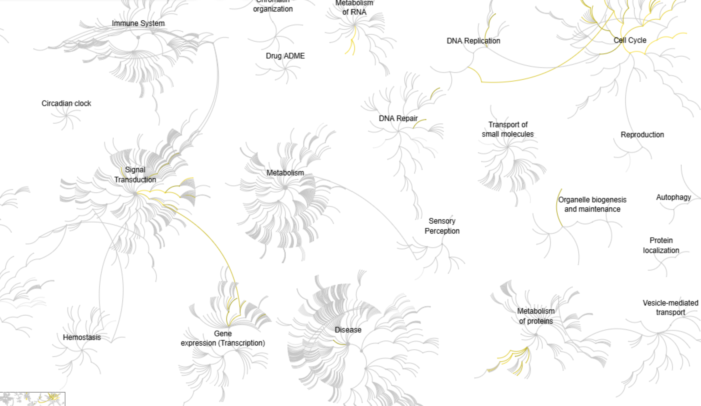

```{r}
library(DESeq2)
```

## Background

## Data Import
Read counts and metadata CSV Files

```{r}
metaFile <- "GSE37704_metadata.csv"
countFile <- "GSE37704_featurecounts.csv"
```

```{r}
colData <- read.csv(metaFile, row.names=1)
countData <- read.csv(countFile, row.names=1)

head(colData)
head(countData)
```

> Q. Complete the code below to remove the troublesome first column from countData

Remove length data:

```{r}
countData$length <- NULL

head(countData)
```

> Q. Complete the code below to filter countData to exclude genes (i.e. rows) where we have 0 read count across all samples (i.e. columns).

Furthermore remove data where all reads are 0 across the column 


```{r}
countData <- countData[rowSums(countData) > 0, ]

head(countData)
```


### Sanity Check

## Setup DESeq object

```{r}
library(DESeq2)
```


## Run DESeq analysis pipeline

```{r}
dds <- DESeqDataSetFromMatrix(countData = countData,
                              colData = colData, 
                              design = ~condition)

dds <- DESeq(dds)
dds
```


## Extract the results
Big table with log2 fold changes and p-values

Below:

```{r}
res <- results(dds)
```


> Q. Call the summary() function on your results to get a sense of how many genes are up or down-regulated at the default 0.1 p-value cutoff.

```{r}
summary(res)
```
Looks like 4396 are downregulated at the 0.1 p-value cutoff. 


## Data Viz 
Volcano Plot


```{r}
library(ggplot2)

ggplot(res, aes(log2FoldChange, -log(padj))) +
  geom_point()
```
> Q. Improve this plot by completing the below code, which adds color, axis labels and cutoff lines:


```{r}
# Make a color vector for all genes
mycols <- rep("gray", nrow(res) )

# Color blue the genes with fold change above 2
mycols[ abs(res$log2FoldChange) > 2 ] <- "blue"

# Color gray those with adjusted p-value more than 0.01
mycols[ res$padj > 0.01 ] <- "gray"

ggplot(res) +
  aes(log2FoldChange,
      -log(padj)) +
  geom_point(col=mycols) +
  xlab("Log2(FoldChange)") +
  ylab("-Log(P-value)") +
  geom_vline(xintercept = c(-2,2)) +
  geom_hline(yintercept = -log(0.01))
```


## Add Annotation Data

Adding gene annotation

> Q. Use the mapIDs() function multiple times to add SYMBOL, ENTREZID and GENENAME annotation to our results by completing the code below.

```{r}

library("AnnotationDbi")
library("org.Hs.eg.db")

columns(org.Hs.eg.db)
```


```{r}


columns(org.Hs.eg.db)

res$symbol = mapIds(org.Hs.eg.db,
                    keys=row.names(res), 
                    keytype="ENSEMBL",
                    column="SYMBOL",
                    multiVals="first")

res$entrez = mapIds(org.Hs.eg.db,
                    keys=row.names(res),
                    keytype="ENSEMBL",
                    column="ENTREZID",
                    multiVals="first")

res$name =   mapIds(org.Hs.eg.db,
                    keys=row.names(res),
                    keytype="ENSEMBL",
                    column="GENENAME",
                    multiVals="first")

head(res, 10)
```

> Q. Finally for this section let's reorder these results by adjusted p-value and save them to a CSV file in your current project directory.

```{r}
res = res[order(res$pvalue),]
write.csv(res, file="deseq_results.csv")
```


# Pathway Analysis

#Kegg pathways

```{r}
library(pathview)
library(gage)
library(gageData)

data(kegg.sets.hs)
data(sigmet.idx.hs)

# Focus on signaling and metabolic pathways only
kegg.sets.hs = kegg.sets.hs[sigmet.idx.hs]

# Examine the first 3 pathways
head(kegg.sets.hs, 3)
```

```{r}
foldchanges = res$log2FoldChange
names(foldchanges) = res$entrez
head(foldchanges)
```

```{r}
keggres = gage(foldchanges, gsets=kegg.sets.hs)
```


```{r}
attributes(keggres)
head(keggres$less)
```

Seems like This downregulated the cell cycle, DNA replication, and RNA transport

```{r}
pathview(gene.data=foldchanges, pathway.id="hsa04110")
```


```{r}
## Focus on top 5 upregulated pathways here for demo purposes only
keggrespathways <- rownames(keggres$greater)[1:5]

# Extract the 8 character long IDs part of each string
keggresids = substr(keggrespathways, start=1, stop=8)
keggresids
```

```{r}
pathview(gene.data=foldchanges, pathway.id=keggresids, species="hsa")
```








> Q. Can you do the same procedure as above to plot the pathview figures for the top 5 down-regulated pathways?

Yes below:

```{r}
## Focus on top 5 upregulated pathways here for demo purposes only
keggrespathwayslow <- rownames(keggres$less)[1:5]

# Extract the 8 character long IDs part of each string
keggresids2 = substr(keggrespathwayslow, start=1, stop=8)
keggresids2
```
```{r}
pathview(gene.data=foldchanges, pathway.id=keggresids2, species="hsa")
```


# Gene Ontology (GO) 

```{r}
data(go.sets.hs)
data(go.subs.hs)

# Focus on Biological Process subset of GO
gobpsets = go.sets.hs[go.subs.hs$BP]

gobpres = gage(foldchanges, gsets=gobpsets)

lapply(gobpres, head)
```

## Reactome Analysis

```{r}
sig_genes <- res[res$padj <= 0.05 & !is.na(res$padj), "symbol"]
print(paste("Total number of significant genes:", length(sig_genes)))
```

```{r}
write.table(sig_genes, file="significant_genes.txt", row.names=FALSE, col.names=FALSE, quote=FALSE)
```


Full REactome


> Q: What pathway has the most significant “Entities p-value”? Do the most significant pathways listed match your previous KEGG results? What factors could cause differences between the two methods?

The cell cycle pathway has the most significant entities p-value of 2.63E-5. The top results seem to match since cell cycle and mitosis related phenomenon are high up on the list for reactome analysis as well as on the KEGG. The main difference is that there seems to be more detail in the KEGG analysis whereas the reactome analysis looks very general and has a lot of different areas it looks into. 

## Save our results

