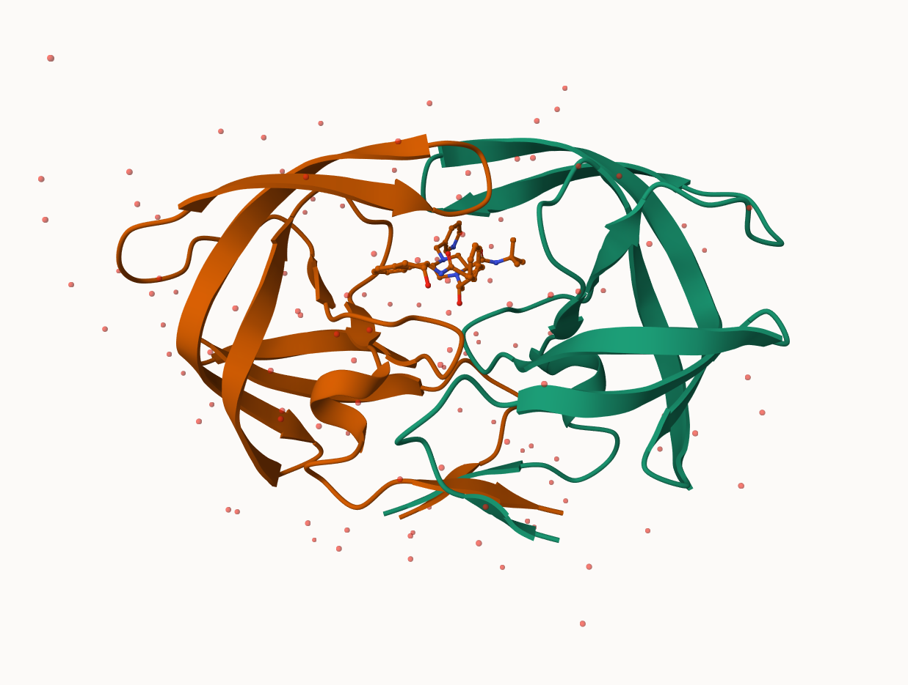
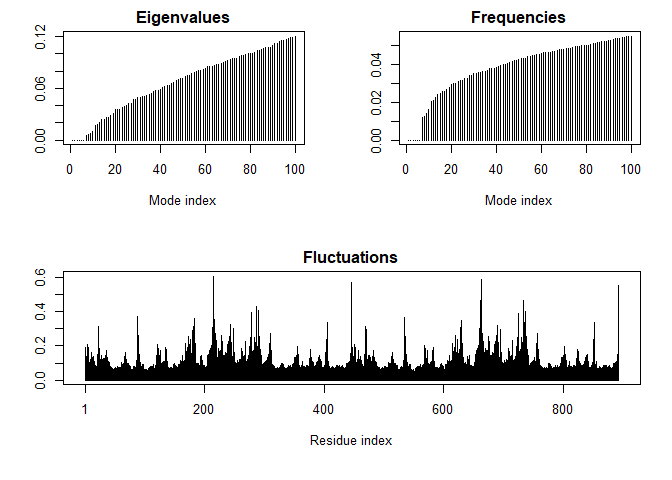
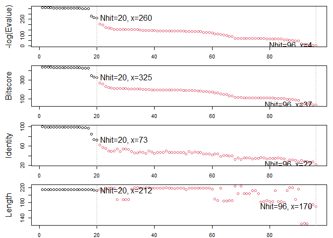
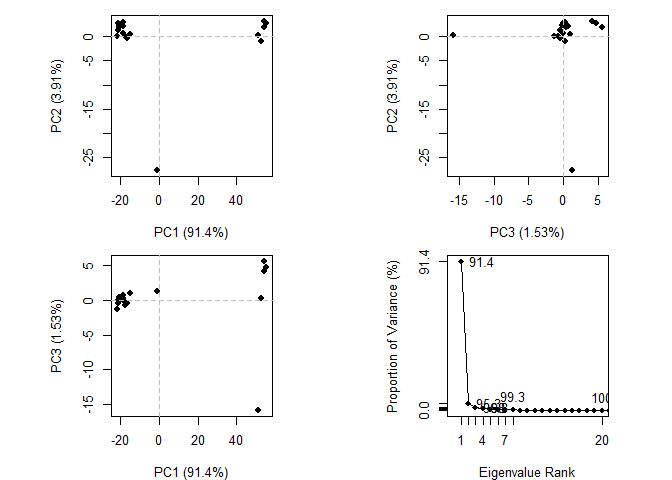
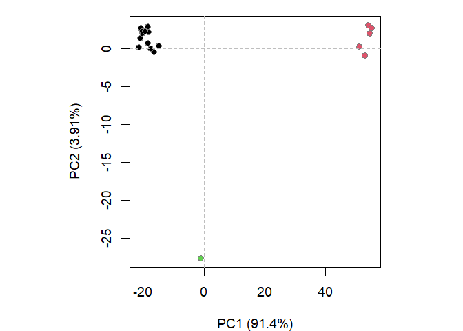

# Class 10: Structural Bioinformatics 1
Mankeerat Rataul

- [Background](#background)
- [PDB Statistics](#pdb-statistics)
- [Visualizing PDB data with
  Mol-star](#visualizing-pdb-data-with-mol-star)
- [Getting started with the Bio3D
  package](#getting-started-with-the-bio3d-package)
  - [Predict the flexibility of a given
    structure](#predict-the-flexibility-of-a-given-structure)
  - [Comparative analysis of the ADK
    family](#comparative-analysis-of-the-adk-family)

## Background

The main repository of high-resolution structural data on biomolecules
is called the **Protein Data Bank (PDB)**.

## PDB Statistics

What is in the PDB databank in terms of molecule type and structure
determination method?

Read a CSV file of current PDB stats obtained from
https://www.rcsb.org/stats/summary

``` r
pdb <- read.csv("Data Export Summary.csv", row.names = 1)
pdb
```

                              X.ray     EM    NMR Integrative Multiple.methods
    Protein (only)          180,758 23,111 12,813         348              229
    Protein/Oligosaccharide  10,488  3,741     34           8               11
    Protein/NA                9,205  6,751    287          26                8
    Nucleic acid (only)       3,154    250  1,578           3               15
    Other                       178     27     35           4                0
    Oligosaccharide (only)       11      0      6           0                1
                            Neutron Other   Total
    Protein (only)               84    32 217,375
    Protein/Oligosaccharide       1     0  14,283
    Protein/NA                    0     0  16,277
    Nucleic acid (only)           3     1   5,004
    Other                         0     0     244
    Oligosaccharide (only)        0     4      22

> **Q1: What percentage of structures in the PDB are solved by X-Ray and
> Electron Microscopy.**

``` r
#Converting all characters to numbers 
pdb$X.ray <- as.numeric(gsub(",", "", pdb$X.ray))
pdb$EM <- as.numeric(gsub(",","",pdb$EM))
pdb$NMR <- as.numeric(gsub(",","", pdb$NMR))
pdb$Total <- as.numeric(gsub(",","",pdb$Total))
pdb
```

                             X.ray    EM   NMR Integrative Multiple.methods Neutron
    Protein (only)          180758 23111 12813         348              229      84
    Protein/Oligosaccharide  10488  3741    34           8               11       1
    Protein/NA                9205  6751   287          26                8       0
    Nucleic acid (only)       3154   250  1578           3               15       3
    Other                      178    27    35           4                0       0
    Oligosaccharide (only)      11     0     6           0                1       0
                            Other  Total
    Protein (only)             32 217375
    Protein/Oligosaccharide     0  14283
    Protein/NA                  0  16277
    Nucleic acid (only)         1   5004
    Other                       0    244
    Oligosaccharide (only)      4     22

And below is how I solved the percentage

``` r
sum(pdb$X.ray, pdb$EM)/sum(pdb$Total)
```

    [1] 0.9386623

~93.87% are solved by X-ray crystallography and EM.

> **Q2: What proportion of structures in the PDB are protein?**

``` r
sum(pdb[1,8])/202556314 * 100
```

    [1] 0.1073158

~0.1073% of structures are protein ONLY

> Key-point: We have a very small structural coverage of known proteins
> (~0.1\$). Most strucures we know of (~80%) come from one method (X-ray
> crystallography).

> **Q3: Type HIV in the PDB website search box on the home page and
> determine how many HIV-1 protease structures are in the current PDB?**

There are 4998 structures in the current PDB.

## Visualizing PDB data with Mol-star

Main stand alone website version with all features is at
https://molstar.org/viewer/



> Q4: Water molecules normally have 3 atoms. Why do we see just one atom
> per water molecule in this structure?

The resolution of this x-ray crystallography is only to 2 angstroms,
whereas Hydrogen is a little over 1 angstrom, therefore it is not
possible to find the location of these hydrogens at that resolution.


> Q5: There is a critical “conserved” water molecule in the binding
> site. Can you identify this water molecule? What residue number does
> this water molecule have

This water molecule binds to residue I50 on each chain, and is shown in
Fig. 4 below.


> Q6: Generate and save a figure clearly showing the two distinct chains
> of HIV-protease along with the ligand. You might also consider showing
> the catalytic residues ASP 25 in each chain and the critical water (we
> recommend “Ball & Stick” for these side-chains). Add this figure to
> your Quarto document.

Below is a spacefill representation of the catalytic aspartic acids
below and hidden water above the chains.


``` r
#install.packages("pak")

#pak::pkg_install(c("bioboot/bio3dview", "NGLVieweR", "bioc::msa"))
```

# Getting started with the Bio3D package

Bio3d is an R package from CRAN for structural bioinformatics.

``` r
library(bio3d)


pdb <- read.pdb("1HSG")
```

      Note: Accessing on-line PDB file

``` r
pdb
```


     Call:  read.pdb(file = "1HSG")

       Total Models#: 1
         Total Atoms#: 1686,  XYZs#: 5058  Chains#: 2  (values: A B)

         Protein Atoms#: 1514  (residues/Calpha atoms#: 198)
         Nucleic acid Atoms#: 0  (residues/phosphate atoms#: 0)

         Non-protein/nucleic Atoms#: 172  (residues: 128)
         Non-protein/nucleic resid values: [ HOH (127), MK1 (1) ]

       Protein sequence:
          PQITLWQRPLVTIKIGGQLKEALLDTGADDTVLEEMSLPGRWKPKMIGGIGGFIKVRQYD
          QILIEICGHKAIGTVLVGPTPVNIIGRNLLTQIGCTLNFPQITLWQRPLVTIKIGGQLKE
          ALLDTGADDTVLEEMSLPGRWKPKMIGGIGGFIKVRQYDQILIEICGHKAIGTVLVGPTP
          VNIIGRNLLTQIGCTLNF

    + attr: atom, xyz, seqres, helix, sheet,
            calpha, remark, call

> Q7: How many amino acid residues are there in this pdb object?

``` r
length(pdbseq(pdb))
```

    [1] 198

198 total amino acid residues

> Q8: Name one of the two non-protein residues?

HOH, or water

> Q9: How many protein chains are in this structure?

There are 2 chains, A and B.

There are lots of functions that can work with these `pdb` objects.

``` r
head(pdbseq(pdb))
```

      1   2   3   4   5   6 
    "P" "Q" "I" "T" "L" "W" 

We can have a quick interactive view of any of these ‘pdb’ objects

``` r
##library(bio3dview)

##view.pdb(pdb)
```

Let’s try a custom view!

``` r
##view.pdb(pdb, colorScheme = "sse", backgroundColor = "skyblue")
```

> Q. Create a custom view highlighting the active site ASP (`resno=25`),
> the two chains (in your choice of colors) and the ligand all on a
> custom color background?

``` r
##library(NGLVieweR)

##active_site <- atom.select(pdb, resno=25)

##view.pdb(pdb, highlight=active_site, highlight.style = "spacefill", cols = c("#98FF98", "#C9A0DC"), backgroundColor = "skyblue") |>

##setRock()
```

## Predict the flexibility of a given structure

Let’s do a Normal Mode Analysis (NMA) to predict the flexibility of a
give `pdb` object:

``` r
adk <- read.pdb("2ANH")
```

      Note: Accessing on-line PDB file

``` r
adk
```


     Call:  read.pdb(file = "2ANH")

       Total Models#: 1
         Total Atoms#: 6772,  XYZs#: 20316  Chains#: 2  (values: A B)

         Protein Atoms#: 6566  (residues/Calpha atoms#: 892)
         Nucleic acid Atoms#: 0  (residues/phosphate atoms#: 0)

         Non-protein/nucleic Atoms#: 206  (residues: 194)
         Non-protein/nucleic resid values: [ HOH (185), PO4 (3), ZN (6) ]

       Protein sequence:
          MPVLENRAAQGDITAPGGARRLTGDQTAALRDSLSDKPAKNIILLIGDGMGDSEITAARN
          YAEGAGGFFKGIDALPLTGQYTHYALNKKTGKPDYVTDSAASATAWSTGVKTYNGALGVD
          IHEKDHPTILEMAKAAGLATGNVSTAELQHATPAALVAHVTSRKCYGPSATSEKCPGNAL
          EKGGKGSITEQLLNARADVTLGGGAKTFAETATAGEWQGKTLREQ...<cut>...LGLK

    + attr: atom, xyz, seqres, helix, sheet,
            calpha, remark, call

``` r
m <- nma(adk)
```

    Warning in nma.pdb(adk): Possible multi-chain structure or missing in-structure residue(s) present
      Fluctuations at neighboring positions may be affected.

     Building Hessian...        Done in 0.33 seconds.
     Diagonalizing Hessian...   Done in 17.82 seconds.

``` r
plot(m)
```



``` r
##view.nma(m, pdb=adk)
```

Write out the results for viewing in Mol-star

``` r
mktrj(m, file="TAQ.pdb")
```

## Comparative analysis of the ADK family

> Q10. Which of the packages above is found only on BioConductor and not
> CRAN?

msa is only available on bioconductor

> Q11. Which of the above packages is not found on BioConductor or CRAN?

bio3dview, only available on github.

> Q12. True or False? Functions from the pak package can be used to
> install packages from GitHub and BitBucket?

TRUE

Our first step is find a sequence for this family. We will use the
database ID “1ake_A” here:

``` r
id <- "1ake_A"

aa <- get.seq(id)
```

    Warning in get.seq(id): Removing existing file: seqs.fasta

    Fetching... Please wait. Done.

``` r
aa
```

                 1        .         .         .         .         .         60 
    pdb|1AKE|A   MRIILLGAPGAGKGTQAQFIMEKYGIPQISTGDMLRAAVKSGSELGKQAKDIMDAGKLVT
                 1        .         .         .         .         .         60 

                61        .         .         .         .         .         120 
    pdb|1AKE|A   DELVIALVKERIAQEDCRNGFLLDGFPRTIPQADAMKEAGINVDYVLEFDVPDELIVDRI
                61        .         .         .         .         .         120 

               121        .         .         .         .         .         180 
    pdb|1AKE|A   VGRRVHAPSGRVYHVKFNPPKVEGKDDVTGEELTTRKDDQEETVRKRLVEYHQMTAPLIG
               121        .         .         .         .         .         180 

               181        .         .         .   214 
    pdb|1AKE|A   YYSKEAEAGNTKYAKVDGTKPVAEVRADLEKILG
               181        .         .         .   214 

    Call:
      read.fasta(file = outfile)

    Class:
      fasta

    Alignment dimensions:
      1 sequence rows; 214 position columns (214 non-gap, 0 gap) 

    + attr: id, ali, call

> Q13. How many amino acids are in this sequence, i.e. how long is this
> sequence?

214 amino acids in this sequence total.

Search for related sequences in the database

``` r
blast <- blast.pdb(aa)
```

     Searching ... please wait (updates every 5 seconds) RID = 1BXUMGB6014 
     ..............................................................................................................
     Reporting 96 hits

``` r
head(blast$hit.tbl)
```

            queryid subjectids identity alignmentlength mismatches gapopens q.start
    1 Query_3724327     1AKE_A  100.000             214          0        0       1
    2 Query_3724327     8BQF_A   99.533             214          1        0       1
    3 Query_3724327     4X8M_A   99.533             214          1        0       1
    4 Query_3724327     6S36_A   99.533             214          1        0       1
    5 Query_3724327     9R6U_A   99.533             214          1        0       1
    6 Query_3724327     9R71_A   99.533             214          1        0       1
      q.end s.start s.end    evalue bitscore positives mlog.evalue pdb.id    acc
    1   214       1   214 1.82e-156      432    100.00    358.6044 1AKE_A 1AKE_A
    2   214      21   234 2.98e-156      433    100.00    358.1114 8BQF_A 8BQF_A
    3   214       1   214 3.26e-156      432    100.00    358.0215 4X8M_A 4X8M_A
    4   214       1   214 4.78e-156      432    100.00    357.6388 6S36_A 6S36_A
    5   214       1   214 1.07e-155      431     99.53    356.8330 9R6U_A 9R6U_A
    6   214       1   214 1.26e-155      431     99.53    356.6696 9R71_A 9R71_A

``` r
hits <- plot(blast)
```

      * Possible cutoff values:    260 3 
                Yielding Nhits:    20 96 

      * Chosen cutoff value of:    260 
                Yielding Nhits:    20 



``` r
hits$pdb.id
```

     [1] "1AKE_A" "8BQF_A" "4X8M_A" "6S36_A" "9R6U_A" "9R71_A" "8Q2B_A" "8RJ9_A"
     [9] "6RZE_A" "4X8H_A" "3HPR_A" "1E4V_A" "5EJE_A" "1E4Y_A" "3X2S_A" "6HAP_A"
    [17] "6HAM_A" "8PVW_A" "4K46_A" "4NP6_A"

``` r
files <- get.pdb(hits$pdb.id, path="pdbs", split = TRUE, gzip=TRUE)
```

    Warning in get.pdb(hits$pdb.id, path = "pdbs", split = TRUE, gzip = TRUE):
    pdbs/1AKE.pdb exists. Skipping download

    Warning in get.pdb(hits$pdb.id, path = "pdbs", split = TRUE, gzip = TRUE):
    pdbs/8BQF.pdb exists. Skipping download

    Warning in get.pdb(hits$pdb.id, path = "pdbs", split = TRUE, gzip = TRUE):
    pdbs/4X8M.pdb exists. Skipping download

    Warning in get.pdb(hits$pdb.id, path = "pdbs", split = TRUE, gzip = TRUE):
    pdbs/6S36.pdb exists. Skipping download

    Warning in get.pdb(hits$pdb.id, path = "pdbs", split = TRUE, gzip = TRUE):
    pdbs/9R6U.pdb exists. Skipping download

    Warning in get.pdb(hits$pdb.id, path = "pdbs", split = TRUE, gzip = TRUE):
    pdbs/9R71.pdb exists. Skipping download

    Warning in get.pdb(hits$pdb.id, path = "pdbs", split = TRUE, gzip = TRUE):
    pdbs/8Q2B.pdb exists. Skipping download

    Warning in get.pdb(hits$pdb.id, path = "pdbs", split = TRUE, gzip = TRUE):
    pdbs/8RJ9.pdb exists. Skipping download

    Warning in get.pdb(hits$pdb.id, path = "pdbs", split = TRUE, gzip = TRUE):
    pdbs/6RZE.pdb exists. Skipping download

    Warning in get.pdb(hits$pdb.id, path = "pdbs", split = TRUE, gzip = TRUE):
    pdbs/4X8H.pdb exists. Skipping download

    Warning in get.pdb(hits$pdb.id, path = "pdbs", split = TRUE, gzip = TRUE):
    pdbs/3HPR.pdb exists. Skipping download

    Warning in get.pdb(hits$pdb.id, path = "pdbs", split = TRUE, gzip = TRUE):
    pdbs/1E4V.pdb exists. Skipping download

    Warning in get.pdb(hits$pdb.id, path = "pdbs", split = TRUE, gzip = TRUE):
    pdbs/5EJE.pdb exists. Skipping download

    Warning in get.pdb(hits$pdb.id, path = "pdbs", split = TRUE, gzip = TRUE):
    pdbs/1E4Y.pdb exists. Skipping download

    Warning in get.pdb(hits$pdb.id, path = "pdbs", split = TRUE, gzip = TRUE):
    pdbs/3X2S.pdb exists. Skipping download

    Warning in get.pdb(hits$pdb.id, path = "pdbs", split = TRUE, gzip = TRUE):
    pdbs/6HAP.pdb exists. Skipping download

    Warning in get.pdb(hits$pdb.id, path = "pdbs", split = TRUE, gzip = TRUE):
    pdbs/6HAM.pdb exists. Skipping download

    Warning in get.pdb(hits$pdb.id, path = "pdbs", split = TRUE, gzip = TRUE):
    pdbs/8PVW.pdb exists. Skipping download

    Warning in get.pdb(hits$pdb.id, path = "pdbs", split = TRUE, gzip = TRUE):
    pdbs/4K46.pdb exists. Skipping download

    Warning in get.pdb(hits$pdb.id, path = "pdbs", split = TRUE, gzip = TRUE):
    pdbs/4NP6.pdb exists. Skipping download


      |                                                                            
      |                                                                      |   0%
      |                                                                            
      |====                                                                  |   5%
      |                                                                            
      |=======                                                               |  10%
      |                                                                            
      |==========                                                            |  15%
      |                                                                            
      |==============                                                        |  20%
      |                                                                            
      |==================                                                    |  25%
      |                                                                            
      |=====================                                                 |  30%
      |                                                                            
      |========================                                              |  35%
      |                                                                            
      |============================                                          |  40%
      |                                                                            
      |================================                                      |  45%
      |                                                                            
      |===================================                                   |  50%
      |                                                                            
      |======================================                                |  55%
      |                                                                            
      |==========================================                            |  60%
      |                                                                            
      |==============================================                        |  65%
      |                                                                            
      |=================================================                     |  70%
      |                                                                            
      |====================================================                  |  75%
      |                                                                            
      |========================================================              |  80%
      |                                                                            
      |============================================================          |  85%
      |                                                                            
      |===============================================================       |  90%
      |                                                                            
      |==================================================================    |  95%
      |                                                                            
      |======================================================================| 100%

Quick interactive structural view

``` r
pdbs <- pdbaln(files, fit=TRUE, exefile="msa")
```

    Reading PDB files:
    pdbs/split_chain/1AKE_A.pdb
    pdbs/split_chain/8BQF_A.pdb
    pdbs/split_chain/4X8M_A.pdb
    pdbs/split_chain/6S36_A.pdb
    pdbs/split_chain/9R6U_A.pdb
    pdbs/split_chain/9R71_A.pdb
    pdbs/split_chain/8Q2B_A.pdb
    pdbs/split_chain/8RJ9_A.pdb
    pdbs/split_chain/6RZE_A.pdb
    pdbs/split_chain/4X8H_A.pdb
    pdbs/split_chain/3HPR_A.pdb
    pdbs/split_chain/1E4V_A.pdb
    pdbs/split_chain/5EJE_A.pdb
    pdbs/split_chain/1E4Y_A.pdb
    pdbs/split_chain/3X2S_A.pdb
    pdbs/split_chain/6HAP_A.pdb
    pdbs/split_chain/6HAM_A.pdb
    pdbs/split_chain/8PVW_A.pdb
    pdbs/split_chain/4K46_A.pdb
    pdbs/split_chain/4NP6_A.pdb
       PDB has ALT records, taking A only, rm.alt=TRUE
    .   PDB has ALT records, taking A only, rm.alt=TRUE
    ..   PDB has ALT records, taking A only, rm.alt=TRUE
    .   PDB has ALT records, taking A only, rm.alt=TRUE
    .   PDB has ALT records, taking A only, rm.alt=TRUE
    .   PDB has ALT records, taking A only, rm.alt=TRUE
    .   PDB has ALT records, taking A only, rm.alt=TRUE
    .   PDB has ALT records, taking A only, rm.alt=TRUE
    ..   PDB has ALT records, taking A only, rm.alt=TRUE
    ..   PDB has ALT records, taking A only, rm.alt=TRUE
    ....   PDB has ALT records, taking A only, rm.alt=TRUE
    .   PDB has ALT records, taking A only, rm.alt=TRUE
    .   PDB has ALT records, taking A only, rm.alt=TRUE
    ..

    Extracting sequences

    pdb/seq: 1   name: pdbs/split_chain/1AKE_A.pdb 
       PDB has ALT records, taking A only, rm.alt=TRUE
    pdb/seq: 2   name: pdbs/split_chain/8BQF_A.pdb 
       PDB has ALT records, taking A only, rm.alt=TRUE
    pdb/seq: 3   name: pdbs/split_chain/4X8M_A.pdb 
    pdb/seq: 4   name: pdbs/split_chain/6S36_A.pdb 
       PDB has ALT records, taking A only, rm.alt=TRUE
    pdb/seq: 5   name: pdbs/split_chain/9R6U_A.pdb 
       PDB has ALT records, taking A only, rm.alt=TRUE
    pdb/seq: 6   name: pdbs/split_chain/9R71_A.pdb 
       PDB has ALT records, taking A only, rm.alt=TRUE
    pdb/seq: 7   name: pdbs/split_chain/8Q2B_A.pdb 
       PDB has ALT records, taking A only, rm.alt=TRUE
    pdb/seq: 8   name: pdbs/split_chain/8RJ9_A.pdb 
       PDB has ALT records, taking A only, rm.alt=TRUE
    pdb/seq: 9   name: pdbs/split_chain/6RZE_A.pdb 
       PDB has ALT records, taking A only, rm.alt=TRUE
    pdb/seq: 10   name: pdbs/split_chain/4X8H_A.pdb 
    pdb/seq: 11   name: pdbs/split_chain/3HPR_A.pdb 
       PDB has ALT records, taking A only, rm.alt=TRUE
    pdb/seq: 12   name: pdbs/split_chain/1E4V_A.pdb 
    pdb/seq: 13   name: pdbs/split_chain/5EJE_A.pdb 
       PDB has ALT records, taking A only, rm.alt=TRUE
    pdb/seq: 14   name: pdbs/split_chain/1E4Y_A.pdb 
    pdb/seq: 15   name: pdbs/split_chain/3X2S_A.pdb 
    pdb/seq: 16   name: pdbs/split_chain/6HAP_A.pdb 
    pdb/seq: 17   name: pdbs/split_chain/6HAM_A.pdb 
       PDB has ALT records, taking A only, rm.alt=TRUE
    pdb/seq: 18   name: pdbs/split_chain/8PVW_A.pdb 
       PDB has ALT records, taking A only, rm.alt=TRUE
    pdb/seq: 19   name: pdbs/split_chain/4K46_A.pdb 
       PDB has ALT records, taking A only, rm.alt=TRUE
    pdb/seq: 20   name: pdbs/split_chain/4NP6_A.pdb 

``` r
pdbs
```

                                    1        .         .         .         40 
    [Truncated_Name:1]1AKE_A.pdb    --MRIILLGAPGAGKGTQAQFIMEKYGIPQISTGDMLRAA
    [Truncated_Name:2]8BQF_A.pdb    --MRIILLGAPGAGKGTQAQFIMEKYGIPQISTGDMLRAA
    [Truncated_Name:3]4X8M_A.pdb    --MRIILLGAPGAGKGTQAQFIMEKYGIPQISTGDMLRAA
    [Truncated_Name:4]6S36_A.pdb    --MRIILLGAPGAGKGTQAQFIMEKYGIPQISTGDMLRAA
    [Truncated_Name:5]9R6U_A.pdb    --MRIILLGAPGAGKGTQAQFIMEKYGIPQISTGDMLRAA
    [Truncated_Name:6]9R71_A.pdb    --MRIILLGAPGAGKGTQAQFIMEKYGIPQISTGDMLRAA
    [Truncated_Name:7]8Q2B_A.pdb    --MRIILLGAPGAGKGTQAQFIMEKYGIPQISTGDMLRAA
    [Truncated_Name:8]8RJ9_A.pdb    --MRIILLGAPGAGKGTQAQFIMEKYGIPQISTGDMLRAA
    [Truncated_Name:9]6RZE_A.pdb    --MRIILLGAPGAGKGTQAQFIMEKYGIPQISTGDMLRAA
    [Truncated_Name:10]4X8H_A.pdb   --MRIILLGAPGAGKGTQAQFIMEKYGIPQISTGDMLRAA
    [Truncated_Name:11]3HPR_A.pdb   --MRIILLGAPGAGKGTQAQFIMEKYGIPQISTGDMLRAA
    [Truncated_Name:12]1E4V_A.pdb   --MRIILLGAPVAGKGTQAQFIMEKYGIPQISTGDMLRAA
    [Truncated_Name:13]5EJE_A.pdb   --MRIILLGAPGAGKGTQAQFIMEKYGIPQISTGDMLRAA
    [Truncated_Name:14]1E4Y_A.pdb   --MRIILLGALVAGKGTQAQFIMEKYGIPQISTGDMLRAA
    [Truncated_Name:15]3X2S_A.pdb   --MRIILLGAPGAGKGTQAQFIMEKYGIPQISTGDMLRAA
    [Truncated_Name:16]6HAP_A.pdb   --MRIILLGAPGAGKGTQAQFIMEKYGIPQISTGDMLRAA
    [Truncated_Name:17]6HAM_A.pdb   --MRIILLGAPGAGKGTQAQFIMEKYGIPQISTGDMLRAA
    [Truncated_Name:18]8PVW_A.pdb   --MRIILLGAPGAGKGTQAQFIMEKYGIPQISTGDMLRAA
    [Truncated_Name:19]4K46_A.pdb   --MRIILLGAPGAGKGTQAQFIMAKFGIPQISTGDMLRAA
    [Truncated_Name:20]4NP6_A.pdb   NAMRIILLGAPGAGKGTQAQFIMEKFGIPQISTGDMLRAA
                                      ********  *********** *^************** 
                                    1        .         .         .         40 

                                   41        .         .         .         80 
    [Truncated_Name:1]1AKE_A.pdb    VKSGSELGKQAKDIMDAGKLVTDELVIALVKERIAQEDCR
    [Truncated_Name:2]8BQF_A.pdb    VKSGSELGKQAKDIMDAGKLVTDELVIALVKERIAQE---
    [Truncated_Name:3]4X8M_A.pdb    VKSGSELGKQAKDIMDAGKLVTDELVIALVKERIAQEDCR
    [Truncated_Name:4]6S36_A.pdb    VKSGSELGKQAKDIMDAGKLVTDELVIALVKERIAQEDCR
    [Truncated_Name:5]9R6U_A.pdb    VKSGSELGAQAKDIMDAGKLVTDELVIALVKERIAQEDCR
    [Truncated_Name:6]9R71_A.pdb    VKSGSELGKQAKDIMDAGKLVTDELVIALVKERIAQEDCR
    [Truncated_Name:7]8Q2B_A.pdb    VKSGSELGKQAKDIMDAGKLVTDELVIALVKERIAQEDCR
    [Truncated_Name:8]8RJ9_A.pdb    VKSGSELGKQAKDIMDAGKLVTDELVIALVKERIAQEDCR
    [Truncated_Name:9]6RZE_A.pdb    VKSGSELGKQAKDIMDAGKLVTDELVIALVKERIAQEDCR
    [Truncated_Name:10]4X8H_A.pdb   VKSGSELGKQAKDIMDAGKLVTDELVIALVKERIAQEDCR
    [Truncated_Name:11]3HPR_A.pdb   VKSGSELGKQAKDIMDAGKLVTDELVIALVKERIAQEDCR
    [Truncated_Name:12]1E4V_A.pdb   VKSGSELGKQAKDIMDAGKLVTDELVIALVKERIAQEDCR
    [Truncated_Name:13]5EJE_A.pdb   VKSGSELGKQAKDIMDACKLVTDELVIALVKERIAQEDCR
    [Truncated_Name:14]1E4Y_A.pdb   VKSGSELGKQAKDIMDAGKLVTDELVIALVKERIAQEDCR
    [Truncated_Name:15]3X2S_A.pdb   VKSGSELGKQAKDIMDCGKLVTDELVIALVKERIAQEDSR
    [Truncated_Name:16]6HAP_A.pdb   VKSGSELGKQAKDIMDAGKLVTDELVIALVRERICQEDSR
    [Truncated_Name:17]6HAM_A.pdb   IKSGSELGKQAKDIMDAGKLVTDEIIIALVKERICQEDSR
    [Truncated_Name:18]8PVW_A.pdb   VKSGSELGKQAKDIMDAGKLVTDELVIALVKERIAQEDCR
    [Truncated_Name:19]4K46_A.pdb   IKAGTELGKQAKSVIDAGQLVSDDIILGLVKERIAQDDCA
    [Truncated_Name:20]4NP6_A.pdb   IKAGTELGKQAKAVIDAGQLVSDDIILGLIKERIAQADCE
                                    ^* *^*** *** ^^*   **^*^^^^^*^^*** *     
                                   41        .         .         .         80 

                                   81        .         .         .         120 
    [Truncated_Name:1]1AKE_A.pdb    NGFLLDGFPRTIPQADAMKEAGINVDYVLEFDVPDELIVD
    [Truncated_Name:2]8BQF_A.pdb    -GFLLDGFPRTIPQADAMKEAGINVDYVIEFDVPDELIVD
    [Truncated_Name:3]4X8M_A.pdb    NGFLLDGFPRTIPQADAMKEAGINVDYVLEFDVPDELIVD
    [Truncated_Name:4]6S36_A.pdb    NGFLLDGFPRTIPQADAMKEAGINVDYVLEFDVPDELIVD
    [Truncated_Name:5]9R6U_A.pdb    NGFLLDGFPRTIPQADAMKEAGINVDYVLEFDVPDELIVD
    [Truncated_Name:6]9R71_A.pdb    NGFLLDGFPRTIPQADAMKEAGINVDYVLEFDVPDALIVD
    [Truncated_Name:7]8Q2B_A.pdb    NGFLLDGFPRTIPQADAMKEAGINVDYVLEFDVPDELIVD
    [Truncated_Name:8]8RJ9_A.pdb    NGFLLAGFPRTIPQADAMKEAGINVDYVLEFDVPDELIVD
    [Truncated_Name:9]6RZE_A.pdb    NGFLLDGFPRTIPQADAMKEAGINVDYVLEFDVPDELIVD
    [Truncated_Name:10]4X8H_A.pdb   NGFLLDGFPRTIPQADAMKEAGINVDYVLEFDVPDELIVD
    [Truncated_Name:11]3HPR_A.pdb   NGFLLDGFPRTIPQADAMKEAGINVDYVLEFDVPDELIVD
    [Truncated_Name:12]1E4V_A.pdb   NGFLLDGFPRTIPQADAMKEAGINVDYVLEFDVPDELIVD
    [Truncated_Name:13]5EJE_A.pdb   NGFLLDGFPRTIPQADAMKEAGINVDYVLEFDVPDELIVD
    [Truncated_Name:14]1E4Y_A.pdb   NGFLLDGFPRTIPQADAMKEAGINVDYVLEFDVPDELIVD
    [Truncated_Name:15]3X2S_A.pdb   NGFLLDGFPRTIPQADAMKEAGINVDYVLEFDVPDELIVD
    [Truncated_Name:16]6HAP_A.pdb   NGFLLDGFPRTIPQADAMKEAGINVDYVLEFDVPDELIVD
    [Truncated_Name:17]6HAM_A.pdb   NGFLLDGFPRTIPQADAMKEAGINVDYVLEFDVPDELIVD
    [Truncated_Name:18]8PVW_A.pdb   NGFLLDGFPRTIPQADAMKEAGINVDYVLEFDVPDELIVD
    [Truncated_Name:19]4K46_A.pdb   KGFLLDGFPRTIPQADGLKEVGVVVDYVIEFDVADSVIVE
    [Truncated_Name:20]4NP6_A.pdb   KGFLLDGFPRTIPQADGLKEMGINVDYVIEFDVADDVIVE
                                     **** **********^^** *^ ****^**** * ^**^ 
                                   81        .         .         .         120 

                                  121        .         .         .         160 
    [Truncated_Name:1]1AKE_A.pdb    RIVGRRVHAPSGRVYHVKFNPPKVEGKDDVTGEELTTRKD
    [Truncated_Name:2]8BQF_A.pdb    RIVGRRVHAPSGRVYHVKFNPPKVEGKDDVTGEELTTRKD
    [Truncated_Name:3]4X8M_A.pdb    RIVGRRVHAPSGRVYHVKFNPPKVEGKDDVTGEELTTRKD
    [Truncated_Name:4]6S36_A.pdb    KIVGRRVHAPSGRVYHVKFNPPKVEGKDDVTGEELTTRKD
    [Truncated_Name:5]9R6U_A.pdb    RIVGRRVHAPSGRVYHVKFNPPKVEGKDDVTGEELTTRKD
    [Truncated_Name:6]9R71_A.pdb    RIVGRRVHAPSGRVYHVKFNPPKVEGKDDVTGEELTTRKD
    [Truncated_Name:7]8Q2B_A.pdb    RIVGRRVHAPSGRVYHVKFNPPKVEGKDDVTGEELTTRKA
    [Truncated_Name:8]8RJ9_A.pdb    RIVGRRVHAPSGRVYHVKFNPPKVEGKDDVTGEELTTRKD
    [Truncated_Name:9]6RZE_A.pdb    AIVGRRVHAPSGRVYHVKFNPPKVEGKDDVTGEELTTRKD
    [Truncated_Name:10]4X8H_A.pdb   RIVGRRVHAPSGRVYHVKFNPPKVEGKDDVTGEELTTRKD
    [Truncated_Name:11]3HPR_A.pdb   RIVGRRVHAPSGRVYHVKFNPPKVEGKDDGTGEELTTRKD
    [Truncated_Name:12]1E4V_A.pdb   RIVGRRVHAPSGRVYHVKFNPPKVEGKDDVTGEELTTRKD
    [Truncated_Name:13]5EJE_A.pdb   RIVGRRVHAPSGRVYHVKFNPPKVEGKDDVTGEELTTRKD
    [Truncated_Name:14]1E4Y_A.pdb   RIVGRRVHAPSGRVYHVKFNPPKVEGKDDVTGEELTTRKD
    [Truncated_Name:15]3X2S_A.pdb   RIVGRRVHAPSGRVYHVKFNPPKVEGKDDVTGEELTTRKD
    [Truncated_Name:16]6HAP_A.pdb   RIVGRRVHAPSGRVYHVKFNPPKVEGKDDVTGEELTTRKD
    [Truncated_Name:17]6HAM_A.pdb   RIVGRRVHAPSGRVYHVKFNPPKVEGKDDVTGEELTTRKD
    [Truncated_Name:18]8PVW_A.pdb   RILKR--GETSGRV-------------------------D
    [Truncated_Name:19]4K46_A.pdb   RMAGRRAHLASGRTYHNVYNPPKVEGKDDVTGEDLVIRED
    [Truncated_Name:20]4NP6_A.pdb   RMAGRRAHLPSGRTYHVVYNPPKVEGKDDVTGEDLVIRED
                                     ^  *     ***                            
                                  121        .         .         .         160 

                                  161        .         .         .         200 
    [Truncated_Name:1]1AKE_A.pdb    DQEETVRKRLVEYHQMTAPLIGYYSKEAEAGNTKYAKVDG
    [Truncated_Name:2]8BQF_A.pdb    DQEETVRKRLVEYHQMTAPLIGYYSKEAEAGNTKYAKVDG
    [Truncated_Name:3]4X8M_A.pdb    DQEETVRKRLVEWHQMTAPLIGYYSKEAEAGNTKYAKVDG
    [Truncated_Name:4]6S36_A.pdb    DQEETVRKRLVEYHQMTAPLIGYYSKEAEAGNTKYAKVDG
    [Truncated_Name:5]9R6U_A.pdb    DQEETVRKRLVEYHQMTAPLIGYYSKEAEAGNTKYAKVDG
    [Truncated_Name:6]9R71_A.pdb    DQEETVRKRLVEYHQMTAPLIGYYSKEAEAGNTKYAKVDG
    [Truncated_Name:7]8Q2B_A.pdb    DQEETVRKRLVEYHQMTAPLIGYYSKEAEAGNTKYAKVDG
    [Truncated_Name:8]8RJ9_A.pdb    DQEETVRKRLVEYHQMTAPLIGYYSKEAEAGNTKYAKVDG
    [Truncated_Name:9]6RZE_A.pdb    DQEETVRKRLVEYHQMTAPLIGYYSKEAEAGNTKYAKVDG
    [Truncated_Name:10]4X8H_A.pdb   DQEETVRKRLVEYHQMTAALIGYYSKEAEAGNTKYAKVDG
    [Truncated_Name:11]3HPR_A.pdb   DQEETVRKRLVEYHQMTAPLIGYYSKEAEAGNTKYAKVDG
    [Truncated_Name:12]1E4V_A.pdb   DQEETVRKRLVEYHQMTAPLIGYYSKEAEAGNTKYAKVDG
    [Truncated_Name:13]5EJE_A.pdb   DQEECVRKRLVEYHQMTAPLIGYYSKEAEAGNTKYAKVDG
    [Truncated_Name:14]1E4Y_A.pdb   DQEETVRKRLVEYHQMTAPLIGYYSKEAEAGNTKYAKVDG
    [Truncated_Name:15]3X2S_A.pdb   DQEETVRKRLCEYHQMTAPLIGYYSKEAEAGNTKYAKVDG
    [Truncated_Name:16]6HAP_A.pdb   DQEETVRKRLVEYHQMTAPLIGYYSKEAEAGNTKYAKVDG
    [Truncated_Name:17]6HAM_A.pdb   DQEETVRKRLVEYHQMTAPLIGYYSKEAEAGNTKYAKVDG
    [Truncated_Name:18]8PVW_A.pdb   DNEETVRKRLVEYHQMTAPLIGYYSKEAEAGNTKYAKVDG
    [Truncated_Name:19]4K46_A.pdb   DKEETVLARLGVYHNQTAPLIAYYGKEAEAGNTQYLKFDG
    [Truncated_Name:20]4NP6_A.pdb   DKEETVRARLNVYHTQTAPLIEYYGKEAAAGKTQYLKFDG
                                    * ** *  **  ^*  ** ** ** *** ** * * * ** 
                                  161        .         .         .         200 

                                  201        .     216 
    [Truncated_Name:1]1AKE_A.pdb    TKPVAEVRADLEKILG
    [Truncated_Name:2]8BQF_A.pdb    TKPVAEVRADLEKIL-
    [Truncated_Name:3]4X8M_A.pdb    TKPVAEVRADLEKILG
    [Truncated_Name:4]6S36_A.pdb    TKPVAEVRADLEKILG
    [Truncated_Name:5]9R6U_A.pdb    TKPVAEVRADLEKILG
    [Truncated_Name:6]9R71_A.pdb    TKPVAEVRADLEKILG
    [Truncated_Name:7]8Q2B_A.pdb    TKPVAEVRADLEKILG
    [Truncated_Name:8]8RJ9_A.pdb    TKPVAEVRADLEKILG
    [Truncated_Name:9]6RZE_A.pdb    TKPVAEVRADLEKILG
    [Truncated_Name:10]4X8H_A.pdb   TKPVAEVRADLEKILG
    [Truncated_Name:11]3HPR_A.pdb   TKPVAEVRADLEKILG
    [Truncated_Name:12]1E4V_A.pdb   TKPVAEVRADLEKILG
    [Truncated_Name:13]5EJE_A.pdb   TKPVAEVRADLEKILG
    [Truncated_Name:14]1E4Y_A.pdb   TKPVAEVRADLEKILG
    [Truncated_Name:15]3X2S_A.pdb   TKPVAEVRADLEKILG
    [Truncated_Name:16]6HAP_A.pdb   TKPVCEVRADLEKILG
    [Truncated_Name:17]6HAM_A.pdb   TKPVCEVRADLEKILG
    [Truncated_Name:18]8PVW_A.pdb   TKPVAEVRADLEKILG
    [Truncated_Name:19]4K46_A.pdb   TKAVAEVSAELEKALA
    [Truncated_Name:20]4NP6_A.pdb   TKQVSEVSADIAKALA
                                    ** * ** *^^ * *  
                                  201        .     216 

    Call:
      pdbaln(files = files, fit = TRUE, exefile = "msa")

    Class:
      pdbs, fasta

    Alignment dimensions:
      20 sequence rows; 216 position columns (182 non-gap, 34 gap) 

    + attr: xyz, resno, b, chain, id, ali, resid, sse, call

PCA all of this structural data (x, y and z atom coordinates):

``` r
pc <- pca(pdbs)
plot(pc)
```



``` r
rd <- rmsd(pdbs)
```

    Warning in rmsd(pdbs): No indices provided, using the 182 non NA positions

``` r
hc.rd <- hclust(dist(rd))
grps.rd <- cutree(hc.rd, k=3)

plot(pc, 1:2, col="grey50", bg=grps.rd, pch=21, cex=1)
```



``` r
##view.pca(pc)
pc1 <- mktrj(pc, pc=1, file="pc_1.pdb")
```

The bottom is a result of the movement of this protein:

[Animation of the movement of this
protein](PC_1.PDB_animate-trajectory.mp4)
