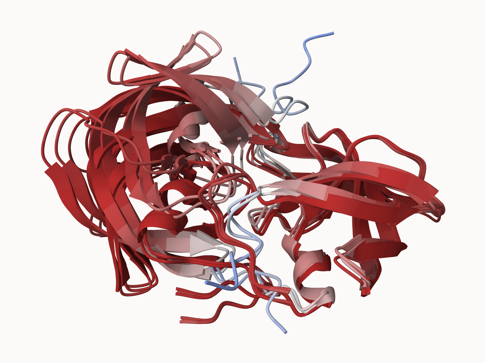
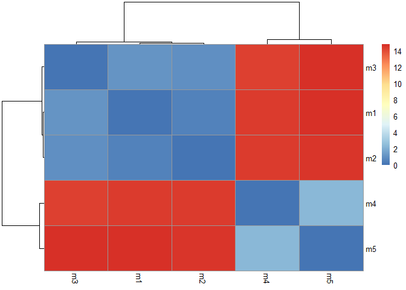
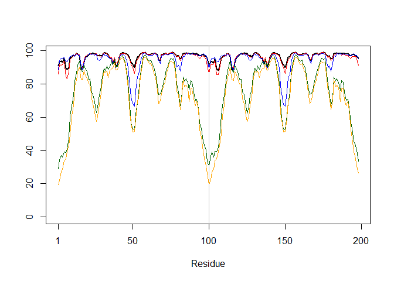
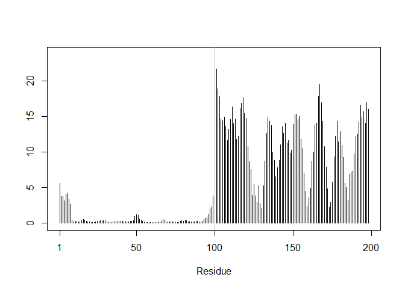
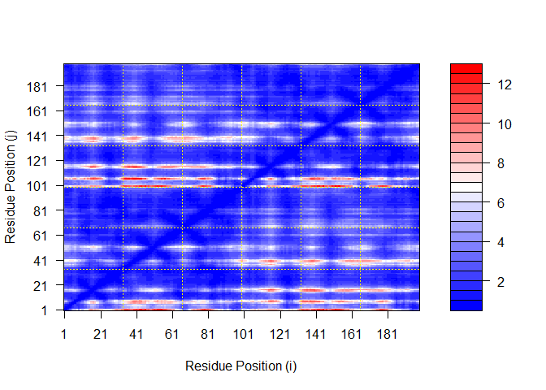
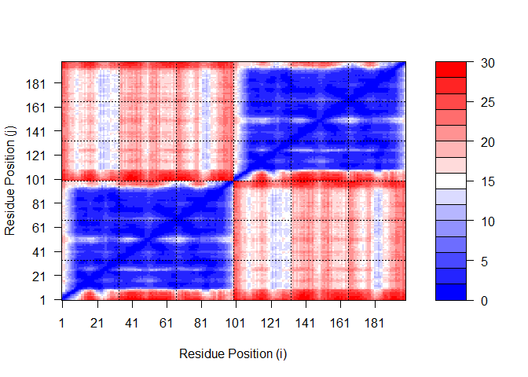
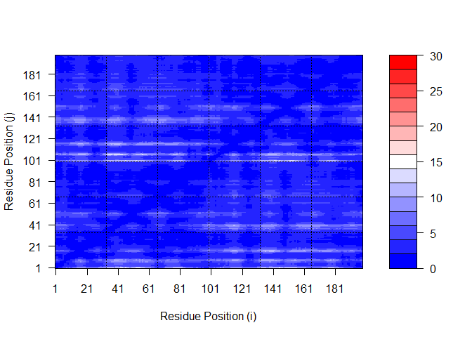
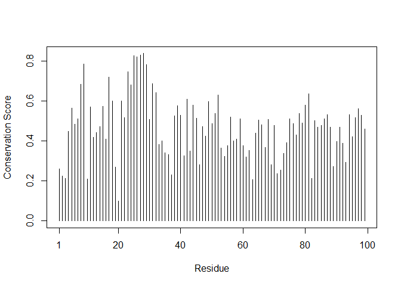
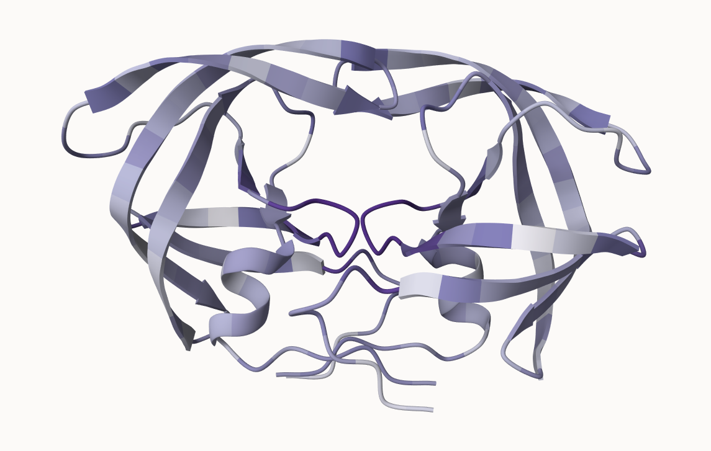

# Class 11: AlphaFold
Mankeerat Rataul

- [Custom analysis of resulting
  models](#custom-analysis-of-resulting-models)
- [Predicted Alignment Error for
  domains](#predicted-alignment-error-for-domains)
- [Residue Conservation from alignment
  file](#residue-conservation-from-alignment-file)

``` r
library(bio3d)

pdb <- read.pdb("HIV_DIMER_23119_0.result/HIV_DIMER_23119_0/HIV_DIMER_23119_0_unrelaxed_rank_001_alphafold2_multimer_v3_model_4_seed_000.pdb")

pdb
```


     Call:  read.pdb(file = "HIV_DIMER_23119_0.result/HIV_DIMER_23119_0/HIV_DIMER_23119_0_unrelaxed_rank_001_alphafold2_multimer_v3_model_4_seed_000.pdb")

       Total Models#: 1
         Total Atoms#: 1514,  XYZs#: 4542  Chains#: 2  (values: A B)

         Protein Atoms#: 1514  (residues/Calpha atoms#: 198)
         Nucleic acid Atoms#: 0  (residues/phosphate atoms#: 0)

         Non-protein/nucleic Atoms#: 0  (residues: 0)
         Non-protein/nucleic resid values: [ none ]

       Protein sequence:
          PQITLWQRPLVTIKIGGQLKEALLDTGADDTVLEEMSLPGRWKPKMIGGIGGFIKVRQYD
          QILIEICGHKAIGTVLVGPTPVNIIGRNLLTQIGCTLNFPQITLWQRPLVTIKIGGQLKE
          ALLDTGADDTVLEEMSLPGRWKPKMIGGIGGFIKVRQYDQILIEICGHKAIGTVLVGPTP
          VNIIGRNLLTQIGCTLNF

    + attr: atom, xyz, calpha, call

``` r
head(pdb$atom)
```

      type eleno elety  alt resid chain resno insert      x      y      z o     b
    1 ATOM     1     N <NA>   PRO     A     1   <NA> 16.922 -3.898 -6.254 1 90.81
    2 ATOM     2    CA <NA>   PRO     A     1   <NA> 16.891 -2.467 -6.562 1 90.81
    3 ATOM     3     C <NA>   PRO     A     1   <NA> 16.406 -1.617 -5.395 1 90.81
    4 ATOM     4    CB <NA>   PRO     A     1   <NA> 15.930 -2.373 -7.746 1 90.81
    5 ATOM     5     O <NA>   PRO     A     1   <NA> 15.820 -2.146 -4.445 1 90.81
    6 ATOM     6    CG <NA>   PRO     A     1   <NA> 15.031 -3.559 -7.598 1 90.81
      segid elesy charge
    1  <NA>     N   <NA>
    2  <NA>     C   <NA>
    3  <NA>     C   <NA>
    4  <NA>     C   <NA>
    5  <NA>     O   <NA>
    6  <NA>     C   <NA>

Make a vector of input PDB file names that we can read into R

``` r
pdbfiles <- list.files("HIV_DIMER_23119_0.result/HIV_DIMER_23119_0/", pattern=".pdb", full.names=TRUE)

pdbfiles
```

    [1] "HIV_DIMER_23119_0.result/HIV_DIMER_23119_0/HIV_DIMER_23119_0_unrelaxed_rank_001_alphafold2_multimer_v3_model_4_seed_000.pdb"
    [2] "HIV_DIMER_23119_0.result/HIV_DIMER_23119_0/HIV_DIMER_23119_0_unrelaxed_rank_002_alphafold2_multimer_v3_model_1_seed_000.pdb"
    [3] "HIV_DIMER_23119_0.result/HIV_DIMER_23119_0/HIV_DIMER_23119_0_unrelaxed_rank_003_alphafold2_multimer_v3_model_5_seed_000.pdb"
    [4] "HIV_DIMER_23119_0.result/HIV_DIMER_23119_0/HIV_DIMER_23119_0_unrelaxed_rank_004_alphafold2_multimer_v3_model_2_seed_000.pdb"
    [5] "HIV_DIMER_23119_0.result/HIV_DIMER_23119_0/HIV_DIMER_23119_0_unrelaxed_rank_005_alphafold2_multimer_v3_model_3_seed_000.pdb"

Below is the molstar image overlying it. Unfortunately it is not
possible to do both parts of the dimer for overlaying since there are
some strange errors, so I just aligned the right side.



## Custom analysis of resulting models

``` r
pdbs <- pdbaln(pdbfiles, fit=TRUE, exefile="msa")
```

    Reading PDB files:
    HIV_DIMER_23119_0.result/HIV_DIMER_23119_0/HIV_DIMER_23119_0_unrelaxed_rank_001_alphafold2_multimer_v3_model_4_seed_000.pdb
    HIV_DIMER_23119_0.result/HIV_DIMER_23119_0/HIV_DIMER_23119_0_unrelaxed_rank_002_alphafold2_multimer_v3_model_1_seed_000.pdb
    HIV_DIMER_23119_0.result/HIV_DIMER_23119_0/HIV_DIMER_23119_0_unrelaxed_rank_003_alphafold2_multimer_v3_model_5_seed_000.pdb
    HIV_DIMER_23119_0.result/HIV_DIMER_23119_0/HIV_DIMER_23119_0_unrelaxed_rank_004_alphafold2_multimer_v3_model_2_seed_000.pdb
    HIV_DIMER_23119_0.result/HIV_DIMER_23119_0/HIV_DIMER_23119_0_unrelaxed_rank_005_alphafold2_multimer_v3_model_3_seed_000.pdb
    .....

    Extracting sequences

    pdb/seq: 1   name: HIV_DIMER_23119_0.result/HIV_DIMER_23119_0/HIV_DIMER_23119_0_unrelaxed_rank_001_alphafold2_multimer_v3_model_4_seed_000.pdb 
    pdb/seq: 2   name: HIV_DIMER_23119_0.result/HIV_DIMER_23119_0/HIV_DIMER_23119_0_unrelaxed_rank_002_alphafold2_multimer_v3_model_1_seed_000.pdb 
    pdb/seq: 3   name: HIV_DIMER_23119_0.result/HIV_DIMER_23119_0/HIV_DIMER_23119_0_unrelaxed_rank_003_alphafold2_multimer_v3_model_5_seed_000.pdb 
    pdb/seq: 4   name: HIV_DIMER_23119_0.result/HIV_DIMER_23119_0/HIV_DIMER_23119_0_unrelaxed_rank_004_alphafold2_multimer_v3_model_2_seed_000.pdb 
    pdb/seq: 5   name: HIV_DIMER_23119_0.result/HIV_DIMER_23119_0/HIV_DIMER_23119_0_unrelaxed_rank_005_alphafold2_multimer_v3_model_3_seed_000.pdb 

``` r
pdbs
```

                                   1        .         .         .         .         50 
    [Truncated_Name:1]HIV_DIMER_   PQITLWQRPLVTIKIGGQLKEALLDTGADDTVLEEMSLPGRWKPKMIGGI
    [Truncated_Name:2]HIV_DIMER_   PQITLWQRPLVTIKIGGQLKEALLDTGADDTVLEEMSLPGRWKPKMIGGI
    [Truncated_Name:3]HIV_DIMER_   PQITLWQRPLVTIKIGGQLKEALLDTGADDTVLEEMSLPGRWKPKMIGGI
    [Truncated_Name:4]HIV_DIMER_   PQITLWQRPLVTIKIGGQLKEALLDTGADDTVLEEMSLPGRWKPKMIGGI
    [Truncated_Name:5]HIV_DIMER_   PQITLWQRPLVTIKIGGQLKEALLDTGADDTVLEEMSLPGRWKPKMIGGI
                                   ************************************************** 
                                   1        .         .         .         .         50 

                                  51        .         .         .         .         100 
    [Truncated_Name:1]HIV_DIMER_   GGFIKVRQYDQILIEICGHKAIGTVLVGPTPVNIIGRNLLTQIGCTLNFP
    [Truncated_Name:2]HIV_DIMER_   GGFIKVRQYDQILIEICGHKAIGTVLVGPTPVNIIGRNLLTQIGCTLNFP
    [Truncated_Name:3]HIV_DIMER_   GGFIKVRQYDQILIEICGHKAIGTVLVGPTPVNIIGRNLLTQIGCTLNFP
    [Truncated_Name:4]HIV_DIMER_   GGFIKVRQYDQILIEICGHKAIGTVLVGPTPVNIIGRNLLTQIGCTLNFP
    [Truncated_Name:5]HIV_DIMER_   GGFIKVRQYDQILIEICGHKAIGTVLVGPTPVNIIGRNLLTQIGCTLNFP
                                   ************************************************** 
                                  51        .         .         .         .         100 

                                 101        .         .         .         .         150 
    [Truncated_Name:1]HIV_DIMER_   QITLWQRPLVTIKIGGQLKEALLDTGADDTVLEEMSLPGRWKPKMIGGIG
    [Truncated_Name:2]HIV_DIMER_   QITLWQRPLVTIKIGGQLKEALLDTGADDTVLEEMSLPGRWKPKMIGGIG
    [Truncated_Name:3]HIV_DIMER_   QITLWQRPLVTIKIGGQLKEALLDTGADDTVLEEMSLPGRWKPKMIGGIG
    [Truncated_Name:4]HIV_DIMER_   QITLWQRPLVTIKIGGQLKEALLDTGADDTVLEEMSLPGRWKPKMIGGIG
    [Truncated_Name:5]HIV_DIMER_   QITLWQRPLVTIKIGGQLKEALLDTGADDTVLEEMSLPGRWKPKMIGGIG
                                   ************************************************** 
                                 101        .         .         .         .         150 

                                 151        .         .         .         .       198 
    [Truncated_Name:1]HIV_DIMER_   GFIKVRQYDQILIEICGHKAIGTVLVGPTPVNIIGRNLLTQIGCTLNF
    [Truncated_Name:2]HIV_DIMER_   GFIKVRQYDQILIEICGHKAIGTVLVGPTPVNIIGRNLLTQIGCTLNF
    [Truncated_Name:3]HIV_DIMER_   GFIKVRQYDQILIEICGHKAIGTVLVGPTPVNIIGRNLLTQIGCTLNF
    [Truncated_Name:4]HIV_DIMER_   GFIKVRQYDQILIEICGHKAIGTVLVGPTPVNIIGRNLLTQIGCTLNF
    [Truncated_Name:5]HIV_DIMER_   GFIKVRQYDQILIEICGHKAIGTVLVGPTPVNIIGRNLLTQIGCTLNF
                                   ************************************************ 
                                 151        .         .         .         .       198 

    Call:
      pdbaln(files = pdbfiles, fit = TRUE, exefile = "msa")

    Class:
      pdbs, fasta

    Alignment dimensions:
      5 sequence rows; 198 position columns (198 non-gap, 0 gap) 

    + attr: xyz, resno, b, chain, id, ali, resid, sse, call

``` r
rd <- rmsd(pdbs, fit=T)
```

    Warning in rmsd(pdbs, fit = T): No indices provided, using the 198 non NA positions

``` r
range(rd)
```

    [1]  0.000 14.754

Drawing a heatmap of the RMSD matrix values

``` r
library(pheatmap)

colnames(rd) <- paste0("m",1:5)
rownames(rd) <- paste0("m",1:5)
pheatmap(rd)
```



Below will be a read of all the pLDDT values

``` r
pdb2 <- read.pdb("1HSG")
```

      Note: Accessing on-line PDB file

``` r
plotb3(pdbs$b[1,], typ="l", lwd=2, sse=pdb)
```

    Warning in pdb2sse(sse): No helix and sheet defined in input 'sse' PDB object:
    try using dssp()

    Warning in plotb3(pdbs$b[1, ], typ = "l", lwd = 2, sse = pdb): Length of input
    'sse' does not equal the length of input 'x'; Ignoring 'sse'

``` r
points(pdbs$b[2,], typ="l", col="red")
points(pdbs$b[3,], typ="l", col="blue")
points(pdbs$b[4,], typ="l", col="darkgreen")
points(pdbs$b[5,], typ="l", col="orange")
abline(v=100, col="gray")
```



``` r
core <- core.find(pdbs)
```

     core size 197 of 198  vol = 9881.716 
     core size 196 of 198  vol = 6878.296 
     core size 195 of 198  vol = 1334.229 
     core size 194 of 198  vol = 1039.217 
     core size 193 of 198  vol = 950.298 
     core size 192 of 198  vol = 897.651 
     core size 191 of 198  vol = 833.382 
     core size 190 of 198  vol = 769.99 
     core size 189 of 198  vol = 731.732 
     core size 188 of 198  vol = 695.939 
     core size 187 of 198  vol = 658.409 
     core size 186 of 198  vol = 623.889 
     core size 185 of 198  vol = 588.148 
     core size 184 of 198  vol = 566.834 
     core size 183 of 198  vol = 543.661 
     core size 182 of 198  vol = 511.572 
     core size 181 of 198  vol = 489.388 
     core size 180 of 198  vol = 468.918 
     core size 179 of 198  vol = 449.633 
     core size 178 of 198  vol = 433.621 
     core size 177 of 198  vol = 419.234 
     core size 176 of 198  vol = 405.688 
     core size 175 of 198  vol = 392.453 
     core size 174 of 198  vol = 381.499 
     core size 173 of 198  vol = 371.883 
     core size 172 of 198  vol = 356.017 
     core size 171 of 198  vol = 345.622 
     core size 170 of 198  vol = 336.503 
     core size 169 of 198  vol = 325.735 
     core size 168 of 198  vol = 314.055 
     core size 167 of 198  vol = 303.257 
     core size 166 of 198  vol = 293.703 
     core size 165 of 198  vol = 284.865 
     core size 164 of 198  vol = 278.254 
     core size 163 of 198  vol = 266.143 
     core size 162 of 198  vol = 258.428 
     core size 161 of 198  vol = 247.147 
     core size 160 of 198  vol = 239.31 
     core size 159 of 198  vol = 234.436 
     core size 158 of 198  vol = 229.567 
     core size 157 of 198  vol = 221.505 
     core size 156 of 198  vol = 215.181 
     core size 155 of 198  vol = 206.319 
     core size 154 of 198  vol = 197.35 
     core size 153 of 198  vol = 188.035 
     core size 152 of 198  vol = 181.788 
     core size 151 of 198  vol = 176.501 
     core size 150 of 198  vol = 170.249 
     core size 149 of 198  vol = 165.704 
     core size 148 of 198  vol = 159.379 
     core size 147 of 198  vol = 153.34 
     core size 146 of 198  vol = 148.708 
     core size 145 of 198  vol = 143.325 
     core size 144 of 198  vol = 136.797 
     core size 143 of 198  vol = 132.187 
     core size 142 of 198  vol = 126.89 
     core size 141 of 198  vol = 121.226 
     core size 140 of 198  vol = 116.432 
     core size 139 of 198  vol = 112.209 
     core size 138 of 198  vol = 107.817 
     core size 137 of 198  vol = 104.77 
     core size 136 of 198  vol = 100.894 
     core size 135 of 198  vol = 97.097 
     core size 134 of 198  vol = 92.711 
     core size 133 of 198  vol = 87.976 
     core size 132 of 198  vol = 83.829 
     core size 131 of 198  vol = 81.711 
     core size 130 of 198  vol = 77.856 
     core size 129 of 198  vol = 75.599 
     core size 128 of 198  vol = 72.912 
     core size 127 of 198  vol = 70.604 
     core size 126 of 198  vol = 68.832 
     core size 125 of 198  vol = 66.515 
     core size 124 of 198  vol = 64.216 
     core size 123 of 198  vol = 60.981 
     core size 122 of 198  vol = 58.864 
     core size 121 of 198  vol = 56.456 
     core size 120 of 198  vol = 53.855 
     core size 119 of 198  vol = 51.645 
     core size 118 of 198  vol = 49.503 
     core size 117 of 198  vol = 48.055 
     core size 116 of 198  vol = 46.501 
     core size 115 of 198  vol = 44.58 
     core size 114 of 198  vol = 43.121 
     core size 113 of 198  vol = 40.925 
     core size 112 of 198  vol = 38.993 
     core size 111 of 198  vol = 36.323 
     core size 110 of 198  vol = 33.973 
     core size 109 of 198  vol = 31.337 
     core size 108 of 198  vol = 29.321 
     core size 107 of 198  vol = 27.222 
     core size 106 of 198  vol = 25.732 
     core size 105 of 198  vol = 24.059 
     core size 104 of 198  vol = 22.571 
     core size 103 of 198  vol = 20.997 
     core size 102 of 198  vol = 19.912 
     core size 101 of 198  vol = 18.312 
     core size 100 of 198  vol = 16.852 
     core size 99 of 198  vol = 14.362 
     core size 98 of 198  vol = 13.67 
     core size 97 of 198  vol = 10.548 
     core size 96 of 198  vol = 8.367 
     core size 95 of 198  vol = 6.437 
     core size 94 of 198  vol = 4.976 
     core size 93 of 198  vol = 4.06 
     core size 92 of 198  vol = 3.676 
     core size 91 of 198  vol = 2.77 
     core size 90 of 198  vol = 2.155 
     core size 89 of 198  vol = 1.712 
     core size 88 of 198  vol = 1.144 
     core size 87 of 198  vol = 0.866 
     core size 86 of 198  vol = 0.683 
     core size 85 of 198  vol = 0.528 
     core size 84 of 198  vol = 0.37 
     FINISHED: Min vol ( 0.5 ) reached

``` r
core.inds <- print(core, vol=0.5)
```

    # 85 positions (cumulative volume <= 0.5 Angstrom^3) 
      start end length
    1     9  49     41
    2    52  95     44

``` r
xyz <- pdbfit(pdbs, core.inds, outpath="corefit_structures")
```

``` r
rf <- rmsf(xyz)


plotb3(rf, sse=pdb)
```

    Warning in pdb2sse(sse): No helix and sheet defined in input 'sse' PDB object:
    try using dssp()

    Warning in plotb3(rf, sse = pdb): Length of input 'sse' does not equal the
    length of input 'x'; Ignoring 'sse'

``` r
abline(v=100, col="gray", ylab="RMSF")
```



## Predicted Alignment Error for domains

``` r
library(jsonlite)

results_dir <- "HIV_DIMER_23119_0.result/HIV_DIMER_23119_0/"
# Listing of all PAE JSON files
pae_files <- list.files(path=results_dir,
                        pattern=".*model.*\\.json",
                        full.names = TRUE)
```

``` r
pae1 <- read_json(pae_files[1],simplifyVector = TRUE)
pae5 <- read_json(pae_files[5],simplifyVector = TRUE)

attributes(pae1)
```

    $names
    [1] "plddt"   "max_pae" "pae"     "ptm"     "iptm"   

``` r
# Per-residue pLDDT scores 
#  same as B-factor of PDB..
head(pae1$plddt) 
```

    [1] 90.81 93.25 93.69 92.88 95.25 89.44

Maximum PAE values of each model to determine which has the most error:

``` r
pae1$max_pae
```

    [1] 12.84375

``` r
pae5$max_pae
```

    [1] 29.59375

Model 1 has lower PAE than model 5 thus is better due to having lower
error.

The below is an overall error frame showing the residues in the
prediction vs the real one for model 1:

``` r
plot.dmat(pae1$pae, 
          xlab="Residue Position (i)",
          ylab="Residue Position (j)")
```



Whereas the following is from model 5:

``` r
plot.dmat(pae5$pae, 
          xlab="Residue Position (i)",
          ylab="Residue Position (j)",
          grid.col = "black",
          zlim=c(0,30))
```



But the ranges are messed up because model 1 shows more finer error thus
use the following to actually view it:

``` r
plot.dmat(pae1$pae, 
          xlab="Residue Position (i)",
          ylab="Residue Position (j)",
          grid.col = "black",
          zlim=c(0,30))
```



## Residue Conservation from alignment file

Loads the file a3m into a variable for easier use:

``` r
aln_file <- list.files(path=results_dir,
                       pattern=".a3m$",
                        full.names = TRUE)
aln_file
```

    [1] "HIV_DIMER_23119_0.result/HIV_DIMER_23119_0/HIV_DIMER_23119_0.a3m"

Reads the fasta from the file above into a data frame:

``` r
aln <- read.fasta(aln_file[1], to.upper = TRUE)
```

    [1] " ** Duplicated sequence id's: 101 **"
    [2] " ** Duplicated sequence id's: 101 **"

Checks the number of sequences in this alignment:

``` r
dim(aln$ali)
```

    [1] 5397  132

The below ranks sequences by their conservation amount for certain
residues.

``` r
sim <- conserv(aln)
plotb3(sim[1:99], sse=trim.pdb(pdb, chain="A"),
       ylab="Conservation Score")
```

    Warning in pdb2sse(sse): No helix and sheet defined in input 'sse' PDB object:
    try using dssp()

    Warning in plotb3(sim[1:99], sse = trim.pdb(pdb, chain = "A"), ylab =
    "Conservation Score"): Length of input 'sse' does not equal the length of input
    'x'; Ignoring 'sse'



``` r
con <- consensus(aln, cutoff = 0.9)
con$seq
```

      [1] "-" "-" "-" "-" "-" "-" "-" "-" "-" "-" "-" "-" "-" "-" "-" "-" "-" "-"
     [19] "-" "-" "-" "-" "-" "-" "D" "T" "G" "A" "-" "-" "-" "-" "-" "-" "-" "-"
     [37] "-" "-" "-" "-" "-" "-" "-" "-" "-" "-" "-" "-" "-" "-" "-" "-" "-" "-"
     [55] "-" "-" "-" "-" "-" "-" "-" "-" "-" "-" "-" "-" "-" "-" "-" "-" "-" "-"
     [73] "-" "-" "-" "-" "-" "-" "-" "-" "-" "-" "-" "-" "-" "-" "-" "-" "-" "-"
     [91] "-" "-" "-" "-" "-" "-" "-" "-" "-" "-" "-" "-" "-" "-" "-" "-" "-" "-"
    [109] "-" "-" "-" "-" "-" "-" "-" "-" "-" "-" "-" "-" "-" "-" "-" "-" "-" "-"
    [127] "-" "-" "-" "-" "-" "-"

Visualization of important sites:

The below shows a consensus structure based on a consensus sequence.
This was received from molstar.

``` r
m1.pdb <- read.pdb(pdbfiles[1])
occ <- vec2resno(c(sim[1:99], sim[1:99]), m1.pdb$atom$resno)
write.pdb(m1.pdb, o=occ, file="m1_conserv.pdb")
```

The below shows purple as more conserved sites and white as more
variable sites


