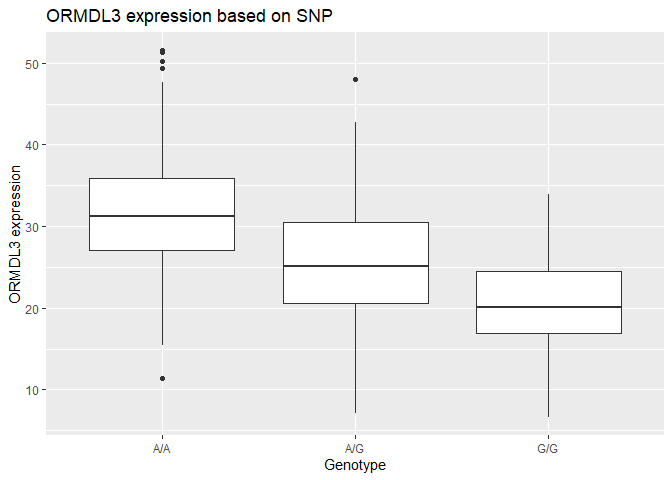

# Class 12: Population Scale Analysis Homework
Mankeerat Rataul

> Q13: Read this file into R and determine the sample size for each
> genotype and their corresponding median expression levels for each of
> these genotypes.

``` r
dataset <- read.table("https://bioboot.github.io/bggn213_W19/class-material/rs8067378_ENSG00000172057.6.txt")

table(dataset$geno)
```


    A/A A/G G/G 
    108 233 121 

``` r
nrow(dataset)
```

    [1] 462

The above shows the sample size for each genotype, the total dataset
consisting of 462 datapoints.

``` r
library(tidyverse)
```

    ── Attaching core tidyverse packages ──────────────────────── tidyverse 2.0.0 ──
    ✔ dplyr     1.2.1     ✔ readr     2.2.0
    ✔ forcats   1.0.1     ✔ stringr   1.6.0
    ✔ ggplot2   4.0.3     ✔ tibble    3.3.1
    ✔ lubridate 1.9.5     ✔ tidyr     1.3.2
    ✔ purrr     1.2.2     
    ── Conflicts ────────────────────────────────────────── tidyverse_conflicts() ──
    ✖ dplyr::filter() masks stats::filter()
    ✖ dplyr::lag()    masks stats::lag()
    ℹ Use the conflicted package (<http://conflicted.r-lib.org/>) to force all conflicts to become errors

``` r
AGonly <-  dataset %>%
  arrange(dataset$geno) %>%
  filter(geno == "A/G")

AAonly <-  dataset %>%
  arrange(dataset$geno) %>%
  filter(geno == "A/A")

GGonly <-  dataset %>%
  arrange(dataset$geno) %>%
  filter(geno == "G/G")

summary(AGonly)
```

           sample           geno          exp        
     Length   :233   Length   :233   Min.   : 7.075  
     N.unique :233   N.unique :  1   1st Qu.:20.626  
     N.blank  :  0   N.blank  :  0   Median :25.065  
     Min.nchar:  7   Min.nchar:  3   Mean   :25.397  
     Max.nchar:  7   Max.nchar:  3   3rd Qu.:30.552  
                                     Max.   :48.034  

``` r
summary(AAonly)
```

           sample           geno          exp       
     Length   :108   Length   :108   Min.   :11.40  
     N.unique :108   N.unique :  1   1st Qu.:27.02  
     N.blank  :  0   N.blank  :  0   Median :31.25  
     Min.nchar:  7   Min.nchar:  3   Mean   :31.82  
     Max.nchar:  7   Max.nchar:  3   3rd Qu.:35.92  
                                     Max.   :51.52  

``` r
summary(GGonly)
```

           sample           geno          exp        
     Length   :121   Length   :121   Min.   : 6.675  
     N.unique :121   N.unique :  1   1st Qu.:16.903  
     N.blank  :  0   N.blank  :  0   Median :20.074  
     Min.nchar:  7   Min.nchar:  3   Mean   :20.594  
     Max.nchar:  7   Max.nchar:  3   3rd Qu.:24.457  
                                     Max.   :33.956  

For A/G individuals the median expression for ORMDL3 is 25.065. For A/A,
it is 31.25, and for G/G, it is 20.074.

> Q14: Generate a boxplot with a box per genotype, what could you infer
> from the relative expression value between A/A and G/G displayed in
> this plot? Does the SNP effect the expression of ORMDL3?

``` r
library(ggplot2)

ggplot(dataset, aes(x=geno, y=exp)) +
  geom_boxplot() +
  labs(y="ORMDL3 expression", x="Genotype", title="ORMDL3 expression based on SNP")
```



This SNP seems to affect the expression of ORMDL3, as G/G has much lower
expression compared to A/A it seems, with A/G bridging the middle.
Visually this looks like there is a decrease due to the G allele.
