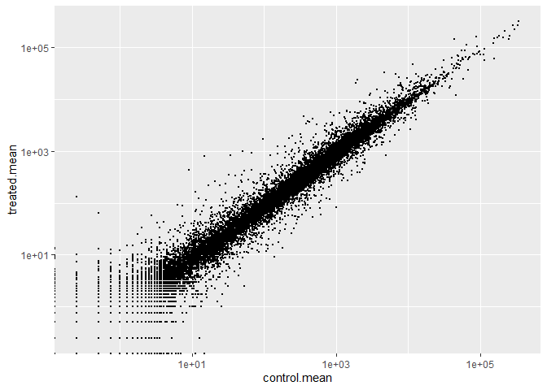
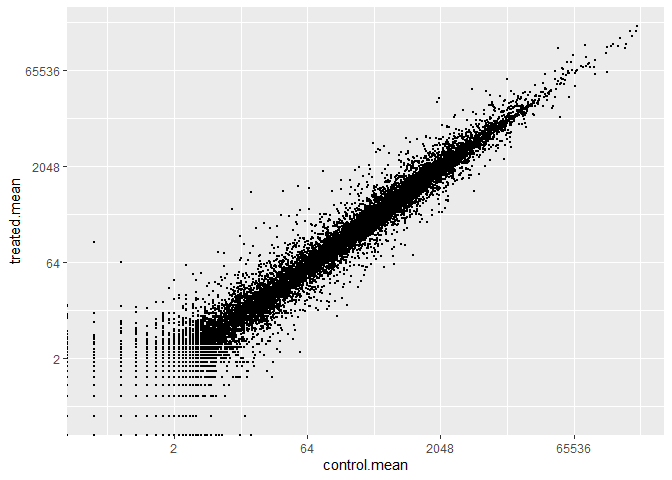
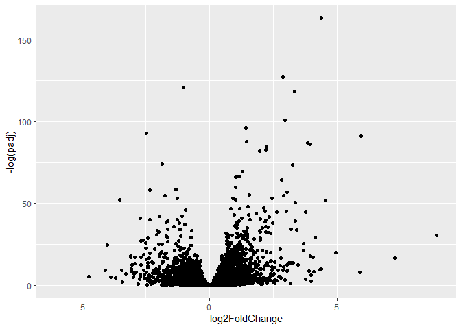

# Class 13: RNASeq Analysis with DESeq
Mankeerat Rataul

- [Background](#background)
- [Data Import](#data-import)
- [Toy differential gene expression](#toy-differential-gene-expression)
- [DESeq](#deseq)
- [Volcano plot](#volcano-plot)
- [Adding annotation data](#adding-annotation-data)
- [Pathway analysis](#pathway-analysis)
- [Save our annotated results](#save-our-annotated-results)

``` r
library(BiocManager)
library(DESeq2)
```

    Loading required package: S4Vectors

    Loading required package: stats4

    Loading required package: BiocGenerics

    Loading required package: generics


    Attaching package: 'generics'

    The following objects are masked from 'package:base':

        as.difftime, as.factor, as.ordered, intersect, is.element, setdiff,
        setequal, union


    Attaching package: 'BiocGenerics'

    The following objects are masked from 'package:stats':

        IQR, mad, sd, var, xtabs

    The following objects are masked from 'package:base':

        anyDuplicated, aperm, append, as.data.frame, basename, cbind,
        colnames, dirname, do.call, duplicated, eval, evalq, Filter, Find,
        get, grep, grepl, is.unsorted, lapply, Map, mapply, match, mget,
        order, paste, pmax, pmax.int, pmin, pmin.int, Position, rank,
        rbind, Reduce, rownames, sapply, saveRDS, table, tapply, unique,
        unsplit, which.max, which.min


    Attaching package: 'S4Vectors'

    The following object is masked from 'package:utils':

        findMatches

    The following objects are masked from 'package:base':

        expand.grid, I, unname

    Loading required package: IRanges


    Attaching package: 'IRanges'

    The following object is masked from 'package:grDevices':

        windows

    Loading required package: GenomicRanges

    Loading required package: Seqinfo

    Loading required package: SummarizedExperiment

    Loading required package: MatrixGenerics

    Loading required package: matrixStats


    Attaching package: 'MatrixGenerics'

    The following objects are masked from 'package:matrixStats':

        colAlls, colAnyNAs, colAnys, colAvgsPerRowSet, colCollapse,
        colCounts, colCummaxs, colCummins, colCumprods, colCumsums,
        colDiffs, colIQRDiffs, colIQRs, colLogSumExps, colMadDiffs,
        colMads, colMaxs, colMeans2, colMedians, colMins, colOrderStats,
        colProds, colQuantiles, colRanges, colRanks, colSdDiffs, colSds,
        colSums2, colTabulates, colVarDiffs, colVars, colWeightedMads,
        colWeightedMeans, colWeightedMedians, colWeightedSds,
        colWeightedVars, rowAlls, rowAnyNAs, rowAnys, rowAvgsPerColSet,
        rowCollapse, rowCounts, rowCummaxs, rowCummins, rowCumprods,
        rowCumsums, rowDiffs, rowIQRDiffs, rowIQRs, rowLogSumExps,
        rowMadDiffs, rowMads, rowMaxs, rowMeans2, rowMedians, rowMins,
        rowOrderStats, rowProds, rowQuantiles, rowRanges, rowRanks,
        rowSdDiffs, rowSds, rowSums2, rowTabulates, rowVarDiffs, rowVars,
        rowWeightedMads, rowWeightedMeans, rowWeightedMedians,
        rowWeightedSds, rowWeightedVars

    Loading required package: Biobase

    Welcome to Bioconductor

        Vignettes contain introductory material; view with
        'browseVignettes()'. To cite Bioconductor, see
        'citation("Biobase")', and for packages 'citation("pkgname")'.


    Attaching package: 'Biobase'

    The following object is masked from 'package:MatrixGenerics':

        rowMedians

    The following objects are masked from 'package:matrixStats':

        anyMissing, rowMedians

## Background

Today we’re going to do an RNA-seq of a dataset on the glucocorticoid
steroid dexamethasone, and we will use DESeq for this analysis.

## Data Import

Let’s read the `count` data and `metadata` about this experiment setup
from the CSV files supplied:

``` r
# Complete the missing code
counts <- read.csv("airway_scaledcounts.csv", row.names=1)
metadata <-  read.csv("airway_metadata.csv")

head(counts)
```

                    SRR1039508 SRR1039509 SRR1039512 SRR1039513 SRR1039516
    ENSG00000000003        723        486        904        445       1170
    ENSG00000000005          0          0          0          0          0
    ENSG00000000419        467        523        616        371        582
    ENSG00000000457        347        258        364        237        318
    ENSG00000000460         96         81         73         66        118
    ENSG00000000938          0          0          1          0          2
                    SRR1039517 SRR1039520 SRR1039521
    ENSG00000000003       1097        806        604
    ENSG00000000005          0          0          0
    ENSG00000000419        781        417        509
    ENSG00000000457        447        330        324
    ENSG00000000460         94        102         74
    ENSG00000000938          0          0          0

``` r
metadata
```

              id     dex celltype     geo_id
    1 SRR1039508 control   N61311 GSM1275862
    2 SRR1039509 treated   N61311 GSM1275863
    3 SRR1039512 control  N052611 GSM1275866
    4 SRR1039513 treated  N052611 GSM1275867
    5 SRR1039516 control  N080611 GSM1275870
    6 SRR1039517 treated  N080611 GSM1275871
    7 SRR1039520 control  N061011 GSM1275874
    8 SRR1039521 treated  N061011 GSM1275875

> Q1. How many genes are in this dataset?

``` r
nrow(counts)
```

    [1] 38694

38694 genes total.

> Q2. How many ‘control’ cell lines do we have?

``` r
table(metadata$dex)
```


    control treated 
          4       4 

4 control and 4 treated cell lines.

``` r
library(ggplot2)
library(tidyverse)
```

    ── Attaching core tidyverse packages ──────────────────────── tidyverse 2.0.0 ──
    ✔ dplyr     1.2.1     ✔ readr     2.2.0
    ✔ forcats   1.0.1     ✔ stringr   1.6.0
    ✔ lubridate 1.9.5     ✔ tibble    3.3.1
    ✔ purrr     1.2.2     ✔ tidyr     1.3.2
    ── Conflicts ────────────────────────────────────────── tidyverse_conflicts() ──
    ✖ lubridate::%within%() masks IRanges::%within%()
    ✖ dplyr::collapse()     masks IRanges::collapse()
    ✖ dplyr::combine()      masks Biobase::combine(), BiocGenerics::combine()
    ✖ dplyr::count()        masks matrixStats::count()
    ✖ dplyr::desc()         masks IRanges::desc()
    ✖ tidyr::expand()       masks S4Vectors::expand()
    ✖ dplyr::filter()       masks stats::filter()
    ✖ dplyr::first()        masks S4Vectors::first()
    ✖ dplyr::lag()          masks stats::lag()
    ✖ ggplot2::Position()   masks BiocGenerics::Position(), base::Position()
    ✖ purrr::reduce()       masks GenomicRanges::reduce(), IRanges::reduce()
    ✖ dplyr::rename()       masks S4Vectors::rename()
    ✖ lubridate::second()   masks S4Vectors::second()
    ✖ lubridate::second<-() masks S4Vectors::second<-()
    ✖ dplyr::slice()        masks IRanges::slice()
    ℹ Use the conflicted package (<http://conflicted.r-lib.org/>) to force all conflicts to become errors

## Toy differential gene expression

- Find the “control” columns in our ‘counts’ object
- Extract just the ‘control’ column values for all genes
- Calculate the average value per gene in these “control” columns

The means for control are found below:

``` r
control.inds <- metadata$dex == "control"
control.counts <- counts[, control.inds]

control.mean <- rowMeans(control.counts)
```

> Q3. How would you make the above code in either approach more robust?
> Is there a function that could help here?

rowMeans is used to replace the original code’s division of rowSums,
since if more samples are added then dividing by 4 would not be accurate
in the original code.

> Q4. Follow the same procedure for the treated samples (i.e. calculate
> the mean per gene across drug treated samples and assign to a labeled
> vector called treated.mean)

The means for treated are found below

``` r
treated.inds <- metadata$dex == "treated"
treated.counts <- counts[, treated.inds]

treated.mean <- rowMeans(treated.counts)
```

> Q5 (a). Create a scatter plot showing the mean of the treated samples
> against the mean of the control samples. Your plot should look
> something like the following.

And below we append the columns to make a full dataset and then plot the
differences.

``` r
meancounts <- data.frame(control.mean, treated.mean)

plot(meancounts)
```


> Q5 (b).You could also use the ggplot2 package to make this figure
> producing the plot below. What geom\_?() function would you use for
> this plot?

You would use `geom_point` to do this.

> Q6. Try plotting both axes on a log scale. What is the argument to
> plot() that allows you to do this?

You would add the argument `log="x"` within the parentheses after a
comma to plot. I used ggplot instead though with scale_x_log10()

It seems like there aren’t 38000 datapoints because most of them are
covering each other up. I will try to employ a log scale to combat this
high skew.

``` r
ggplot(meancounts, aes(control.mean, treated.mean)) +
  geom_point(size=0.01) +
  scale_x_log10() +
  scale_y_log10()
```

    Warning in scale_x_log10(): log-10 transformation introduced infinite values.

    Warning in scale_y_log10(): log-10 transformation introduced infinite values.



We most often use log2 transform for this kind of data because it makes
the interpretation of this data much easier.

``` r
ggplot(meancounts, aes(control.mean, treated.mean)) +
  geom_point(size=0.01) +
  scale_x_continuous(transform = "log2") +
  scale_y_continuous(transform = "log2")
```

    Warning in scale_x_continuous(transform = "log2"): log-2 transformation
    introduced infinite values.

    Warning in scale_y_continuous(transform = "log2"): log-2 transformation
    introduced infinite values.



> Q7. What is the purpose of the arr.ind argument in the which()
> function call above? Why would we then take the first column of the
> output and need to call the unique() function?

arr.ind just returns the values themselves instead of a binary TRUE or
FALSE for each value in the array. It makes the expression act as a
filter instead of some sort of a logic gate.

We call this fraction the “fold change” for log2

``` r
meancounts$log2fc <- log2(meancounts$treated.mean/meancounts$control.mean)

head(meancounts)
```

                    control.mean treated.mean      log2fc
    ENSG00000000003       900.75       658.00 -0.45303916
    ENSG00000000005         0.00         0.00         NaN
    ENSG00000000419       520.50       546.00  0.06900279
    ENSG00000000457       339.75       316.50 -0.10226805
    ENSG00000000460        97.25        78.75 -0.30441833
    ENSG00000000938         0.75         0.00        -Inf

``` r
noninfinds <- is.finite(meancounts$log2fc)
noninfmeancounts <- meancounts[noninfinds,]

head(noninfmeancounts)
```

                    control.mean treated.mean      log2fc
    ENSG00000000003       900.75       658.00 -0.45303916
    ENSG00000000419       520.50       546.00  0.06900279
    ENSG00000000457       339.75       316.50 -0.10226805
    ENSG00000000460        97.25        78.75 -0.30441833
    ENSG00000000971      5219.00      6687.50  0.35769358
    ENSG00000001036      2327.00      1785.75 -0.38194109

A common ‘rule of thumb’ threshold for calling a gene ‘upregulated’ or
‘downregulated’ is a log2 fold-change value of +2 or -2 or greater.

> Q8. Using the up.ind vector above can you determine how many up
> regulated genes we have at the greater than 2 fc level?

``` r
up.ind <- noninfmeancounts$log2fc > 2
sum(up.ind)
```

    [1] 250

Yes, there are 250 upregulated genes.

> Q9. Using the down.ind vector above can you determine how many down
> regulated genes we have at the greater than 2 fc level?

``` r
down.ind <- noninfmeancounts$log2fc < (-2)
sum(down.ind)
```

    [1] 367

Yes, there are 367 downregulated genes lower than -2.

> Q10. Do you trust these results? Why or why not?

Not at all, there were no significance tests done to determine if these
are actually different, and some may be very close to the threshold.

## DESeq

Let’s do a proper analysis and not forget about stat significance.

For this we will use the **DESeq2** package

``` r
library(DESeq2)
```

To run a DESeq analysis we need 2 inputs:

- `countdata` or gene counts across diff experiments
- `colData` or our metadata about those count columns

``` r
dds <- DESeqDataSetFromMatrix(countData=counts,
                              colData=metadata,
                              design = ~dex)
```

    converting counts to integer mode

Now we can run the DESeq analysis pipeline using this `dds` object that
has all the inputs we need.

``` r
dds <- DESeq(dds)
```

    estimating size factors

    estimating dispersions

    gene-wise dispersion estimates

    mean-dispersion relationship

    final dispersion estimates

    fitting model and testing

``` r
res <- results(dds)
head(res)
```

    log2 fold change (MLE): dex treated vs control 
    Wald test p-value: dex treated vs control 
    DataFrame with 6 rows and 6 columns
                      baseMean log2FoldChange     lfcSE      stat    pvalue
                     <numeric>      <numeric> <numeric> <numeric> <numeric>
    ENSG00000000003 747.194195     -0.3507030  0.168246 -2.084470 0.0371175
    ENSG00000000005   0.000000             NA        NA        NA        NA
    ENSG00000000419 520.134160      0.2061078  0.101059  2.039475 0.0414026
    ENSG00000000457 322.664844      0.0245269  0.145145  0.168982 0.8658106
    ENSG00000000460  87.682625     -0.1471420  0.257007 -0.572521 0.5669691
    ENSG00000000938   0.319167     -1.7322890  3.493601 -0.495846 0.6200029
                         padj
                    <numeric>
    ENSG00000000003  0.163035
    ENSG00000000005        NA
    ENSG00000000419  0.176032
    ENSG00000000457  0.961694
    ENSG00000000460  0.815849
    ENSG00000000938        NA

## Volcano plot

This is useful for data with the log fold chnage and adjusted p value
into one plot. Basically looks like a volcano almost and above a certain
threshold are significant points with the rest grouped into useless.

``` r
ggplot(res, aes(x=log2FoldChange, y=padj)) +
  geom_point()
```

    Warning: Removed 23549 rows containing missing values or values outside the scale range
    (`geom_point()`).


Useless plot, we don’t care about the very high p values so it being at
such high scale is wasteful of plotting space. Better to scale on a log
so smaller p values are magnified that are below the alpha threshold
such as 0.01 or 0.05.

The y axis is flipped using -log instead of positive so that the volcano
is upside up, with higher significance due to lower p being higher.

``` r
ggplot(res, aes(x=log2FoldChange, y=-log(padj))) +
  geom_point()
```

    Warning: Removed 23549 rows containing missing values or values outside the scale range
    (`geom_point()`).



Nearly perfect, just needs threshold to show which points are useful.
I’ll try using plotly so that you can see the genes.

> Q. Add annotation to this volcano plot including the log2 fold-change
> thresholds of +2 and -2 and the p-value threshold of 0.05. Also color
> up just the genes that meet both these thresholds. These are the ones
> we will focus on next day!

``` r
library(plotly)
```


    Attaching package: 'plotly'

    The following object is masked from 'package:ggplot2':

        last_plot

    The following object is masked from 'package:IRanges':

        slice

    The following object is masked from 'package:S4Vectors':

        rename

    The following object is masked from 'package:stats':

        filter

    The following object is masked from 'package:graphics':

        layout

``` r
res$sigpos <- ifelse(res$padj < 0.05 & res$log2FoldChange > 2, "sigpos", ifelse(res$padj <0.05 & res$log2FoldChange < -2, "sigpos", ifelse(res$padj>0.05 & res$log2FoldChange < -2, "nonsigpos", ifelse(res$padj>0.05 & res$log2FoldChange > 2, "nonsigpos", "nonsig"))))

res
```

    log2 fold change (MLE): dex treated vs control 
    Wald test p-value: dex treated vs control 
    DataFrame with 38694 rows and 7 columns
                     baseMean log2FoldChange     lfcSE      stat    pvalue
                    <numeric>      <numeric> <numeric> <numeric> <numeric>
    ENSG00000000003  747.1942     -0.3507030  0.168246 -2.084470 0.0371175
    ENSG00000000005    0.0000             NA        NA        NA        NA
    ENSG00000000419  520.1342      0.2061078  0.101059  2.039475 0.0414026
    ENSG00000000457  322.6648      0.0245269  0.145145  0.168982 0.8658106
    ENSG00000000460   87.6826     -0.1471420  0.257007 -0.572521 0.5669691
    ...                   ...            ...       ...       ...       ...
    ENSG00000283115  0.000000             NA        NA        NA        NA
    ENSG00000283116  0.000000             NA        NA        NA        NA
    ENSG00000283119  0.000000             NA        NA        NA        NA
    ENSG00000283120  0.974916      -0.668258   1.69456 -0.394354  0.693319
    ENSG00000283123  0.000000             NA        NA        NA        NA
                         padj      sigpos
                    <numeric> <character>
    ENSG00000000003  0.163035      nonsig
    ENSG00000000005        NA          NA
    ENSG00000000419  0.176032      nonsig
    ENSG00000000457  0.961694      nonsig
    ENSG00000000460  0.815849      nonsig
    ...                   ...         ...
    ENSG00000283115        NA          NA
    ENSG00000283116        NA          NA
    ENSG00000283119        NA          NA
    ENSG00000283120        NA      nonsig
    ENSG00000283123        NA          NA

\#`{r} plot_ly(as.data.frame(res), x=res$log2FoldChange, y=-log(res$padj), type="scatter", mode="markers", marker=list(size=4), text=~row.names(res), hoverinfo="text", color = res$sigpos, colors = c("sigpos" = "blue", "nonsigpos" = "red", "nonsig" = "darkgray")) %>% layout(dragmode = 'zoom') %>% config(scrollZoom=TRUE) #`

``` r
write.csv(res, file="myresults.csv")
```

## Adding annotation data

We need to map or translate our ENSEMBLE gene identifiers in our results
object to date to the identifiers used in different databases.

``` r
library("AnnotationDbi")
library("org.Hs.eg.db")
```

We can see the columns in `org.Hs.eg.db` that list the different
databases we can map between:

``` r
columns(org.Hs.eg.db)
```

     [1] "ACCNUM"       "ALIAS"        "ENSEMBL"      "ENSEMBLPROT"  "ENSEMBLTRANS"
     [6] "ENTREZID"     "ENZYME"       "EVIDENCE"     "EVIDENCEALL"  "GENENAME"    
    [11] "GENETYPE"     "GO"           "GOALL"        "IPI"          "MAP"         
    [16] "OMIM"         "ONTOLOGY"     "ONTOLOGYALL"  "PATH"         "PFAM"        
    [21] "PMID"         "PROSITE"      "REFSEQ"       "SYMBOL"       "UCSCKG"      
    [26] "UNIPROT"     

We can now use the `mapIDs()` function to map between these different
database identifier formats:

``` r
res$symbol <- mapIds(org.Hs.eg.db,
       keys=row.names(res), 
       keytype="ENSEMBL",
       column="SYMBOL")
```

    'select()' returned 1:many mapping between keys and columns

> Q11. Run the mapIds() function two more times to add the Entrez ID and
> UniProt accession and GENENAME as new columns called
> res$entrez, res$uniprot and res\$genename.

> Q. Can you map to “GENENAME” and add as a new col to our `res` object

> Q. Add “ENTREZID” as `res$entrez`

``` r
res$genename <- mapIds(org.Hs.eg.db,
       keys=row.names(res), 
       keytype="ENSEMBL",
       column="GENENAME")
```

    'select()' returned 1:many mapping between keys and columns

``` r
res$entrez <- mapIds(org.Hs.eg.db,
       keys=row.names(res), 
       keytype="ENSEMBL",
       column="ENTREZID")
```

    'select()' returned 1:many mapping between keys and columns

\#`{r} plot_ly(as.data.frame(res), x=res$log2FoldChange, y=-log(res$padj), type="scatter", mode="markers", marker=list(size=4), text=res$symbol, hoverinfo="text", color = res$sigpos, colors = c("sigpos" = "blue", "nonsigpos" = "red", "nonsig" = "darkgray")) %>% layout(dragmode = 'zoom') %>% config(scrollZoom=TRUE) #`

## Pathway analysis

Now that we have our annotated results with their log2 fold-change and
p-values we can figure out which biological pathways and processes these
genes are involved with.

We will use the **gage** and **pathview** packages for this step and we
an install them with
`BiocManager::install(c("pathview", "gage", "gageData"))`

``` r
library(gage)
```

``` r
library(gageData)
library(pathview)
```

    ##############################################################################
    Pathview is an open source software package distributed under GNU General
    Public License version 3 (GPLv3). Details of GPLv3 is available at
    http://www.gnu.org/licenses/gpl-3.0.html. Particullary, users are required to
    formally cite the original Pathview paper (not just mention it) in publications
    or products. For details, do citation("pathview") within R.

    The pathview downloads and uses KEGG data. Non-academic uses may require a KEGG
    license agreement (details at http://www.kegg.jp/kegg/legal.html).
    ##############################################################################

Let’s have a peek at gageData

``` r
data(kegg.sets.hs)

head(kegg.sets.hs, 2)
```

    $`hsa00232 Caffeine metabolism`
    [1] "10"   "1544" "1548" "1549" "1553" "7498" "9"   

    $`hsa00983 Drug metabolism - other enzymes`
     [1] "10"     "1066"   "10720"  "10941"  "151531" "1548"   "1549"   "1551"  
     [9] "1553"   "1576"   "1577"   "1806"   "1807"   "1890"   "221223" "2990"  
    [17] "3251"   "3614"   "3615"   "3704"   "51733"  "54490"  "54575"  "54576" 
    [25] "54577"  "54578"  "54579"  "54600"  "54657"  "54658"  "54659"  "54963" 
    [33] "574537" "64816"  "7083"   "7084"   "7172"   "7363"   "7364"   "7365"  
    [41] "7366"   "7367"   "7371"   "7372"   "7378"   "7498"   "79799"  "83549" 
    [49] "8824"   "8833"   "9"      "978"   

We need a named vector of importance (e.g. fold change values) that has
gene ids as names. These names need to be in the correct format (using
the correct database format for the IDs).

Here we will make an input vector called `foldchanges` that has “entrez”
ids as names.

``` r
foldchanges <- res$log2FoldChange
names(foldchanges) <- res$entrez
```

Now we can run `gage()` to do our pathway analysis.

``` r
keggres = gage(foldchanges, gsets=kegg.sets.hs)
```

``` r
attributes(keggres)
```

    $names
    [1] "greater" "less"    "stats"  

The top 3 overlapping pathways from k

``` r
head(keggres$less, 3)
```

                                          p.geomean stat.mean        p.val
    hsa05332 Graft-versus-host disease 0.0004250461 -3.473346 0.0004250461
    hsa04940 Type I diabetes mellitus  0.0017820293 -3.002352 0.0017820293
    hsa05310 Asthma                    0.0020045888 -3.009050 0.0020045888
                                            q.val set.size         exp1
    hsa05332 Graft-versus-host disease 0.09053483       40 0.0004250461
    hsa04940 Type I diabetes mellitus  0.14232581       42 0.0017820293
    hsa05310 Asthma                    0.14232581       29 0.0020045888

Now we can use the **pathview** package with the found KEGG pathway IDs
(e.g. hsa05310 for asthma pathway) to make a pathway figure showing our
differential expressed genes (DEGs).

``` r
pathview(gene.data=foldchanges, pathway.id="hsa05310")
```

    'select()' returned 1:1 mapping between keys and columns

    Info: Working in directory C:/Users/keera/Documents/BIMM 143/bimm143_github/class1314

    Info: Writing image file hsa05310.pathview.png


> Q12. Can you do the same procedure as above to plot the pathview
> figures for the top 2 down-reguled pathways?

``` r
pathview(gene.data=foldchanges, pathway.id="hsa05332")
```

    'select()' returned 1:1 mapping between keys and columns

    Info: Working in directory C:/Users/keera/Documents/BIMM 143/bimm143_github/class1314

    Info: Writing image file hsa05332.pathview.png

``` r
pathview(gene.data=foldchanges, pathway.id="hsa04940")
```

    'select()' returned 1:1 mapping between keys and columns

    Info: Working in directory C:/Users/keera/Documents/BIMM 143/bimm143_github/class1314

    Info: Writing image file hsa04940.pathview.png

 

## Save our annotated results

``` r
write.csv(res, file="myresults_annotated.csv")
```
