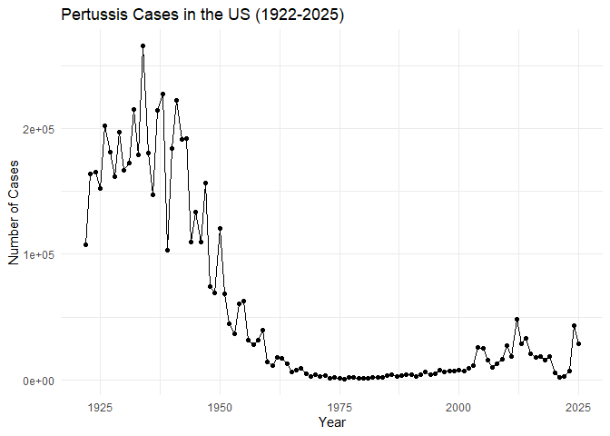
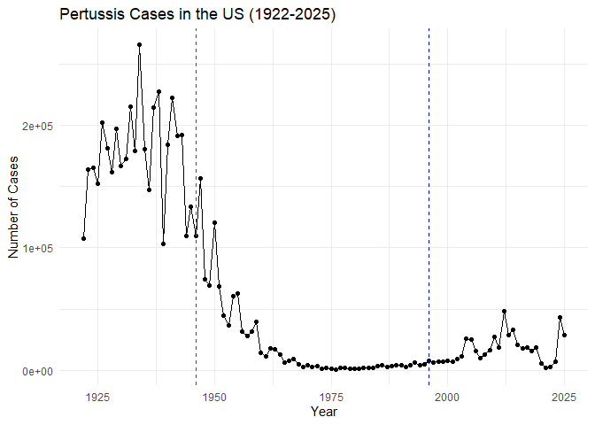
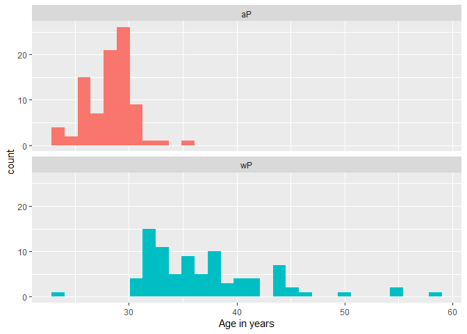
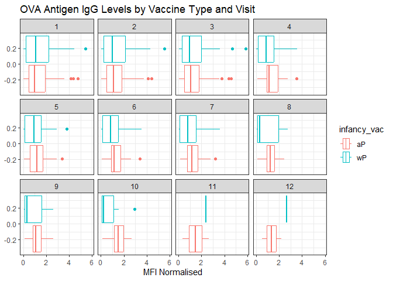
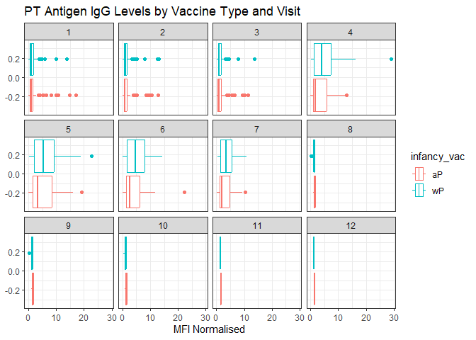
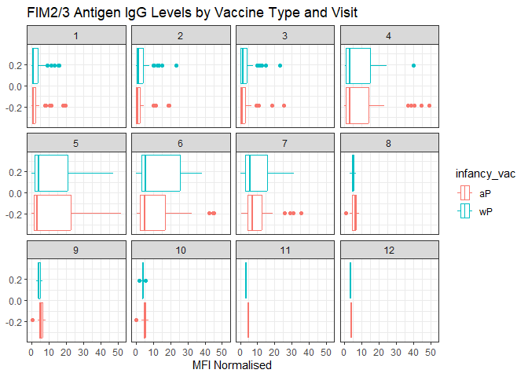
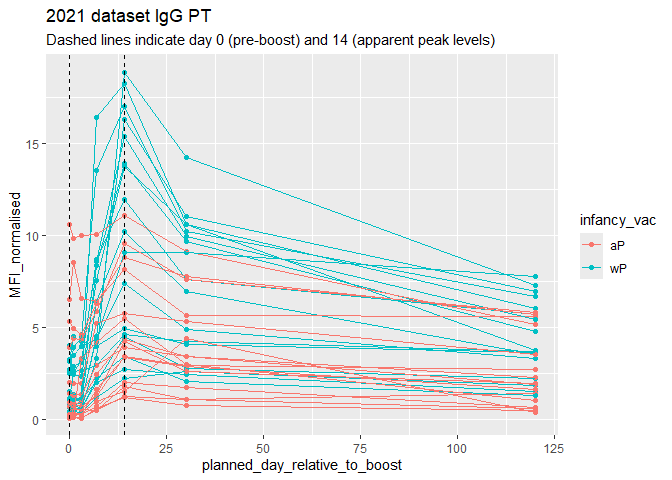
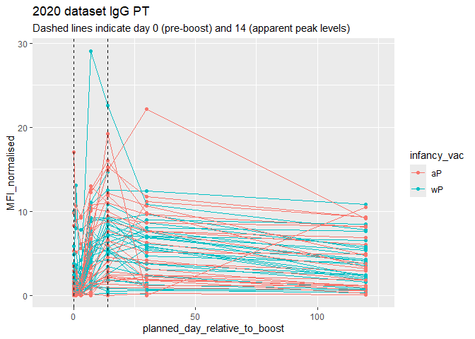
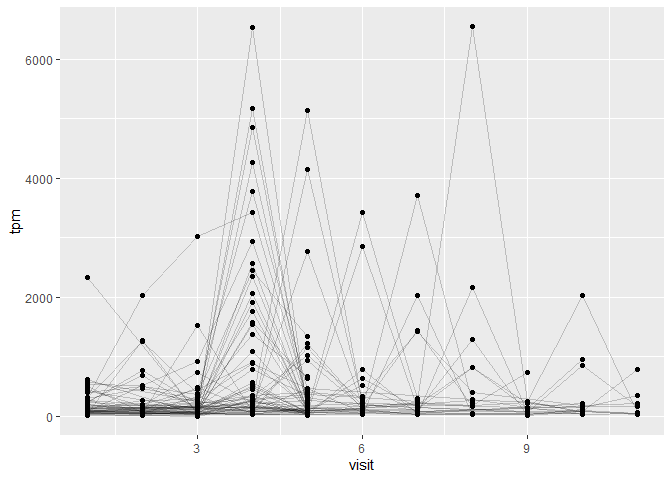
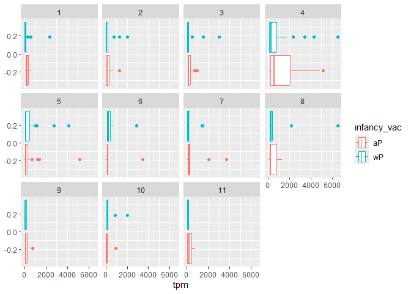

# Class 19: Investigating Pertussis Resurgence Mini Project
Mankeerat Rataul

Import the case data for pertussis below:

## Investigating Pertussis cases by year

> Q1. With the help of the R “addin” package datapasta assign the CDC
> pertussis case number data to a data frame called cdc and use ggplot
> to make a plot of cases numbers over time.

``` r
cdc <- read.csv("U.S. Reported Pertussis Cases_ 1922 - 2025.csv")

head(cdc)
```

      Year Number.of.Reported.Pertussis.Cases Data.Status
    1 1922                            107,473   Finalized
    2 1923                            164,191   Finalized
    3 1924                            165,418   Finalized
    4 1925                            152,003   Finalized
    5 1926                            202,210   Finalized
    6 1927                            181,411   Finalized

There is a problem where half of the data is in character form so we
need to transform the Reported Case column to integer form.

``` r
cdc$Number.of.Reported.Pertussis.Cases <- as.integer(gsub(",", "", cdc$Number.of.Reported.Pertussis.Cases))

head(cdc)
```

      Year Number.of.Reported.Pertussis.Cases Data.Status
    1 1922                             107473   Finalized
    2 1923                             164191   Finalized
    3 1924                             165418   Finalized
    4 1925                             152003   Finalized
    5 1926                             202210   Finalized
    6 1927                             181411   Finalized

``` r
library(ggplot2)

ggplot(cdc, aes(x=Year, y=Number.of.Reported.Pertussis.Cases)) + 
  geom_point() +
  geom_line() +
  labs(title = "Pertussis Cases in the US (1922-2025)",
       x = "Year",
       y = "Number of Cases") +
  theme_minimal()
```



## A tale of two vaccines (wp and ap)

> Q2. Using the ggplot geom_vline() function add lines to your previous
> plot for the 1946 introduction of the wP vaccine and the 1996 switch
> to aP vaccine (see example in the hint below). What do you notice?

``` r
library(ggplot2)

ggplot(cdc, aes(x=Year, y=Number.of.Reported.Pertussis.Cases)) + 
  geom_point() +
  geom_line() +
  geom_vline(xintercept = 1946, linetype = "dashed", color = "red") +
  geom_vline(xintercept = 1996, linetype = "dashed", color = "blue") +
  labs(title = "Pertussis Cases in the US (1922-2025)",
       x = "Year",
       y = "Number of Cases") +
  theme_minimal()
```



> Q3. Describe what happened after the introduction of the aP vaccine?
> Do you have a possible explanation for the observed trend?

It seems like cases started spiking after the introduction. It could be
that the vaccine is possibly less effective, however it could also be
due to other factors like vaccine hesitancy as mentioned in class.

## Exploring CMI-PB data

Jsonlite needs to be called to read the CMI-PB data below.

``` r
library(jsonlite)

subject <- read_json("https://www.cmi-pb.org/api/subject", simplifyVector=TRUE)

head(subject)
```

      subject_id infancy_vac biological_sex              ethnicity  race
    1          1          wP         Female Not Hispanic or Latino White
    2          2          wP         Female Not Hispanic or Latino White
    3          3          wP         Female                Unknown White
    4          4          wP           Male Not Hispanic or Latino Asian
    5          5          wP           Male Not Hispanic or Latino Asian
    6          6          wP         Female Not Hispanic or Latino White
      year_of_birth date_of_boost      dataset
    1    1986-01-01    2016-09-12 2020_dataset
    2    1968-01-01    2019-01-28 2020_dataset
    3    1983-01-01    2016-10-10 2020_dataset
    4    1988-01-01    2016-08-29 2020_dataset
    5    1991-01-01    2016-08-29 2020_dataset
    6    1988-01-01    2016-10-10 2020_dataset

> Q4. How many aP and wP infancy vaccinated subjects are in the dataset?

``` r
table(subject$infancy_vac)
```


    aP wP 
    87 85 

87 aP subjects and 85 wP subjects are in the dataset, for a total of 172
subjects.

> Q5. How many Male and Female subjects/patients are in the dataset?

``` r
table(subject$biological_sex)
```


    Female   Male 
       112     60 

112 female and 60 male subjects.

> Q6. What is the breakdown of race and biological sex (e.g. number of
> Asian females, White males etc…)?

``` r
table(subject$biological_sex, subject$race)
```

            
             American Indian/Alaska Native Asian Black or African American
      Female                             0    32                         2
      Male                               1    12                         3
            
             More Than One Race Native Hawaiian or Other Pacific Islander
      Female                 15                                         1
      Male                    4                                         1
            
             Unknown or Not Reported White
      Female                      14    48
      Male                         7    32

32 asian females, 32 white males, etc. for other races

Below I’ll use a library to deal with dates:

``` r
library(lubridate)
```


    Attaching package: 'lubridate'

    The following objects are masked from 'package:base':

        date, intersect, setdiff, union

``` r
today()
```

    [1] "2026-06-08"

> Q7. Using this approach determine (i) the average age of wP
> individuals, (ii) the average age of aP individuals; and (iii) are
> they significantly different?

So we can use `ymd()` to convert the date of birth from a string into a
date and then subtract from the current date. I’m gonna need to use
tidyverse in order to filter the pipe for each respective category

``` r
subject$age <- time_length(today() - ymd(subject$year_of_birth), "years")

library(tidyverse)
```

    ── Attaching core tidyverse packages ──────────────────────── tidyverse 2.0.0 ──
    ✔ dplyr   1.2.1     ✔ stringr 1.6.0
    ✔ forcats 1.0.1     ✔ tibble  3.3.1
    ✔ purrr   1.2.2     ✔ tidyr   1.3.2
    ✔ readr   2.2.0     
    ── Conflicts ────────────────────────────────────────── tidyverse_conflicts() ──
    ✖ dplyr::filter()  masks stats::filter()
    ✖ purrr::flatten() masks jsonlite::flatten()
    ✖ dplyr::lag()     masks stats::lag()
    ℹ Use the conflicted package (<http://conflicted.r-lib.org/>) to force all conflicts to become errors

``` r
##First gonna find the one for ap vaccine
apdataset <- subject %>%
  filter(infancy_vac == "aP")

wpdataset <- subject %>%
  filter(infancy_vac == "wP")

mean(apdataset$age)
```

    [1] 28.3293

``` r
mean(wpdataset$age)
```

    [1] 37.08

``` r
ttest_result <- t.test(apdataset$age, wpdataset$age)

ttest_result
```


        Welch Two Sample t-test

    data:  apdataset$age and wpdataset$age
    t = -12.918, df = 104.03, p-value < 2.2e-16
    alternative hypothesis: true difference in means is not equal to 0
    95 percent confidence interval:
     -10.094058  -7.407351
    sample estimates:
    mean of x mean of y 
      28.3293   37.0800 

The average age of subjects in the ap dataset is ~28.30 years old, and
for the wp dataset it is 37.05 years old.

According to the t-test, the p value is extremely low thus it’s a clear
difference in age between these groups.

> Q8. Determine the age of all individuals at time of boost?

``` r
subject$age_at_boost <- time_length(ymd(subject$date_of_boost) - ymd(subject$year_of_birth), "years")

head(subject)
```

      subject_id infancy_vac biological_sex              ethnicity  race
    1          1          wP         Female Not Hispanic or Latino White
    2          2          wP         Female Not Hispanic or Latino White
    3          3          wP         Female                Unknown White
    4          4          wP           Male Not Hispanic or Latino Asian
    5          5          wP           Male Not Hispanic or Latino Asian
    6          6          wP         Female Not Hispanic or Latino White
      year_of_birth date_of_boost      dataset      age age_at_boost
    1    1986-01-01    2016-09-12 2020_dataset 40.43258     30.69678
    2    1968-01-01    2019-01-28 2020_dataset 58.43395     51.07461
    3    1983-01-01    2016-10-10 2020_dataset 43.43326     33.77413
    4    1988-01-01    2016-08-29 2020_dataset 38.43395     28.65982
    5    1991-01-01    2016-08-29 2020_dataset 35.43326     25.65914
    6    1988-01-01    2016-10-10 2020_dataset 38.43395     28.77481

> Q9. With the help of a faceted boxplot or histogram (see below), do
> you think these two groups are significantly different?

``` r
ggplot(subject) +
  aes(age, fill = infancy_vac) +
  geom_histogram(show.legend=FALSE) +
  facet_wrap(vars(infancy_vac), nrow=2) +
  xlab("Age in years")
```

    `stat_bin()` using `bins = 30`. Pick better value `binwidth`.



It does seem like there is a big difference in these groups by histogram
with wP being administered to those generally older whereas aP is rarely
administered to anyone older than 30.

Below I need to download and append the other data to this dataset in
order to interpret antibody titers, etc.

``` r
specimen <- read_json("https://www.cmi-pb.org/api/specimen", simplifyVector = TRUE)
titer <- read_json("https://www.cmi-pb.org/api/plasma_ab_titer", simplifyVector = TRUE)
```

> Q9. Complete the code to join specimen and subject tables to make a
> new merged data frame containing all specimen records along with their
> associated subject details:

``` r
head(specimen)
```

      specimen_id subject_id actual_day_relative_to_boost
    1           1          1                           -3
    2           2          1                            1
    3           3          1                            3
    4           4          1                            7
    5           5          1                           11
    6           6          1                           32
      planned_day_relative_to_boost specimen_type visit
    1                             0         Blood     1
    2                             1         Blood     2
    3                             3         Blood     3
    4                             7         Blood     4
    5                            14         Blood     5
    6                            30         Blood     6

``` r
head(subject)
```

      subject_id infancy_vac biological_sex              ethnicity  race
    1          1          wP         Female Not Hispanic or Latino White
    2          2          wP         Female Not Hispanic or Latino White
    3          3          wP         Female                Unknown White
    4          4          wP           Male Not Hispanic or Latino Asian
    5          5          wP           Male Not Hispanic or Latino Asian
    6          6          wP         Female Not Hispanic or Latino White
      year_of_birth date_of_boost      dataset      age age_at_boost
    1    1986-01-01    2016-09-12 2020_dataset 40.43258     30.69678
    2    1968-01-01    2019-01-28 2020_dataset 58.43395     51.07461
    3    1983-01-01    2016-10-10 2020_dataset 43.43326     33.77413
    4    1988-01-01    2016-08-29 2020_dataset 38.43395     28.65982
    5    1991-01-01    2016-08-29 2020_dataset 35.43326     25.65914
    6    1988-01-01    2016-10-10 2020_dataset 38.43395     28.77481

We’d use full_join here since there are multiple specimens for each
subject so you need to preserve that data.

``` r
meta <- full_join(specimen, subject)
```

    Joining with `by = join_by(subject_id)`

``` r
dim(meta)
```

    [1] 1504   15

``` r
head(meta)
```

      specimen_id subject_id actual_day_relative_to_boost
    1           1          1                           -3
    2           2          1                            1
    3           3          1                            3
    4           4          1                            7
    5           5          1                           11
    6           6          1                           32
      planned_day_relative_to_boost specimen_type visit infancy_vac biological_sex
    1                             0         Blood     1          wP         Female
    2                             1         Blood     2          wP         Female
    3                             3         Blood     3          wP         Female
    4                             7         Blood     4          wP         Female
    5                            14         Blood     5          wP         Female
    6                            30         Blood     6          wP         Female
                   ethnicity  race year_of_birth date_of_boost      dataset
    1 Not Hispanic or Latino White    1986-01-01    2016-09-12 2020_dataset
    2 Not Hispanic or Latino White    1986-01-01    2016-09-12 2020_dataset
    3 Not Hispanic or Latino White    1986-01-01    2016-09-12 2020_dataset
    4 Not Hispanic or Latino White    1986-01-01    2016-09-12 2020_dataset
    5 Not Hispanic or Latino White    1986-01-01    2016-09-12 2020_dataset
    6 Not Hispanic or Latino White    1986-01-01    2016-09-12 2020_dataset
           age age_at_boost
    1 40.43258     30.69678
    2 40.43258     30.69678
    3 40.43258     30.69678
    4 40.43258     30.69678
    5 40.43258     30.69678
    6 40.43258     30.69678

> Q10. Now using the same procedure join meta with titer data so we can
> further analyze this data in terms of time of visit aP/wP, male/female
> etc.

``` r
abdata <- inner_join(meta, titer)
```

    Joining with `by = join_by(specimen_id)`

``` r
dim(abdata)
```

    [1] 52576    22

> Q11. How many specimens (i.e. entries in abdata) do we have for each
> isotype?

``` r
table(abdata$isotype)
```


      IgE   IgG  IgG1  IgG2  IgG3  IgG4 
     6698  5389 10117 10124 10124 10124 

Shown above for each antibody isotype.

> Q12. What are the different \$dataset values in abdata and what do you
> notice about the number of rows for the most “recent” dataset?

``` r
table(abdata$dataset)
```


    2020_dataset 2021_dataset 2022_dataset 2023_dataset 
           31520         8085         7301         5670 

Looks like the most recent datasets have lots lower number of rows
compared to the 2020 dataset, which has the most amount.

## Examining IgG Ab titer levels

``` r
igg <- abdata %>% filter(isotype == "IgG")
head(igg)
```

      specimen_id subject_id actual_day_relative_to_boost
    1           1          1                           -3
    2           1          1                           -3
    3           1          1                           -3
    4           2          1                            1
    5           2          1                            1
    6           2          1                            1
      planned_day_relative_to_boost specimen_type visit infancy_vac biological_sex
    1                             0         Blood     1          wP         Female
    2                             0         Blood     1          wP         Female
    3                             0         Blood     1          wP         Female
    4                             1         Blood     2          wP         Female
    5                             1         Blood     2          wP         Female
    6                             1         Blood     2          wP         Female
                   ethnicity  race year_of_birth date_of_boost      dataset
    1 Not Hispanic or Latino White    1986-01-01    2016-09-12 2020_dataset
    2 Not Hispanic or Latino White    1986-01-01    2016-09-12 2020_dataset
    3 Not Hispanic or Latino White    1986-01-01    2016-09-12 2020_dataset
    4 Not Hispanic or Latino White    1986-01-01    2016-09-12 2020_dataset
    5 Not Hispanic or Latino White    1986-01-01    2016-09-12 2020_dataset
    6 Not Hispanic or Latino White    1986-01-01    2016-09-12 2020_dataset
           age age_at_boost isotype is_antigen_specific antigen        MFI
    1 40.43258     30.69678     IgG                TRUE      PT   68.56614
    2 40.43258     30.69678     IgG                TRUE     PRN  332.12718
    3 40.43258     30.69678     IgG                TRUE     FHA 1887.12263
    4 40.43258     30.69678     IgG                TRUE      PT   41.38442
    5 40.43258     30.69678     IgG                TRUE     PRN  174.89761
    6 40.43258     30.69678     IgG                TRUE     FHA  246.00957
      MFI_normalised  unit lower_limit_of_detection
    1       3.736992 IU/ML                 0.530000
    2       2.602350 IU/ML                 6.205949
    3      34.050956 IU/ML                 4.679535
    4       2.255534 IU/ML                 0.530000
    5       1.370393 IU/ML                 6.205949
    6       4.438960 IU/ML                 4.679535

> Q13. Complete the following code to make a summary boxplot of Ab titer
> levels (MFI) for all antigens:

``` r
ggplot(igg) + 
  aes(MFI_normalised, antigen) + 
  geom_boxplot() +
    xlim(0,75) +
  facet_wrap(vars(igg$visit), nrow=2)
```

    Warning: Removed 5 rows containing non-finite outside the scale range
    (`stat_boxplot()`).


> Q14. What antigens show differences in the level of IgG antibody
> titers recognizing them over time? Why these and not others?

It looks like FIM2/3 has a clear increase, alongside PT to some small
extent. FHA shows a small increase but it diminishes over visit time.

FIM2 and 3 are both surface proteins on pertussis, therefore it makes
sense for antibodies to attach it. FHA is filamentous hemagglutinin,
surface protein used for binding to hosts. Finally PT is the toxin
complex for pertussis therefore it’s useful to target this as well since
it’s outside the cell. TT is tetanus toxin which is unrelated, DT is
diptheria which is unrelated to pertussis as well, PRN is pertactin
autotransporter, which is why it shows a slight increase but not too
much. OVA is ovalbumin, which is an internal component of many cells.

> Q15. Filter to pull out only two specific antigens for analysis and
> create a boxplot for each. You can chose any you like. Below I picked
> a “control” antigen (“OVA”, that is not in our vaccines) and a clear
> antigen of interest (“PT”, Pertussis Toxin, one of the key virulence
> factors produced by the bacterium B. pertussis).

``` r
filter(igg, antigen=="OVA") %>%
  ggplot() +
  aes(MFI_normalised, col=infancy_vac) +
  geom_boxplot(show.legend = TRUE) +
  facet_wrap(vars(visit)) +
  theme_bw() +
  labs(title="OVA Antigen IgG Levels by Vaccine Type and Visit",
       x="MFI Normalised")
```



``` r
filter(igg, antigen=="PT") %>%
  ggplot() +
  aes(MFI_normalised, col=infancy_vac) +
  geom_boxplot(show.legend = TRUE) +
  facet_wrap(vars(visit)) +
  theme_bw() +
  labs(title="PT Antigen IgG Levels by Vaccine Type and Visit",
       x="MFI Normalised")
```



``` r
filter(igg, antigen=="FIM2/3") %>%
  ggplot() +
  aes(MFI_normalised, col=infancy_vac) +
  geom_boxplot(show.legend = TRUE) +
  facet_wrap(vars(visit)) +
  theme_bw() +
  labs(title="FIM2/3 Antigen IgG Levels by Vaccine Type and Visit",
       x="MFI Normalised")
```



> Q16. What do you notice about these two antigens time courses and the
> PT data in particular?

It seems like for PT, aP levels are a bit lower in terms of its median
compared to wP, while still overlapping a great deal. FIM2/3 on the
other hand doesn’t show such a great difference as PT does.

> Q17. Do you see any clear difference in aP vs. wP responses?

It seemed like for PT, wP is faster to act in many individuals and is
much bigger of an antibody response. In FIM2/3 this seems to be somewhat
true however its response dies a bit faster than the aP response.

Next is the time course for 2021 data only

``` r
abdata.21 <- abdata %>% filter(dataset == "2021_dataset")

abdata.21 %>% 
  filter(isotype == "IgG",  antigen == "PT") %>%
  ggplot() +
    aes(x=planned_day_relative_to_boost,
        y=MFI_normalised,
        col=infancy_vac,
        group=subject_id) +
    geom_point() +
    geom_line() +
    geom_vline(xintercept=0, linetype="dashed") +
    geom_vline(xintercept=14, linetype="dashed") +
  labs(title="2021 dataset IgG PT",
       subtitle = "Dashed lines indicate day 0 (pre-boost) and 14 (apparent peak levels)")
```



> Q18. Does this trend look similar for the 2020 dataset?

``` r
abdata.20 <- abdata %>% filter(dataset == "2020_dataset")

abdata.20 %>% 
  filter(isotype == "IgG",  antigen == "PT") %>%
  ggplot() +
    aes(x=planned_day_relative_to_boost,
        y=MFI_normalised,
        col=infancy_vac,
        group=subject_id) +
    geom_point() +
    geom_line() +
    geom_vline(xintercept=0, linetype="dashed") +
    geom_vline(xintercept=14, linetype="dashed") +
  labs(title="2020 dataset IgG PT",
       subtitle = "Dashed lines indicate day 0 (pre-boost) and 14 (apparent peak levels)") +
  xlim(-10, 125)
```

    Warning: Removed 3 rows containing missing values or values outside the scale range
    (`geom_point()`).

    Warning: Removed 3 rows containing missing values or values outside the scale range
    (`geom_line()`).



It does seem similar but it seems more complex, since in the 2020 datset
there are more datapoints there is a lot of variation. It does seem that
overall the MFI-normalized drops but there is no advantage in either aP
or wP, or rather it would be impossible to differentiate without any
sort of statistical comparison.

## Obtaining CMI-PB RNASeq data

``` r
url <- "https://www.cmi-pb.org/api/v2/rnaseq?versioned_ensembl_gene_id=eq.ENSG00000211896.7"

rna <- read_json(url, simplifyVector = TRUE) 
```

``` r
meta <- inner_join(specimen, subject)
```

    Joining with `by = join_by(subject_id)`

``` r
ssrna <- inner_join(meta, rna)
```

    Joining with `by = join_by(specimen_id)`

> Q19. Make a plot of the time course of gene expression for IGHG1 gene
> (i.e. a plot of visit vs. tpm).

``` r
ggplot(ssrna) +
  aes(x=visit, y=tpm, group=subject_id) +
  geom_point() +
  geom_line(alpha=0.2)
```



> Q20.: What do you notice about the expression of this gene (i.e. when
> is it at it’s maximum level)?

Maximum level seems to peak at visit 4, which seems to match up with the
idea that IgG expression is more of a later phenomena whereas IgM is
more common early on. It takes time for recombination to make IgG.

> Q21. Does this pattern in time match the trend of antibody titer data?
> If not, why not?

This does seem to match the prior box plots as in those the IgG count
usually grew for visit 4, which matches the expression found above.

Doing box plots:

``` r
ggplot(ssrna) +
  aes(tpm, col=infancy_vac) +
  geom_boxplot() +
  facet_wrap(vars(visit))
```



Also interesting, visit 4 has a lot of expression of aP and a slight
increase in wP expression.

> Q. Is RNA-Seq expression levels predictive of Ab titers?

It does seem so as increase in expression seems to match up with the
increase in titers.

> Q. What differentiates aP vs. wP primed individuals?

It seems like aP primed individuals have somewhat higher RNA expression
of IGHG1 alongside worse antibody match to PT and slightly better for
FIM2/3. This is very hard to differentiate however.

> Q. What about decades after their first immunization? Do you know?

The main difference is that wP individuals are older than aP, but we
weren’t able to look at long term data it seems on RNA seq or antibody
titers or how long lasting they are.
