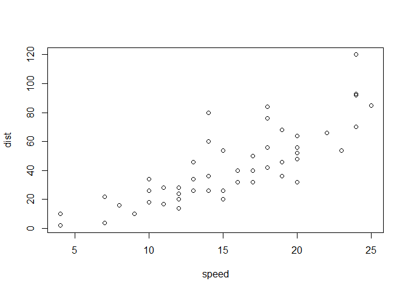
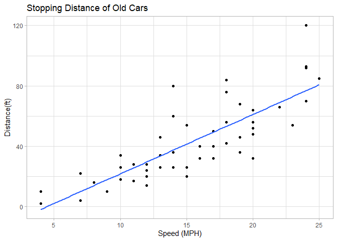
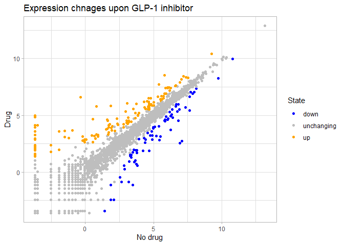
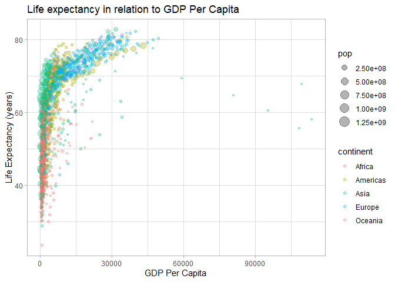
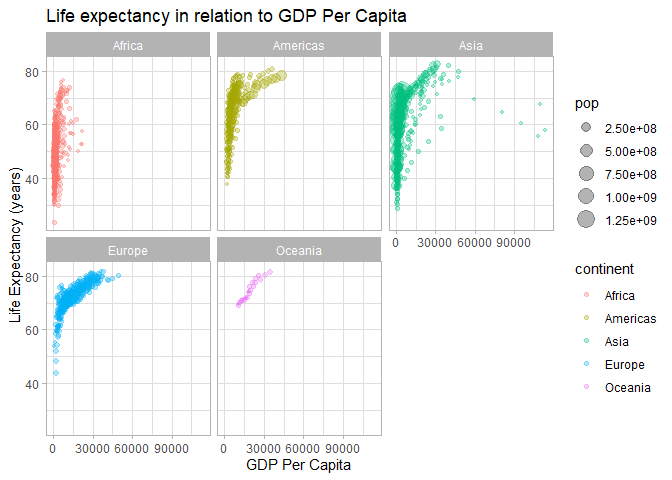
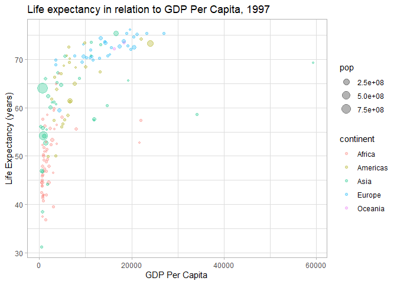
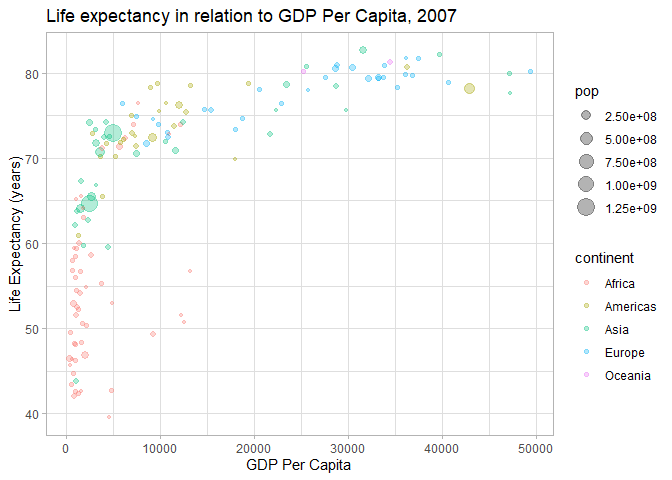
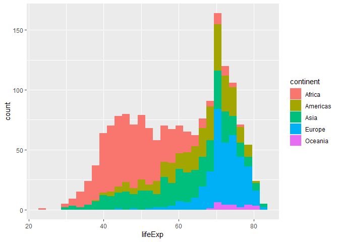

# Class 5: ggplot2 viz
Mankeerat Rataul

- [Background](#background)
- [Add some customization/features](#add-some-customizationfeatures)
- [Gene Expression Figure](#gene-expression-figure)
- [Going further into the GapMinder
  dataset](#going-further-into-the-gapminder-dataset)

## Background

There are many graphics systems in R for making plots and figures. These
include so-called *“base R” graphics* like `plot()` and **ggplot2**
which is an add on package.

Let’s compare how we make a simple figure with these two systems:

We can use the in-built `cars` dataset:

``` r
head(cars)
```

      speed dist
    1     4    2
    2     4   10
    3     7    4
    4     7   22
    5     8   16
    6     9   10

``` r
plot(cars)
```



Before I can use ggplot2 I need to install it on my computer.

To install it, we can use the function `install.packages()`, however we
never run this function in the document because it would redownload it
constantly. Instead this is done in the console.

Below are the 3 commands used for the libraries:

``` r
# install.packages("ggplot2")
# install.packages("gapminder")
# install.packages("dplyr")
```

Once installed, we need to load up the package into our R brain:

``` r
library(ggplot2)
library(gapminder)
library(dplyr)
```

The main function in ggplot2’s package is called `ggplot()`

``` r
ggplot(cars)
```


Every ggplot has at least 3 layers:

- the **data** (data.frame of what we want to plot)
- the **aes** (how data maps onto plot)
- the **geom** (how we want the plot to be drawn)

``` r
ggplot(cars) + 
  aes(x=speed, y=dist) +
  geom_point()
```


## Add some customization/features

Let’s add a trendline that shows the relationship between speed +
distance.

``` r
ggplot(cars) + 
  aes(x=speed, y=dist) +
  geom_point() +
  geom_smooth(method="lm", se=FALSE) +
  theme_light() +
  labs(title="Stopping Distance of Old Cars", x="Speed (MPH)", y="Distance(ft)")
```

    `geom_smooth()` using formula = 'y ~ x'



## Gene Expression Figure

``` r
url <- "https://bioboot.github.io/bimm143_S20/class-material/up_down_expression.txt"
genes <- read.delim(url)
head(genes)
```

            Gene Condition1 Condition2      State
    1      A4GNT -3.6808610 -3.4401355 unchanging
    2       AAAS  4.5479580  4.3864126 unchanging
    3      AASDH  3.7190695  3.4787276 unchanging
    4       AATF  5.0784720  5.0151916 unchanging
    5       AATK  0.4711421  0.5598642 unchanging
    6 AB015752.4 -3.6808610 -3.5921390 unchanging

``` r
head(genes[genes$State == "up",])
```

          Gene Condition1 Condition2 State
    10   ABCC3  0.9305738   3.260304    up
    11   ABCC5  4.6004252   5.499443    up
    420  AHNAK  6.6284895   7.611752    up
    421 AHNAK2  3.6510510   5.181916    up
    496 ALPPL2  0.5586050   2.625953    up
    500 AMIGO2  3.1435673   4.817252    up

``` r
table(genes$State)
```


          down unchanging         up 
            72       4997        127 

``` r
round( table(genes$State)/nrow(genes) * 100, 2 )
```


          down unchanging         up 
          1.39      96.17       2.44 

``` r
colnames(genes)
```

    [1] "Gene"       "Condition1" "Condition2" "State"     

``` r
p <- ggplot(genes) +
  aes(x=Condition1, y=Condition2, col=State) +
  geom_point() +
  theme_light() +
  labs(x="No drug", y="Drug", title="Expression chnages upon GLP-1 inhibitor")

p + scale_color_manual( values=c("blue","gray","orange"))
```



## Going further into the GapMinder dataset

Here is the read of it

``` r
head(gapminder)
```

    # A tibble: 6 × 6
      country     continent  year lifeExp      pop gdpPercap
      <fct>       <fct>     <int>   <dbl>    <int>     <dbl>
    1 Afghanistan Asia       1952    28.8  8425333      779.
    2 Afghanistan Asia       1957    30.3  9240934      821.
    3 Afghanistan Asia       1962    32.0 10267083      853.
    4 Afghanistan Asia       1967    34.0 11537966      836.
    5 Afghanistan Asia       1972    36.1 13079460      740.
    6 Afghanistan Asia       1977    38.4 14880372      786.

> Q. How many entries are there?

``` r
nrow(gapminder)
```

    [1] 1704

> Q. How many countries are in this dataset?

``` r
length(unique(gapminder$country))
```

    [1] 142

Let’s make our first plot of this gapminder dataset

``` r
p <- ggplot(gapminder) + 
  aes(gdpPercap, lifeExp, col=continent, size=pop) +
  geom_point(alpha=0.3) + 
  theme_light() + 
  labs(x="GDP Per Capita", y="Life Expectancy (years)", title="Life expectancy in relation to GDP Per Capita")
p
```



I can add more layers to change the call of p

``` r
p +
  facet_wrap(~gapminder$continent)
```



Make a plot for 1977 and 2007

``` r
gapminder_1977 <- p +
  gapminder %>% filter(year==1977) +
  labs(title="Life expectancy in relation to GDP Per Capita, 1997")

gapminder_2007 <- p + 
  gapminder %>% filter(year==2007) + 
  labs(title="Life expectancy in relation to GDP Per Capita, 2007")

gapminder_1977
```



``` r
gapminder_2007
```



> Q. Make a histogram of lifeExp colored by continent (try using
> `fill-continent` or `col=continent`)

``` r
ggplot(gapminder) + 
  aes(lifeExp, fill=continent) +
  geom_histogram()
```

    `stat_bin()` using `bins = 30`. Pick better value `binwidth`.


