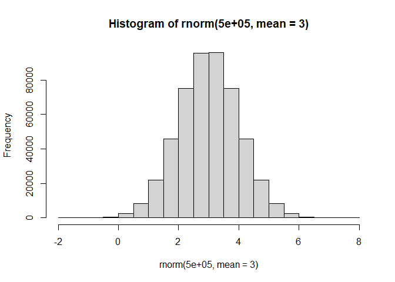
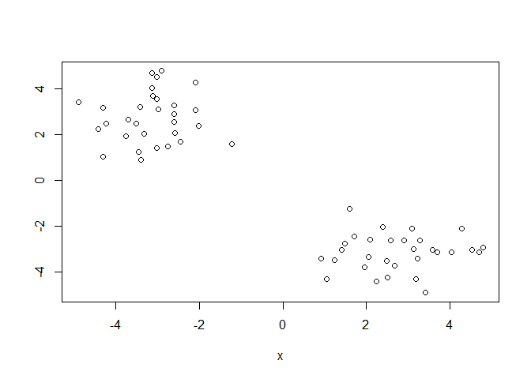
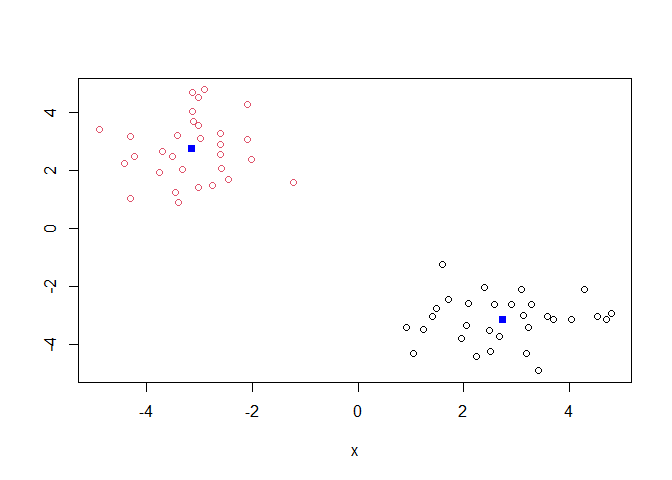
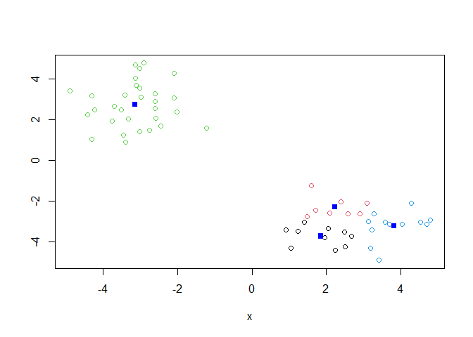
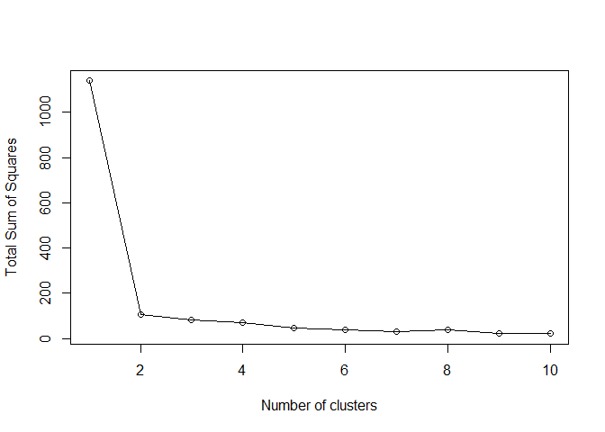
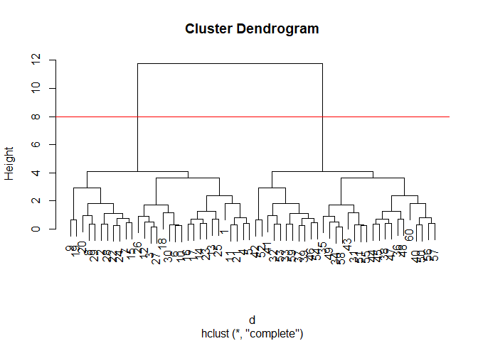
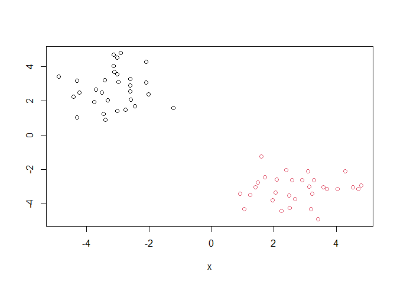
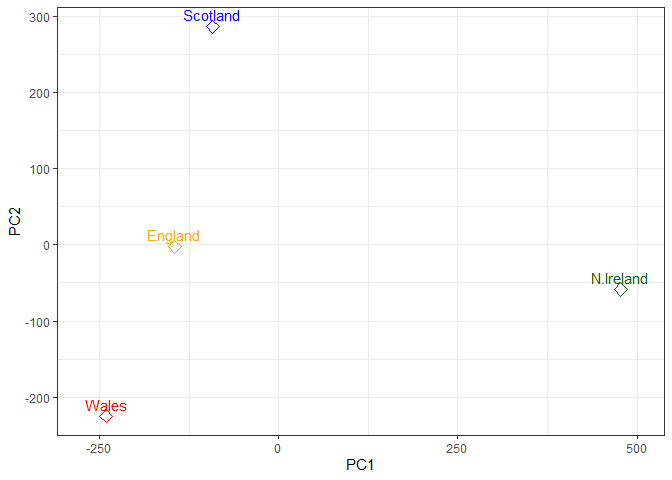
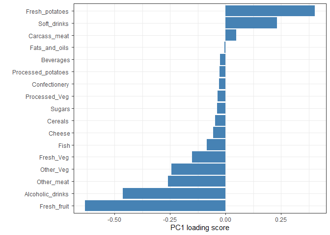
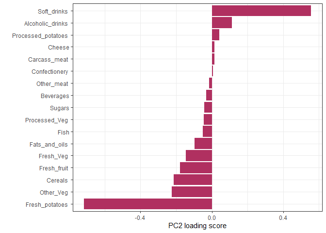

# Class 7: Machine Learning 1
Mankeerat Rataul

- [Background](#background)
- [K-means clustering](#k-means-clustering)
- [Hierarchical Clustering](#hierarchical-clustering)
- [Hands on with Principal Component Analysis
  (PCA)](#hands-on-with-principal-component-analysis-pca)
- [Analysis of UK food data](#analysis-of-uk-food-data)
- [Data Import](#data-import)
- [Tidy data](#tidy-data)
- [Exploratory analysis](#exploratory-analysis)

``` r
library(ggplot2)
```

## Background

Today we will explore some core machine learning methods that are very
popular in bioinformatics. These include **clustering** and
**dimensionality reduction**.

## K-means clustering

The main function in “base” R for K-means clustering is called
`kmeans()`

Before we go too deep let’s make up some “simple” data that we can
cluster and know if we are getting a good answer or not. To do this we
can use the `rnorm()` function:

``` r
hist(rnorm(500000, mean=3))
```



``` r
x <- c(rnorm(30, mean=-3), rnorm(30, mean=3))

z <- cbind(x, rev(x))
z
```

                   x           
     [1,] -1.2203480  1.5873949
     [2,] -4.2330951  2.4963964
     [3,] -3.1104180  3.6834745
     [4,] -2.5882078  2.0813851
     [5,] -2.4400485  1.7144698
     [6,] -3.0080418  4.5171619
     [7,] -3.3265093  2.0535226
     [8,] -3.4589231  1.2368146
     [9,] -4.2933985  3.1774792
    [10,] -3.1239836  4.6916082
    [11,] -2.7527930  1.4795437
    [12,] -3.1239255  4.0324374
    [13,] -2.0058753  2.3822709
    [14,] -2.9843110  3.1256320
    [15,] -3.7615530  1.9471856
    [16,] -2.5917318  2.5733243
    [17,] -2.6053512  2.8979952
    [18,] -2.0881304  4.2680716
    [19,] -4.8922568  3.4142526
    [20,] -4.3011437  1.0413239
    [21,] -3.0164748  1.4119936
    [22,] -3.5090541  2.4874851
    [23,] -2.6071954  3.2775634
    [24,] -3.6931880  2.6679284
    [25,] -2.0918772  3.0828115
    [26,] -3.4036949  3.2117716
    [27,] -3.0178678  3.5703126
    [28,] -4.4083140  2.2367359
    [29,] -3.3922055  0.9177778
    [30,] -2.9096665  4.7815073
    [31,]  4.7815073 -2.9096665
    [32,]  0.9177778 -3.3922055
    [33,]  2.2367359 -4.4083140
    [34,]  3.5703126 -3.0178678
    [35,]  3.2117716 -3.4036949
    [36,]  3.0828115 -2.0918772
    [37,]  2.6679284 -3.6931880
    [38,]  3.2775634 -2.6071954
    [39,]  2.4874851 -3.5090541
    [40,]  1.4119936 -3.0164748
    [41,]  1.0413239 -4.3011437
    [42,]  3.4142526 -4.8922568
    [43,]  4.2680716 -2.0881304
    [44,]  2.8979952 -2.6053512
    [45,]  2.5733243 -2.5917318
    [46,]  1.9471856 -3.7615530
    [47,]  3.1256320 -2.9843110
    [48,]  2.3822709 -2.0058753
    [49,]  4.0324374 -3.1239255
    [50,]  1.4795437 -2.7527930
    [51,]  4.6916082 -3.1239836
    [52,]  3.1774792 -4.2933985
    [53,]  1.2368146 -3.4589231
    [54,]  2.0535226 -3.3265093
    [55,]  4.5171619 -3.0080418
    [56,]  1.7144698 -2.4400485
    [57,]  2.0813851 -2.5882078
    [58,]  3.6834745 -3.1104180
    [59,]  2.4963964 -4.2330951
    [60,]  1.5873949 -1.2203480

``` r
plot(z)
```



Now we can run `kmeans()` on this input `z` and see what the results
look like.

``` r
km <- kmeans(z, 2)
```

> **Q. How many points are in each cluster?**

``` r
km$size
```

    [1] 30 30

> **Q. What “component of your result object details cluster
> assignment/membership?**

``` r
km$cluster
```

     [1] 2 2 2 2 2 2 2 2 2 2 2 2 2 2 2 2 2 2 2 2 2 2 2 2 2 2 2 2 2 2 1 1 1 1 1 1 1 1
    [39] 1 1 1 1 1 1 1 1 1 1 1 1 1 1 1 1 1 1 1 1 1 1

> **Q. What component of your result object results in cluster centers**

``` r
km$centers
```

              x          
    1  2.734921 -3.131986
    2 -3.131986  2.734921

> **Q. Plot `z` colored by the kmeans cluster assignment and add cluster
> centers as blue points**

``` r
plot(z, col=km$cluster)
points(km$centers, col="blue", pch=15)
```



> Run a K-means clustering and plot the results asking for 4 clusters

``` r
km4 <- kmeans(z, 4)
plot(z, col=km4$cluster)
points(km4$centers, col="blue", pch=15)
```



> **N.B** You need to tell K-means the number of clusters

One approach is to try different values for `centers` and then pick the
best

``` r
ans <- NULL
for (i in 1:10){
  km <- kmeans(z, centers=i)
  ans <- c(ans, km$tot.withinss)
}
ans
```

     [1] 1139.02347  106.40548   82.15576   72.05786   48.53372   38.43583
     [7]   31.85187   37.31609   23.98204   21.36062

``` r
plot(ans, typ="o", xlab="Number of clusters", ylab="Total Sum of Squares")
```



## Hierarchical Clustering

The main function in “base” R for Hierarchical Clustering is called
`hclust()`

This function does not take your “raw” data for clustering. You must
first build a “distance matrix” from your data and bass this as input to
`hclust()`.

``` r
d <- dist(z)
hc <- hclust(d)
```

There is a bespoke `plot()` method for `hclust()` result objects.

``` r
plot(hc)
abline(h=8, col="red")
```



Once we have our `hclust` object (our “tree” of “cluster dendrogram”) we
can *“cut”* the tree to reveal the clustering pattern.

``` r
tree <- cutree(hc, h=8)
```

> **Q. Make a plot of `z` with your hclust results (i.e colored by
> cluster membership)**

``` r
plot(z, col=tree)
```



## Hands on with Principal Component Analysis (PCA)

PCA is a dimensionality reduction method that is popular for revealing
patterns in complex datasets.

## Analysis of UK food data

Let’s look at some data on the eating habits of folks from the UK to see
if there are patterns and trends that have some regions being distinct
from others.

## Data Import

``` r
url <- "https://tinyurl.com/UK-foods"
x <- read.csv(url)
x
```

                         X England Wales Scotland N.Ireland
    1               Cheese     105   103      103        66
    2        Carcass_meat      245   227      242       267
    3          Other_meat      685   803      750       586
    4                 Fish     147   160      122        93
    5       Fats_and_oils      193   235      184       209
    6               Sugars     156   175      147       139
    7      Fresh_potatoes      720   874      566      1033
    8           Fresh_Veg      253   265      171       143
    9           Other_Veg      488   570      418       355
    10 Processed_potatoes      198   203      220       187
    11      Processed_Veg      360   365      337       334
    12        Fresh_fruit     1102  1137      957       674
    13            Cereals     1472  1582     1462      1494
    14           Beverages      57    73       53        47
    15        Soft_drinks     1374  1256     1572      1506
    16   Alcoholic_drinks      375   475      458       135
    17      Confectionery       54    64       62        41

The data is made available in CSV format so we can use the `read.csv()`
function for import to R.

## Tidy data

> **Q1. How many rows and columns are in your new data frame named `x`?
> What R functions could you use to answer this question?**

You can use `dim()` to input x and return the row and column numbers.
There are 17 rows and 5 columns as shown below.

``` r
dim(x)
```

    [1] 17  5

Fix anything that went wrong with data import.

``` r
rownames(x) <- x[,1]
x <- x[,-1]

x
```

                        England Wales Scotland N.Ireland
    Cheese                  105   103      103        66
    Carcass_meat            245   227      242       267
    Other_meat              685   803      750       586
    Fish                    147   160      122        93
    Fats_and_oils           193   235      184       209
    Sugars                  156   175      147       139
    Fresh_potatoes          720   874      566      1033
    Fresh_Veg               253   265      171       143
    Other_Veg               488   570      418       355
    Processed_potatoes      198   203      220       187
    Processed_Veg           360   365      337       334
    Fresh_fruit            1102  1137      957       674
    Cereals                1472  1582     1462      1494
    Beverages                57    73       53        47
    Soft_drinks            1374  1256     1572      1506
    Alcoholic_drinks        375   475      458       135
    Confectionery            54    64       62        41

This can also be solved by calling `row.names` during the initial csv
read

``` r
x <- read.csv(url, row.names=1)
head(x)
```

                   England Wales Scotland N.Ireland
    Cheese             105   103      103        66
    Carcass_meat       245   227      242       267
    Other_meat         685   803      750       586
    Fish               147   160      122        93
    Fats_and_oils      193   235      184       209
    Sugars             156   175      147       139

> **Q2. Which approach to solving the ‘row-names problem’ mentioned
> above do you prefer and why? Is one approach more robust than another
> under certain circumstances?**

I prefer the second approach as it’s much simpler, and you can rerun it
without having to reset the value of x, however I assume that the first
approach would be more robust for removing data for example, if the goal
is to navigate to a certain place in the dataframe. It’s mainly weighed
down by its inability to repeat.

## Exploratory analysis

Make some plots to help make sense of obvious trends…

``` r
barplot(as.matrix(x), col=rainbow(nrow(x)))
```


> **Q3: Changing what optional argument in the above barplot() function
> results in the following plot?**

Removing `beside=T` changes it into the above plot.

> **Q5: We can use the pairs() function to generate all pairwise plots
> for our countries. Can you make sense of the following code and
> resulting figure? What does it mean if a given point lies on the
> diagonal for a given plot?**

``` r
pairs(x, col=rainbow(nrow(x)), pch=16)
```


If it’s on the diagonal, both countries consume similar amounts of each
of the foods. Off diagonal means different consumption in some way.

``` r
library(pheatmap)

pheatmap( as.matrix(x) )
```


> **Q6. Based on the pairs and heatmap figures, which countries cluster
> together and what does this suggest about their food consumption
> patterns? Can you easily tell what the main differences between N.
> Ireland and the other countries of the UK in terms of this data-set?**

It seems that for the big two groups, Scotland England and Wales cluster
together and N. Ireland seems to be in a separate cluster. England and
Wales seem to cluster together compared to Scotland as well. It seems
difficult to tell the main differences since while there seem to be
differences and general trends, it remains fully unclear

\##PCA

The main function in “base” R for PCA is called `prcomp()`. This
function wants the observations to be rows and the variables to be
columns.

So here we need to take the transpose of our `x` input object

``` r
pca <- prcomp(t(x))
summary(pca)
```

    Importance of components:
                                PC1      PC2      PC3       PC4
    Standard deviation     324.1502 212.7478 73.87622 3.176e-14
    Proportion of Variance   0.6744   0.2905  0.03503 0.000e+00
    Cumulative Proportion    0.6744   0.9650  1.00000 1.000e+00

The returned `pca` object has components that we can use to make our
main result figures:

``` r
pca$x
```

                     PC1         PC2        PC3           PC4
    England   -144.99315   -2.532999 105.768945 -4.894696e-14
    Wales     -240.52915 -224.646925 -56.475555  5.700024e-13
    Scotland   -91.86934  286.081786 -44.415495 -7.460785e-13
    N.Ireland  477.39164  -58.901862  -4.877895  2.321303e-13

The main result from this analysis is called a “PC score plot” or
“ordination plot” or “PC plot”

> **Q7. Complete the code below to generate a plot of PC1 vs PC2. The
> second line adds text labels over the data points.**

> **Q8. Customize your plot so that the colors of the country names
> match the colors in our UK and Ireland map and table at start of this
> document.**

I combined the two questions’ results below:

``` r
# Create a data frame for plotting
df <- as.data.frame(pca$x)
df$Country <- rownames(df)
mycols <- c("orange", "red", "blue", "darkgreen")

# Plot PC1 vs PC2 with ggplot
ggplot(pca$x) +
  aes(x = PC1, y = PC2, label = rownames(pca$x)) +
  geom_point(size = 3, color=mycols, shape=5) +
  geom_text(vjust = -0.5, col=mycols) +
  xlim(-270, 500) +
  xlab("PC1") +
  ylab("PC2") +
  theme_bw()
```



This plot shows the difference in terms of PC1 and PC2 between regions
in the UK, and shows clear statistical trends that North Ireland is
exceptionally different compared to the other 3 regions.

``` r
ggplot(pca$rotation) +
  aes(PC1, reorder(rownames(pca$rotation), PC1)) +
  geom_col(fill= "steelblue") +
  xlab("PC1 loading score") + 
  ylab("") +
  theme_bw()
```



This output plot is basically what variables affect PC1 the most in
positive and negative ways, and determine the importance of each
variable on PC1.

> **Q9: Generate a similar ‘loadings plot’ for PC2. What two food groups
> feature prominantely and what does PC2 maninly tell us about?**

``` r
ggplot(pca$rotation) +
  aes(PC2, reorder(rownames(pca$rotation), PC2)) +
  geom_col(fill= "maroon") +
  xlab("PC2 loading score") + 
  ylab("") +
  theme_bw()
```



PC2 mainly tells us about soft drinks and fresh potatoes, with the
former positively influencing the PC2 and the latter negatively
influencing it.
