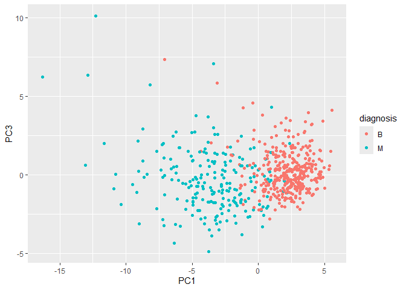
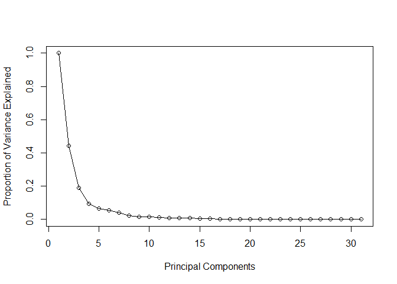
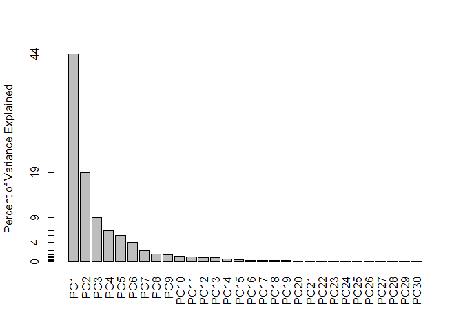
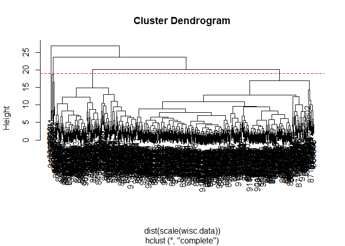
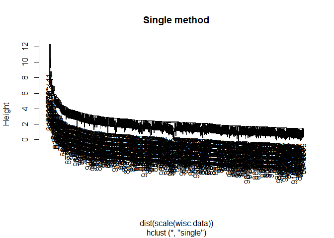
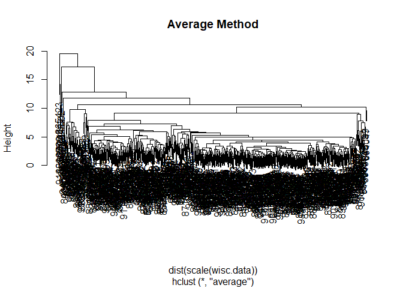
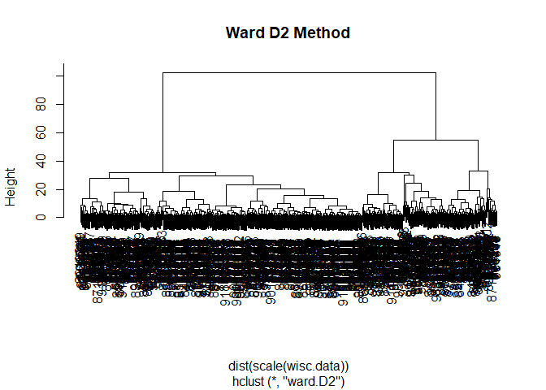
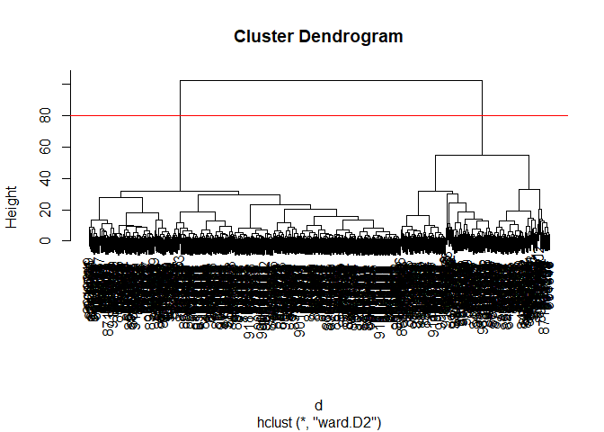
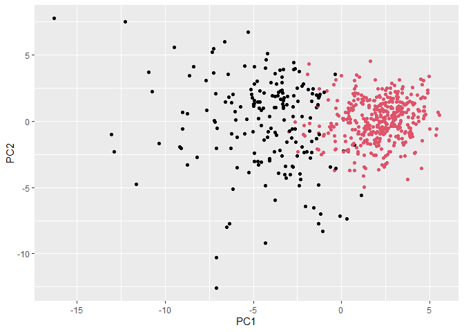
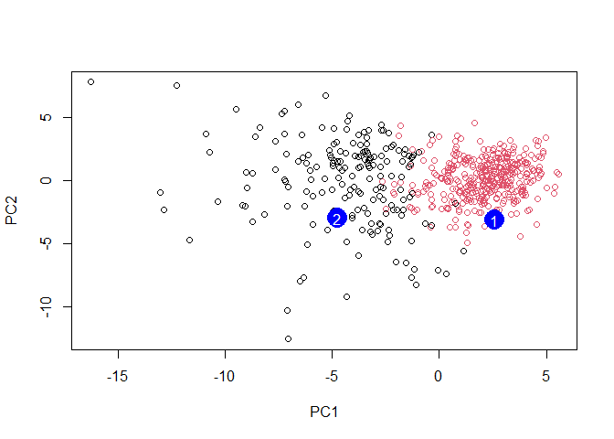

# Class 08: Breast Cancer Mini Project
Mankeerat Rataul

- [Background](#background)
- [Data Import](#data-import)
- [Exploratory Data Analysis](#exploratory-data-analysis)
- [Performing PCA](#performing-pca)
- [Interpreting PCA Results](#interpreting-pca-results)
- [Variance explained](#variance-explained)
- [Communicating PCA results](#communicating-pca-results)
- [Hierarchical Clustering](#hierarchical-clustering)
- [Combining methods](#combining-methods)
- [Prediction](#prediction)

## Background

The goal of this mini-project is for you to explore a complete analysis
using the unsupervised learning techniques covered in class.

Today we will analyze a data-set from fine needle aspiration (FNA) of
breast mass.

## Data Import

read.csv is used here to import the csv file into a dataframe `wisc.df`

``` r
fna.data <- "WisconsinCancer.csv"
wisc.df <- read.csv(fna.data, row.names=1)
head(wisc.df, 3)
```

             diagnosis radius_mean texture_mean perimeter_mean area_mean
    842302           M       17.99        10.38          122.8      1001
    842517           M       20.57        17.77          132.9      1326
    84300903         M       19.69        21.25          130.0      1203
             smoothness_mean compactness_mean concavity_mean concave.points_mean
    842302           0.11840          0.27760         0.3001             0.14710
    842517           0.08474          0.07864         0.0869             0.07017
    84300903         0.10960          0.15990         0.1974             0.12790
             symmetry_mean fractal_dimension_mean radius_se texture_se perimeter_se
    842302          0.2419                0.07871    1.0950     0.9053        8.589
    842517          0.1812                0.05667    0.5435     0.7339        3.398
    84300903        0.2069                0.05999    0.7456     0.7869        4.585
             area_se smoothness_se compactness_se concavity_se concave.points_se
    842302    153.40      0.006399        0.04904      0.05373           0.01587
    842517     74.08      0.005225        0.01308      0.01860           0.01340
    84300903   94.03      0.006150        0.04006      0.03832           0.02058
             symmetry_se fractal_dimension_se radius_worst texture_worst
    842302       0.03003             0.006193        25.38         17.33
    842517       0.01389             0.003532        24.99         23.41
    84300903     0.02250             0.004571        23.57         25.53
             perimeter_worst area_worst smoothness_worst compactness_worst
    842302             184.6       2019           0.1622            0.6656
    842517             158.8       1956           0.1238            0.1866
    84300903           152.5       1709           0.1444            0.4245
             concavity_worst concave.points_worst symmetry_worst
    842302            0.7119               0.2654         0.4601
    842517            0.2416               0.1860         0.2750
    84300903          0.4504               0.2430         0.3613
             fractal_dimension_worst
    842302                   0.11890
    842517                   0.08902
    84300903                 0.08758

Make sure we remove or exclude the `diagnosis` column from the data-set
that we use for further analysis - this is the expert diagnosis as
either M or B:

``` r
wisc.data <- wisc.df[,-1]
head(wisc.data, 3)
```

             radius_mean texture_mean perimeter_mean area_mean smoothness_mean
    842302         17.99        10.38          122.8      1001         0.11840
    842517         20.57        17.77          132.9      1326         0.08474
    84300903       19.69        21.25          130.0      1203         0.10960
             compactness_mean concavity_mean concave.points_mean symmetry_mean
    842302            0.27760         0.3001             0.14710        0.2419
    842517            0.07864         0.0869             0.07017        0.1812
    84300903          0.15990         0.1974             0.12790        0.2069
             fractal_dimension_mean radius_se texture_se perimeter_se area_se
    842302                  0.07871    1.0950     0.9053        8.589  153.40
    842517                  0.05667    0.5435     0.7339        3.398   74.08
    84300903                0.05999    0.7456     0.7869        4.585   94.03
             smoothness_se compactness_se concavity_se concave.points_se
    842302        0.006399        0.04904      0.05373           0.01587
    842517        0.005225        0.01308      0.01860           0.01340
    84300903      0.006150        0.04006      0.03832           0.02058
             symmetry_se fractal_dimension_se radius_worst texture_worst
    842302       0.03003             0.006193        25.38         17.33
    842517       0.01389             0.003532        24.99         23.41
    84300903     0.02250             0.004571        23.57         25.53
             perimeter_worst area_worst smoothness_worst compactness_worst
    842302             184.6       2019           0.1622            0.6656
    842517             158.8       1956           0.1238            0.1866
    84300903           152.5       1709           0.1444            0.4245
             concavity_worst concave.points_worst symmetry_worst
    842302            0.7119               0.2654         0.4601
    842517            0.2416               0.1860         0.2750
    84300903          0.4504               0.2430         0.3613
             fractal_dimension_worst
    842302                   0.11890
    842517                   0.08902
    84300903                 0.08758

``` r
diagnosis <- as.factor(wisc.df$diagnosis)
```

## Exploratory Data Analysis

> **Q1. How many observations are in this dataset?**

``` r
nrow(wisc.data)
```

    [1] 569

There are 569 individual patients.

> **Q2. How many of the observations have a malignant diagnosis?**

``` r
table(diagnosis)
```

    diagnosis
      B   M 
    357 212 

212 individuals have a malignant diagnosis.

> **Q3. How many variables/features in the data are suffixed with
> `_mean`?**

``` r
length(grep("_mean", colnames(wisc.data)))
```

    [1] 10

10 total variables suffixed with `_mean`.

## Performing PCA

We need to scale our data before PCA w/ the `scale=TRUE` argument to
`prcomp()`.

``` r
wisc.pr <- prcomp(wisc.data, scale =T)
summary(wisc.pr)
```

    Importance of components:
                              PC1    PC2     PC3     PC4     PC5     PC6     PC7
    Standard deviation     3.6444 2.3857 1.67867 1.40735 1.28403 1.09880 0.82172
    Proportion of Variance 0.4427 0.1897 0.09393 0.06602 0.05496 0.04025 0.02251
    Cumulative Proportion  0.4427 0.6324 0.72636 0.79239 0.84734 0.88759 0.91010
                               PC8    PC9    PC10   PC11    PC12    PC13    PC14
    Standard deviation     0.69037 0.6457 0.59219 0.5421 0.51104 0.49128 0.39624
    Proportion of Variance 0.01589 0.0139 0.01169 0.0098 0.00871 0.00805 0.00523
    Cumulative Proportion  0.92598 0.9399 0.95157 0.9614 0.97007 0.97812 0.98335
                              PC15    PC16    PC17    PC18    PC19    PC20   PC21
    Standard deviation     0.30681 0.28260 0.24372 0.22939 0.22244 0.17652 0.1731
    Proportion of Variance 0.00314 0.00266 0.00198 0.00175 0.00165 0.00104 0.0010
    Cumulative Proportion  0.98649 0.98915 0.99113 0.99288 0.99453 0.99557 0.9966
                              PC22    PC23   PC24    PC25    PC26    PC27    PC28
    Standard deviation     0.16565 0.15602 0.1344 0.12442 0.09043 0.08307 0.03987
    Proportion of Variance 0.00091 0.00081 0.0006 0.00052 0.00027 0.00023 0.00005
    Cumulative Proportion  0.99749 0.99830 0.9989 0.99942 0.99969 0.99992 0.99997
                              PC29    PC30
    Standard deviation     0.02736 0.01153
    Proportion of Variance 0.00002 0.00000
    Cumulative Proportion  1.00000 1.00000

> **Q4. From your results, what proportion of the original variance is
> captured by the first principal component (PC1)?**

0.4427 of the original variance is captured.

> **Q5. How many principal components (PCs) are required to describe at
> least 70% of the original variance in the data?**

The first 3 PCs are needed to describe at minimum 70% of the variance.

> **Q6. How many principal components (PCs) are required to describe at
> least 90% of the original variance in the data?**

7 Principal components are required to describe \>90% of the original
variance.

## Interpreting PCA Results

``` r
biplot(wisc.pr)
```


> **Q7. What stands out to you about this plot? Is it easy or difficult
> to understand? Why?**

This plot has an incredible amount of data that cannot be interpreted.
It shows the directions in which each variable pulls the Principle
Components, alongside listing all 569 text entries for individual
patients overlapping. It is extremely difficult to understand for that
very reason, since you cannot read any of the data.

The following is the use of a ggplot with diagnostic data graphed over.

``` r
library(ggplot2)

ggplot(wisc.pr$x) + 
  aes(PC1, PC2, col=diagnosis) + 
  geom_point()
```


> **Q8. Generate a similar plot for principal components 1 and 3. What
> do you notice about these plots?**

``` r
ggplot(wisc.pr$x) + 
  aes(PC1, PC3, col=diagnosis) + 
  geom_point()
```



There seems to be a clear clustering of benign tumors vs malignant with
respect to these principle components.

## Variance explained

``` r
# Calculate variance of each component
pr.var <- wisc.pr$sdev^2
head(pr.var)
```

    [1] 13.281608  5.691355  2.817949  1.980640  1.648731  1.207357

``` r
pve <- pr.var/(sum(pr.var))
plot(c(1, pve), xlab = "Principal Components", ylab="Proportion of Variance Explained", ylim= c(0, 1), type = "o")
```



``` r
# Alternative scree plot of the same data, note data driven y-axis
barplot(pve, ylab = "Percent of Variance Explained",
     names.arg=paste0("PC",1:length(pve)), las=2, axes = FALSE)
axis(2, at=pve, labels=round(pve,2)*100 )
```



## Communicating PCA results

> **Q9. For the first principal component, what is the component of the
> loading vector (i.e. wisc.pr\$rotation\[,1\]) for the feature
> concave.points_mean? This tells us how much this original feature
> contributes to the first PC. Are there any features with larger
> contributions than this one?**

``` r
variancofpr1 <- wisc.pr$rotation[,1]
variancofpr1["concave.points_mean"]
```

    concave.points_mean 
             -0.2608538 

``` r
variancofpr1
```

                radius_mean            texture_mean          perimeter_mean 
                -0.21890244             -0.10372458             -0.22753729 
                  area_mean         smoothness_mean        compactness_mean 
                -0.22099499             -0.14258969             -0.23928535 
             concavity_mean     concave.points_mean           symmetry_mean 
                -0.25840048             -0.26085376             -0.13816696 
     fractal_dimension_mean               radius_se              texture_se 
                -0.06436335             -0.20597878             -0.01742803 
               perimeter_se                 area_se           smoothness_se 
                -0.21132592             -0.20286964             -0.01453145 
             compactness_se            concavity_se       concave.points_se 
                -0.17039345             -0.15358979             -0.18341740 
                symmetry_se    fractal_dimension_se            radius_worst 
                -0.04249842             -0.10256832             -0.22799663 
              texture_worst         perimeter_worst              area_worst 
                -0.10446933             -0.23663968             -0.22487053 
           smoothness_worst       compactness_worst         concavity_worst 
                -0.12795256             -0.21009588             -0.22876753 
       concave.points_worst          symmetry_worst fractal_dimension_worst 
                -0.25088597             -0.12290456             -0.13178394 

It seems to have been around -0.261. This means that this feature
contributed 26.1% against PC1. There seems to be no other features with
larger contributions than this one.

## Hierarchical Clustering

Clustering and plotting is done below:

``` r
wisc.hclust <- hclust(dist(scale(wisc.data)))
plot(wisc.hclust)
abline(h=19, col="red", lty=2)
```



> **Q10. Using the plot() and abline() functions, what is the height at
> which the clustering model has 4 clusters?**

19

``` r
wisc.hclust.clusters <- cutree(wisc.hclust, h=19)

table(wisc.hclust.clusters, diagnosis)
```

                        diagnosis
    wisc.hclust.clusters   B   M
                       1  12 165
                       2   2   5
                       3 343  40
                       4   0   2

> **Q12. Which method gives your favorite results for the same data.dist
> dataset? Explain your reasoning.**

``` r
wistsingle.hclust <- hclust(dist(scale(wisc.data)), method = "single")
wistavg.hclust <- hclust(dist(scale(wisc.data)), method = "average")
wistwardD2.hclust <- hclust(dist(scale(wisc.data)), method = "ward.D2")
plot(wistsingle.hclust, main="Single method")
```



``` r
plot(wistavg.hclust, main="Average Method")
```



``` r
plot(wistwardD2.hclust, main="Ward D2 Method")
```



Ward D2 is my favorite results for this, as it gives 2 clear groups and
would seem to work best at splitting into 2 separate groups.

## Combining methods

``` r
d <- dist(wisc.pr$x[,1:30])
wisc.pr.hclust <- hclust(d, method="ward.D2")
plot(wisc.pr.hclust)
abline(h=80, col="red")
```



``` r
grps <- cutree(wisc.pr.hclust, h=70)
table(grps)
```

    grps
      1   2 
    184 385 

How does this clustering `grps` correspond to the expert `diagnosis`?

``` r
table(diagnosis, grps)
```

             grps
    diagnosis   1   2
            B  20 337
            M 164  48

``` r
ggplot(wisc.pr$x) +
  aes(PC1, PC2) +
  geom_point(col=grps)
```



> **Q13. How well does the newly created hclust model with two clusters
> separate out the two “M” and “B” diagnoses?**

It seems to separate it out very well, with one group containing 164
true malignancies and 20 false positives, and the other group containing
337 true benign cases and 48 false negatives.

> **Q14. How well do the hierarchical clustering models you created in
> the previous sections (i.e. without first doing PCA) do in terms of
> separating the diagnoses? Again, use the table() function to compare
> the output of each model (wisc.hclust.clusters and
> wisc.pr.hclust.clusters) with the vector containing the actual
> diagnoses.**

``` r
table(wisc.hclust.clusters, diagnosis)
```

                        diagnosis
    wisc.hclust.clusters   B   M
                       1  12 165
                       2   2   5
                       3 343  40
                       4   0   2

It seems that it did fairly well. Separating out the outliers of cluster
2 and 4, it has a cluster containing 165 true malignancies and 12 false
positives, and a cluster with 343 true benigns and 40 false positives.
In a way it had around the same strength as the PCA analysis.

## Prediction

I will use the `predict()` function below to take the PCA model and
predict the diagnosis for new cancer cell data by projection onto the
PCA.

``` r
url <- "https://tinyurl.com/new-samples-CSV"
new <- read.csv(url)
npc <- predict(wisc.pr, newdata=new)
npc
```

               PC1       PC2        PC3        PC4       PC5        PC6        PC7
    [1,]  2.576616 -3.135913  1.3990492 -0.7631950  2.781648 -0.8150185 -0.3959098
    [2,] -4.754928 -3.009033 -0.1660946 -0.6052952 -1.140698 -1.2189945  0.8193031
                PC8       PC9       PC10      PC11      PC12      PC13     PC14
    [1,] -0.2307350 0.1029569 -0.9272861 0.3411457  0.375921 0.1610764 1.187882
    [2,] -0.3307423 0.5281896 -0.4855301 0.7173233 -1.185917 0.5893856 0.303029
              PC15       PC16        PC17        PC18        PC19       PC20
    [1,] 0.3216974 -0.1743616 -0.07875393 -0.11207028 -0.08802955 -0.2495216
    [2,] 0.1299153  0.1448061 -0.40509706  0.06565549  0.25591230 -0.4289500
               PC21       PC22       PC23       PC24        PC25         PC26
    [1,]  0.1228233 0.09358453 0.08347651  0.1223396  0.02124121  0.078884581
    [2,] -0.1224776 0.01732146 0.06316631 -0.2338618 -0.20755948 -0.009833238
                 PC27        PC28         PC29         PC30
    [1,]  0.220199544 -0.02946023 -0.015620933  0.005269029
    [2,] -0.001134152  0.09638361  0.002795349 -0.019015820

Above are the PCA outputs

``` r
plot(wisc.pr$x[,1:2], col=grps)
points(npc[,1], npc[,2], col="blue", pch=16, cex=3)
text(npc[,1], npc[,2], c(1,2), col="white")
```



> **Q16. Which of these new patients should we prioritize for follow up
> based on your results?**

Most likely the patient at position 2, as this lines up directly with
prior analysis of likelihood to have malignancy.
