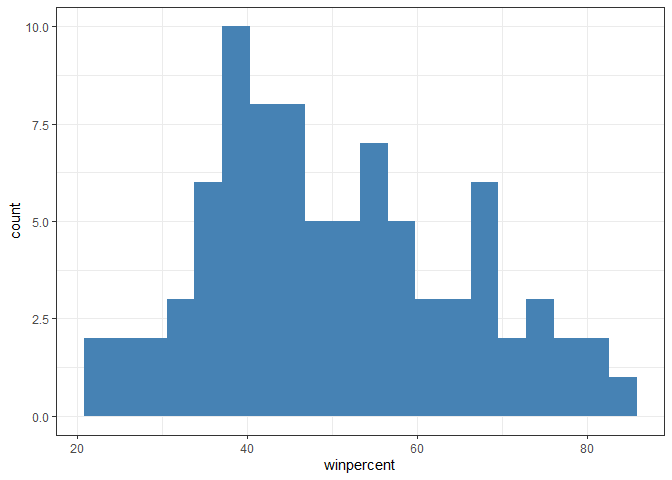
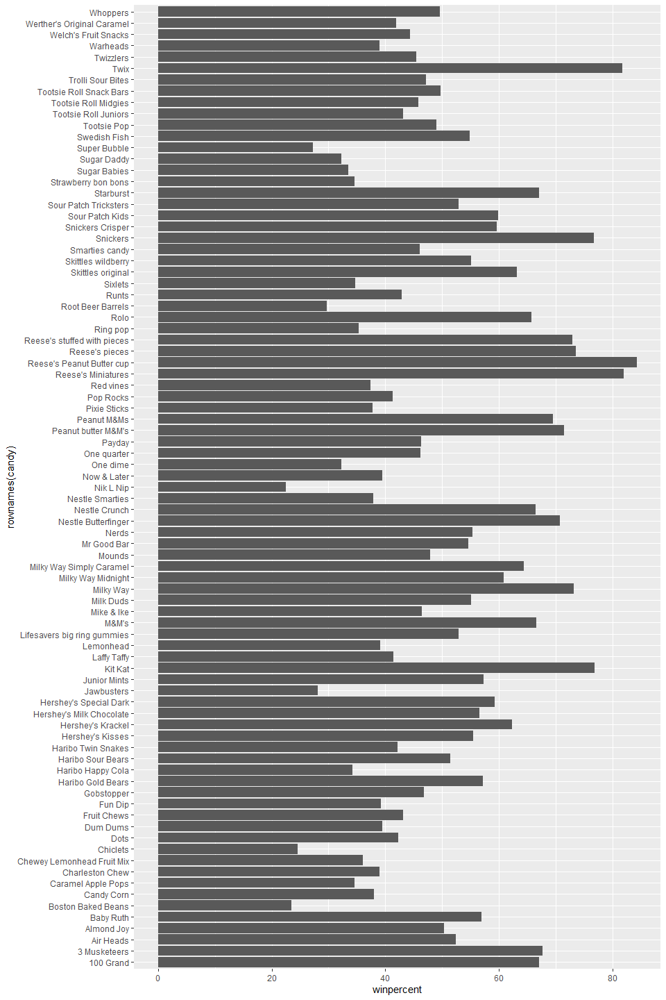
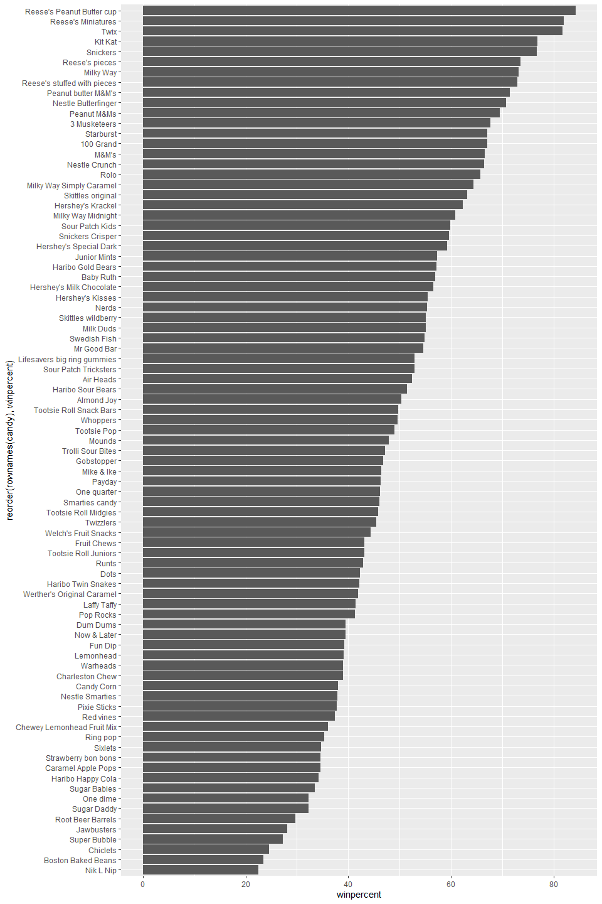
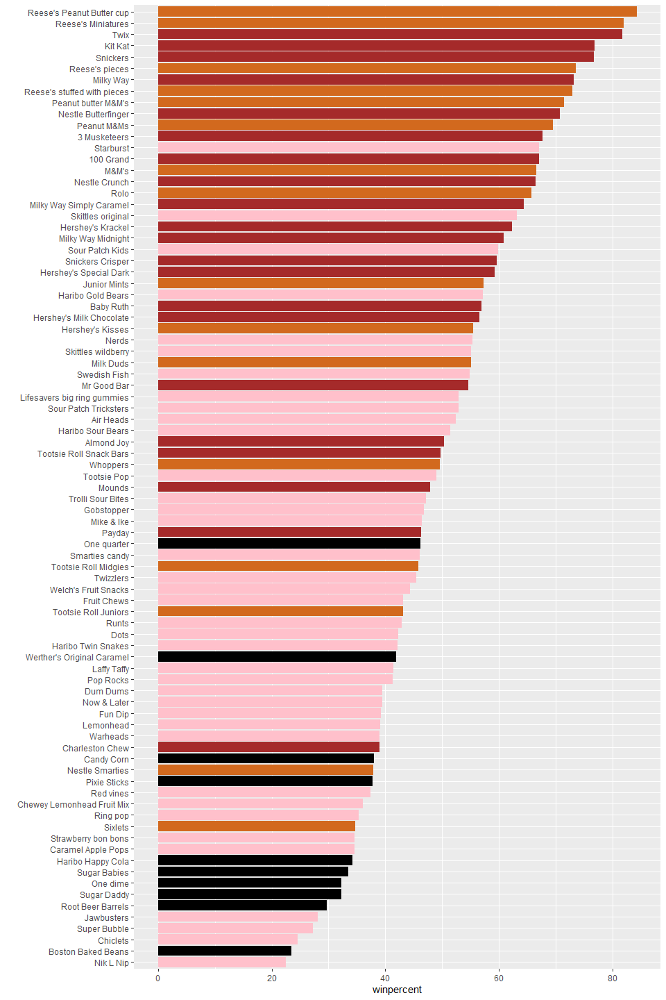
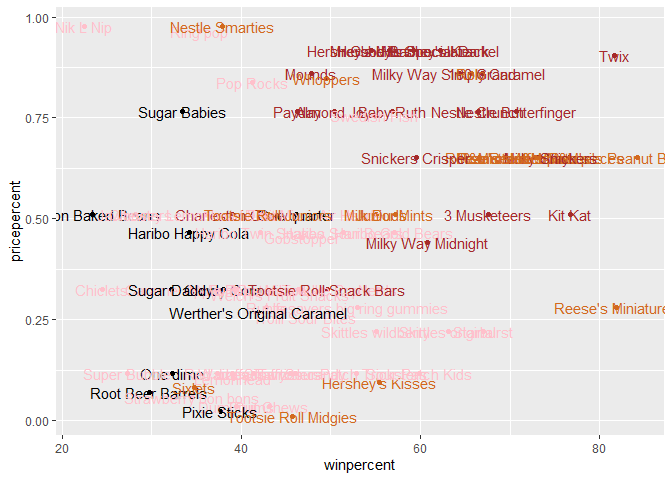
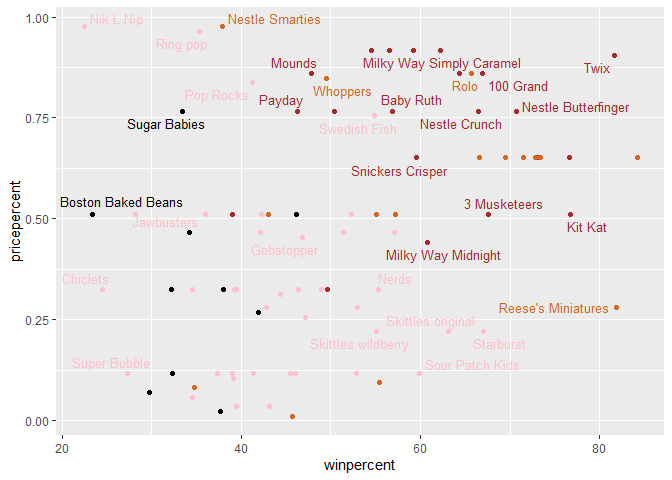
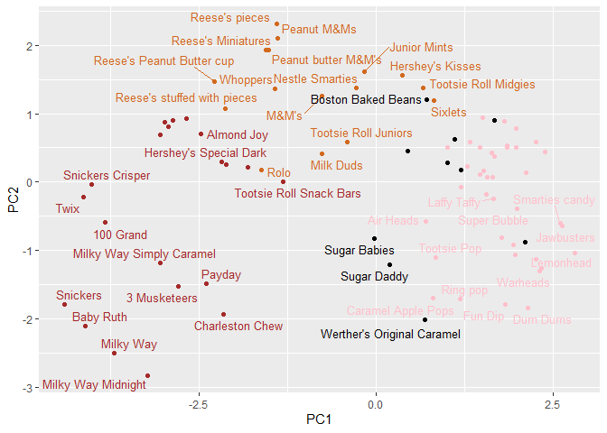

# Class 09: Candy Mini Project
Mankeerat Rataul

- [Background](#background)
- [Data import](#data-import)
- [Overall Candy Rankings](#overall-candy-rankings)
- [Taking a look at pricepercent](#taking-a-look-at-pricepercent)
- [Exploring the correlation
  structure](#exploring-the-correlation-structure)
- [Principal Component Analysis](#principal-component-analysis)

## Background

There will be more analysis in PCA in this document

The following will be just a loading of the candy data.

## Data import

This data is originally gathered from the 538 website.

``` r
candy_file <- "https://raw.githubusercontent.com/fivethirtyeight/data/master/candy-power-ranking/candy-data.csv"
# save the data link into a variable candy_file

candy = read.csv(candy_file, row.names=1)
#use read.csv to save the data into a data frame variable 'candy', and eliminates the first header so that row names start with the flavors


head(candy)
```

                 chocolate fruity caramel peanutyalmondy nougat crispedricewafer
    100 Grand            1      0       1              0      0                1
    3 Musketeers         1      0       0              0      1                0
    One dime             0      0       0              0      0                0
    One quarter          0      0       0              0      0                0
    Air Heads            0      1       0              0      0                0
    Almond Joy           1      0       0              1      0                0
                 hard bar pluribus sugarpercent pricepercent winpercent
    100 Grand       0   1        0        0.732        0.860   66.97173
    3 Musketeers    0   1        0        0.604        0.511   67.60294
    One dime        0   0        0        0.011        0.116   32.26109
    One quarter     0   0        0        0.011        0.511   46.11650
    Air Heads       0   0        0        0.906        0.511   52.34146
    Almond Joy      0   1        0        0.465        0.767   50.34755

``` r
#test the results of candy to ensure proper data frame was made
```

> **Q1. How many different candy types are in this dataset?**

``` r
nrow(candy)
```

    [1] 85

85 candy types total.

> **Q2. How many fruity candy types are in the dataset?**

``` r
sum(candy$fruity)
```

    [1] 38

38 total fruity candy types are in this dataset.

> **Q3. What is your favorite candy (other than Twix) in the dataset and
> what is it’s `winpercent` value?**

``` r
candy["Reese's Peanut Butter cup", ]$winpercent
```

    [1] 84.18029

Reese’s Peanut Butter cups have a winpercent of 84.18029.

> **Q4. What is the winpercent value for “Kit Kat”?**

``` r
candy["Kit Kat",]$winpercent
```

    [1] 76.7686

76.7686 is the winpercent value for kitkat.

> **Q5. What is the winpercent value for “Tootsie Roll Snack Bars”?**

``` r
candy["Tootsie Roll Snack Bars", ]$winpercent
```

    [1] 49.6535

49.6535 is the value for tootsie roll snack bars.

``` r
# install.packages("skimr")
library("skimr")
skim(candy)
```

|                                                  |       |
|:-------------------------------------------------|:------|
| Name                                             | candy |
| Number of rows                                   | 85    |
| Number of columns                                | 12    |
| \_\_\_\_\_\_\_\_\_\_\_\_\_\_\_\_\_\_\_\_\_\_\_   |       |
| Column type frequency:                           |       |
| numeric                                          | 12    |
| \_\_\_\_\_\_\_\_\_\_\_\_\_\_\_\_\_\_\_\_\_\_\_\_ |       |
| Group variables                                  | None  |

Data summary

**Variable type: numeric**

| skim_variable | n_missing | complete_rate | mean | sd | p0 | p25 | p50 | p75 | p100 | hist |
|:---|---:|---:|---:|---:|---:|---:|---:|---:|---:|:---|
| chocolate | 0 | 1 | 0.44 | 0.50 | 0.00 | 0.00 | 0.00 | 1.00 | 1.00 | ▇▁▁▁▆ |
| fruity | 0 | 1 | 0.45 | 0.50 | 0.00 | 0.00 | 0.00 | 1.00 | 1.00 | ▇▁▁▁▆ |
| caramel | 0 | 1 | 0.16 | 0.37 | 0.00 | 0.00 | 0.00 | 0.00 | 1.00 | ▇▁▁▁▂ |
| peanutyalmondy | 0 | 1 | 0.16 | 0.37 | 0.00 | 0.00 | 0.00 | 0.00 | 1.00 | ▇▁▁▁▂ |
| nougat | 0 | 1 | 0.08 | 0.28 | 0.00 | 0.00 | 0.00 | 0.00 | 1.00 | ▇▁▁▁▁ |
| crispedricewafer | 0 | 1 | 0.08 | 0.28 | 0.00 | 0.00 | 0.00 | 0.00 | 1.00 | ▇▁▁▁▁ |
| hard | 0 | 1 | 0.18 | 0.38 | 0.00 | 0.00 | 0.00 | 0.00 | 1.00 | ▇▁▁▁▂ |
| bar | 0 | 1 | 0.25 | 0.43 | 0.00 | 0.00 | 0.00 | 0.00 | 1.00 | ▇▁▁▁▂ |
| pluribus | 0 | 1 | 0.52 | 0.50 | 0.00 | 0.00 | 1.00 | 1.00 | 1.00 | ▇▁▁▁▇ |
| sugarpercent | 0 | 1 | 0.48 | 0.28 | 0.01 | 0.22 | 0.47 | 0.73 | 0.99 | ▇▇▇▇▆ |
| pricepercent | 0 | 1 | 0.47 | 0.29 | 0.01 | 0.26 | 0.47 | 0.65 | 0.98 | ▇▇▇▇▆ |
| winpercent | 0 | 1 | 50.32 | 14.71 | 22.45 | 39.14 | 47.83 | 59.86 | 84.18 | ▃▇▆▅▂ |

> **Q6. Is there any variable/column that looks to be on a different
> scale to the majority of the other columns in the dataset?**

Only winpercent seems to have a different scale to the other columns in
the candy dataset.

> **Q7. What do you think a zero and one represent for the
> candy\$chocolate column?**

They represent whether there are any gaps in the dataset for the
specific variable, for example if the chocolate had an empty space for
rating for a person it would have a slightly lower complete_rate and
slightly higher n_missing.

> **Q8. Plot a histogram of winpercent values using both base R and
> ggplot2.**

``` r
hist(candy$winpercent)
```


``` r
#ggplot version of histogram
library(ggplot2)

ggplot(candy, aes(winpercent)) +
  geom_histogram(bins=20, fill="steelblue") +
  theme_bw()
```



> **Q9. Is the distribution of winpercent values symmetrical?**

No, it seems to be centered on lower percentages, with a tail towards
higher percentages.

> **Q10. Is the center of the distribution above or below 50%?**

``` r
mean(candy$winpercent)
```

    [1] 50.31676

``` r
median(candy$winpercent)
```

    [1] 47.82975

If using the mean, then it is above 50%, however with a median use case
it is below 50%.

> **Q11. On average is chocolate candy higher or lower ranked than fruit
> candy?**

``` r
mean(candy[as.logical(candy$chocolate),]$winpercent)
```

    [1] 60.92153

``` r
mean(candy[as.logical(candy$fruity),]$winpercent)
```

    [1] 44.11974

On average chocolate candy is higher ranked than fruit candy.

> **Q12. Is this difference statistically significant?**

``` r
t.test(candy[as.logical(candy$chocolate),]$winpercent, candy[as.logical(candy$fruity),]$winpercent)
```


        Welch Two Sample t-test

    data:  candy[as.logical(candy$chocolate), ]$winpercent and candy[as.logical(candy$fruity), ]$winpercent
    t = 6.2582, df = 68.882, p-value = 2.871e-08
    alternative hypothesis: true difference in means is not equal to 0
    95 percent confidence interval:
     11.44563 22.15795
    sample estimates:
    mean of x mean of y 
     60.92153  44.11974 

Yes they seem to be different, as the p-value is much much lower than
0.05.

## Overall Candy Rankings

> **Q13. What are the five least liked candy types in this set?**

``` r
library("dplyr")
```


    Attaching package: 'dplyr'

    The following objects are masked from 'package:stats':

        filter, lag

    The following objects are masked from 'package:base':

        intersect, setdiff, setequal, union

``` r
head(candy %>%
  arrange(winpercent), 5)
```

                       chocolate fruity caramel peanutyalmondy nougat
    Nik L Nip                  0      1       0              0      0
    Boston Baked Beans         0      0       0              1      0
    Chiclets                   0      1       0              0      0
    Super Bubble               0      1       0              0      0
    Jawbusters                 0      1       0              0      0
                       crispedricewafer hard bar pluribus sugarpercent pricepercent
    Nik L Nip                         0    0   0        1        0.197        0.976
    Boston Baked Beans                0    0   0        1        0.313        0.511
    Chiclets                          0    0   0        1        0.046        0.325
    Super Bubble                      0    0   0        0        0.162        0.116
    Jawbusters                        0    1   0        1        0.093        0.511
                       winpercent
    Nik L Nip            22.44534
    Boston Baked Beans   23.41782
    Chiclets             24.52499
    Super Bubble         27.30386
    Jawbusters           28.12744

Nik L Nip, Boston Baked Beans, Chiclets, Super Bubble, and Jawbusters.

> **Q14. What are the top 5 all time favorite candy types out of this
> set?**

``` r
head(candy %>%
  arrange(desc(winpercent)), 5)
```

                              chocolate fruity caramel peanutyalmondy nougat
    Reese's Peanut Butter cup         1      0       0              1      0
    Reese's Miniatures                1      0       0              1      0
    Twix                              1      0       1              0      0
    Kit Kat                           1      0       0              0      0
    Snickers                          1      0       1              1      1
                              crispedricewafer hard bar pluribus sugarpercent
    Reese's Peanut Butter cup                0    0   0        0        0.720
    Reese's Miniatures                       0    0   0        0        0.034
    Twix                                     1    0   1        0        0.546
    Kit Kat                                  1    0   1        0        0.313
    Snickers                                 0    0   1        0        0.546
                              pricepercent winpercent
    Reese's Peanut Butter cup        0.651   84.18029
    Reese's Miniatures               0.279   81.86626
    Twix                             0.906   81.64291
    Kit Kat                          0.511   76.76860
    Snickers                         0.651   76.67378

Reese’s Peanut Butter cup, Reese’s Miniatures, Twix, Kit Kat, Snickers

> **Q15. Make a first barplot of candy ranking based on winpercent
> values.**

``` r
ggplot(candy, aes(winpercent, rownames(candy))) +
  geom_col()
```



> **Q16. This is quite ugly, use the reorder() function to get the bars
> sorted by winpercent?**

``` r
ggplot(candy, aes(winpercent, reorder(rownames(candy), winpercent))) +
  geom_col()
```



Below I’ll be able to change the colors so that it lines up with the
type.

``` r
my_cols=rep("black", nrow(candy))
my_cols[as.logical(candy$chocolate)] = "chocolate"
my_cols[as.logical(candy$fruity)] = "pink"
my_cols[as.logical(candy$bar)] = "brown"
```

``` r
ggplot(candy, aes(winpercent, reorder(rownames(candy), winpercent))) +
  geom_col(fill=my_cols) + 
  ylab("")
```



> **Q17. What is the worst ranked chocolate candy?**

Sixlets

> **Q18. What is the best ranked fruity candy?**

Starburst

## Taking a look at pricepercent

``` r
# How about a plot of win vs price
ggplot(candy) +
  aes(winpercent, pricepercent, label=rownames(candy)) +
  geom_point(col=my_cols) +
  geom_text(col=my_cols)
```



We can fix the label text overplotting with an add-on package called
**ggrepel** and its `geom_text_repel()`

``` r
# install.packages("ggrepel")
library(ggrepel)

# How about a plot of win vs price
ggplot(candy) +
  aes(winpercent, pricepercent, label=rownames(candy)) +
  geom_point(col=my_cols) +
  geom_text_repel(col=my_cols, size=3.3, max.overlaps = 5)
```



> **Q19. Which candy type is the highest ranked in terms of winpercent
> for the least money - i.e. offers the most bang for your buck?**

Reese’s Miniatures seem to be the highest ranked for the least amount of
money.

> **Q20. What are the top 5 most expensive candy types in the dataset
> and of these which is the least popular?**

``` r
head(candy %>%
  arrange(desc(candy$pricepercent)))
```

                             chocolate fruity caramel peanutyalmondy nougat
    Nik L Nip                        0      1       0              0      0
    Nestle Smarties                  1      0       0              0      0
    Ring pop                         0      1       0              0      0
    Hershey's Krackel                1      0       0              0      0
    Hershey's Milk Chocolate         1      0       0              0      0
    Hershey's Special Dark           1      0       0              0      0
                             crispedricewafer hard bar pluribus sugarpercent
    Nik L Nip                               0    0   0        1        0.197
    Nestle Smarties                         0    0   0        1        0.267
    Ring pop                                0    1   0        0        0.732
    Hershey's Krackel                       1    0   1        0        0.430
    Hershey's Milk Chocolate                0    0   1        0        0.430
    Hershey's Special Dark                  0    0   1        0        0.430
                             pricepercent winpercent
    Nik L Nip                       0.976   22.44534
    Nestle Smarties                 0.976   37.88719
    Ring pop                        0.965   35.29076
    Hershey's Krackel               0.918   62.28448
    Hershey's Milk Chocolate        0.918   56.49050
    Hershey's Special Dark          0.918   59.23612

Nik L Nip, Smarties, Ring Pop, Hershey’s Krackel, and Hershey’s Milk
Chocolate are most expensive. The least popular of these by far is Nik L
Nip.

## Exploring the correlation structure

We can calculate the pair-wise correlation of all our columns

``` r
cij <- cor(candy)

# install.packages("corrplot")
library(corrplot)
```

    corrplot 0.95 loaded

``` r
corrplot(cij)
```


> **Q22. Examining this plot what two variables are anti-correlated
> (i.e. have minus values)?**

Fruity and Chocolate seem to be anti-correlated, and fruity and bar seem
to have a strong negative correlation as well.

> **Q23. Use your corrplot result to make a prediction: which variables
> do you expect will have the largest contributions (i.e. loadings) to
> PC1 (i.e., drive the most separation between candies along the first
> principal component)?**

Likely fruity vs chocolate, bar vs pluribus, and winpercent.

## Principal Component Analysis

In this case we want to be sure to set `scale=TRUE` because we have one
variable `winpercent` that is on a very different scale than all others
and would otherwise dominate our PCA results.

``` r
pca <- prcomp(candy, scale=TRUE)
summary(pca)
```

    Importance of components:
                              PC1    PC2    PC3     PC4    PC5     PC6     PC7
    Standard deviation     2.0788 1.1378 1.1092 1.07533 0.9518 0.81923 0.81530
    Proportion of Variance 0.3601 0.1079 0.1025 0.09636 0.0755 0.05593 0.05539
    Cumulative Proportion  0.3601 0.4680 0.5705 0.66688 0.7424 0.79830 0.85369
                               PC8     PC9    PC10    PC11    PC12
    Standard deviation     0.74530 0.67824 0.62349 0.43974 0.39760
    Proportion of Variance 0.04629 0.03833 0.03239 0.01611 0.01317
    Cumulative Proportion  0.89998 0.93832 0.97071 0.98683 1.00000

First major result figure is the “score plot” of PC1 vs PC2

``` r
ggplot(pca$x, aes(PC1, PC2, label=row.names(pca$x))) +
  geom_point(col=my_cols) + 
  geom_text_repel(size=3.3, col=my_cols, max.overlaps = 7)
```



> **Q24. Complete the code to generate the loadings plot above. What
> original variables are picked up strongly by PC1 in the positive
> direction? Do these make sense to you? Where did you see this
> relationship highlighted previously?**

``` r
ggplot(pca$rotation) +
  aes(PC1, reorder(rownames(pca$rotation), PC1)) +
  geom_col()
```


It seems that fruity, pluribus, and hard are picked up by PC1 in the
positive direction very strongly, which makes sense as they seem to be
correlated together on the chart, with many fruit candies like skittles
being pluribus. This seems to have been shown well on the corrplot as
well. It then places some pluribus candies like M&Ms and kisses in the
middle, while having bar candies on the far left.

> **Q25. Based on your exploratory analysis, correlation findings, and
> PCA results, what combination of characteristics appears to make a
> “winning” candy? How do these different analyses (visualization,
> correlation, PCA) support or complement each other in reaching this
> conclusion?**

It seems that chocolate based candies, especially bars, that contain
peanut and almond seem to be the combination for a winning candy
according to the corrplot. All of these traits positively correlate with
winpercent thus they are a useful combination. The histogram shows the
same trend, with chocolate candies and bar candies trending much higher
on average than the fruit candies.
